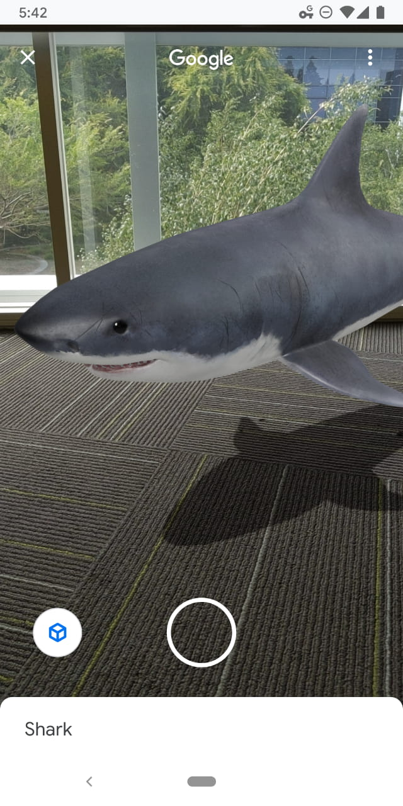

# Filament


Filament is a real-time physically based rendering engine for Android, iOS, Linux, macOS, Windows,
and WebGL. It is designed to be as small as possible and as efficient as possible on Android.

## Download

[Download Filament releases](https://github.com/google/filament/releases) to access stable builds.

Make sure you always use tools from the same release as the runtime library. This is particularly
important for `matc` (material compiler).

### Android

Android projects can simply declare Filament libraries as Maven dependencies:

```
repositories {
    // ...
    mavenCentral()
}

dependencies {
    // Filament rendering engine
    implementation 'com.google.android.filament:filament-android:1.4.4'
    // Filamat material builder
    implementation 'com.google.android.filament:filamat-android-full:1.4.4'
    // glTF 2.0 loader
    implementation 'com.google.android.filament:gltfio-android:1.4.4'
}
```

### Snapshots

If you prefer to live on the edge, you can download a continuous build by following the following
steps:

1. Find the [commit](https://github.com/google/filament/commits/master) you're interested in.
2. Click the green check mark under the commit message.
3. Click on the _Details_ link for the platform you're interested in.
4. On the top right, click on the _Artifacts_ dropdown and choose an artifact.

## Documentation

- [Filament](https://google.github.io/filament/Filament.html), an in-depth explanation of
  real-time physically based rendering, the graphics capabilities and implementation of Filament.
  This document explains the math and reasoning behind most of our decisions. This document is a
  good introduction to PBR for graphics programmers.
- [Materials](https://google.github.io/filament/Materials.html), the full reference
  documentation for our material system. This document explains our different material models, how
  to use the material compiler `matc` and how to write custom materials.
- [Material Properties](https://google.github.io/filament/Material%20Properties.pdf), a reference
  sheet for the standard material model.

## Examples

### Materials

Here are a few sample materials rendered with Filament:


### Applications

Here are a few screenshots of applications that use Filament in production:

#### Google Maps AR Navigation


#### Google Search 3D/AR Viewer on Android



## Features

### APIs

- Native C++ API for Android, iOS, Linux, macOS and Windows
- Java/JNI API for Android, Linux, macOS and Windows
- JavaScript API

### Backends

- OpenGL 4.1+ for Linux, macOS and Windows
- OpenGL ES 3.0+ for Android and iOS
- Metal for macOS and iOS
- Vulkan 1.0 for Android, Linux, macOS and iOS (with MoltenVk), and Windows
- WebGL 2.0 for all platforms

### Rendering

- Clustered forward renderer
- Cook-Torrance microfacet specular BRDF
- Lambertian diffuse BRDF
- HDR/linear lighting
- Metallic workflow
- Clear coat
- Anisotropic lighting
- Approximated translucent (subsurface) materials
- Cloth shading
- Normal mapping & ambient occlusion mapping
- Image-based lighting
- Physically-based camera (shutter speed, sensitivity and aperture)
- Physical light units
- Point light, spot light and directional light
- SSAO
- ACES-like tone-mapping
- Temporal dithering
- FXAA, MSAA and specular anti-aliasing
- Dynamic resolution (on Android and iOS)

### Future

Many other features have been either prototyped or planned:

- IES light profiles/cookies
- Area lights
- Fog
- Color grading
- Bloom
- TAA
- etc.

## Directory structure

This repository not only contains the core Filament engine, but also its supporting libraries
and tools.

- `android`:               Android libraries and projects
  - `filamat-android`:     Filament material generation library (AAR) for Android
  - `filament-android`:    Filament library (AAR) for Android
  - `gltfio-android`:      Filament glTF loading library (AAR) for Android
  - `samples`:             Android-specific Filament samples
- `art`:                   Source for various artworks (logos, PDF manuals, etc.)
- `assets`:                3D assets to use with sample applications
- `build`:                 CMake build scripts
- `docs`:                  Documentation
  - `math`:                Mathematica notebooks used to explore BRDFs, equations, etc.
- `filament`:              Filament rendering engine (minimal dependencies)
- `ide`:                   Configuration files for IDEs (CLion, etc.)
- `ios`:                   Sample projects for iOS
- `java`:                  Java bindings for Filament libraries
- `libs`:                  Libraries
  - `bluegl`:              OpenGL bindings for macOS, Linux and Windows
  - `bluevk`:              Vulkan bindings for macOS, Linux, Windows and Android
  - `filabridge`:          Library shared by the Filament engine and host tools
  - `filaflat`:            Serialization/deserialization library used for materials
  - `filagui`:             Helper library for [Dear ImGui](https://github.com/ocornut/imgui)
  - `filamat`:             Material generation library
  - `filameshio`:          Tiny filamesh parsing library (see also `tools/filamesh`)
  - `geometry`:            Mesh-related utilities
  - `gltfio`:              Loader and optional pipeline for glTF 2.0
  - `ibl`:                 IBL generation tools
  - `image`:               Image filtering and simple transforms
  - `imageio`:             Image file reading / writing, only intended for internal use
  - `matdbg`:              DebugServer for inspecting shaders at run-time (debug builds only)
  - `math`:                Math library
  - `rays`:                Simple path tracer used for baking ambient occlusion, etc.
  - `utils`:               Utility library (threads, memory, data structures, etc.)
- `samples`:               Sample desktop applications
- `shaders`:               Shaders used by `filamat` and `matc`
- `third_party`:           External libraries and assets
  - `environments`:        Environment maps under CC0 license that can be used with `cmgen`
  - `models`:              Models under permissive licenses
  - `textures`:            Textures under CC0 license
- `tools`:                 Host tools
  - `cmgen`:               Image-based lighting asset generator
  - `filamesh`:            Mesh converter
  - `glslminifier`:        Minifies GLSL source code
  - `matc`:                Material compiler
  - `matinfo`              Displays information about materials compiled with `matc`
  - `mipgen`               Generates a series of miplevels from a source image
  - `normal-blending`:     Tool to blend normal maps
  - `resgen`               Aggregates binary blobs into embeddable resources
  - `roughness-prefilter`: Pre-filters a roughness map from a normal map to reduce aliasing
  - `skygen`:              Physically-based sky environment texture generator
  - `specular-color`:      Computes the specular color of conductors based on spectral data
- `web`:                   JavaScript bindings, documentation, and samples

## Building Filament

### Prerequisites

To build Filament, you must first install the following tools:

- CMake 3.10 (or more recent)
- clang 7.0 (or more recent)
- [ninja 1.8](https://github.com/ninja-build/ninja/wiki/Pre-built-Ninja-packages) (or more recent)

To build the Java based components of the project you can optionally install (recommended):

- OpenJDK 1.8 (or more recent)

Additional dependencies may be required for your operating system. Please refer to the appropriate
section below.

Building the `rays` library (used for light baking) is optional and requires the following packages:

- embree 3.0+
- libtbb-dev

To build Filament for Android you must also install the following:

- Android Studio 3.5
- Android SDK
- Android NDK "side-by-side" 20 or higher

### Environment variables

Make sure the environment variable `ANDROID_HOME` points to the location of your Android SDK.

By default our build system will attempt to compile the Java bindings. To do so, the environment
variable `JAVA_HOME` should point to the location of your JDK.

When building for WebGL, you'll also need to set `EMSDK`. See [WebAssembly](#webassembly).

### IDE

We recommend using CLion to develop for Filament. Simply open the root directory's CMakeLists.txt
in CLion to obtain a usable project.

### Easy build

Once the required OS specific dependencies listed below are installed, you can use the script
located in `build.sh` to build Filament easily on macOS and Linux.

This script can be invoked from anywhere and will produce build artifacts in the `out/` directory
inside the Filament source tree.

To trigger an incremental debug build:

```
$ ./build.sh debug
```

To trigger an incremental release build:

```
$ ./build.sh release
```

To trigger both incremental debug and release builds:

```
$ ./build.sh debug release
```

To install the libraries and executables in `out/debug/` and `out/release/`, add the `-i` flag.
You can force a clean build by adding the `-c` flag. The script offers more features described
by executing `build.sh -h`.

### Disabling Java builds

By default our build system will attempt to compile the Java bindings. If you wish to skip this
compilation step simply pass the `-j` flag to `build.sh`:

```
$ ./build.sh -j release
```

If you use CMake directly instead of the build script, pass `-DENABLE_JAVA=OFF` to CMake instead.

### Filament-specific CMake Options

The following CMake options are boolean options specific to Filament:

- `ENABLE_JAVA`:                Compile Java projects: requires a JDK and the JAVA_HOME env var
- `ENABLE_LTO`:                 Enable link-time optimizations if supported by the compiler
- `FILAMENT_BUILD_FILAMAT`:     Build filamat and JNI buildings
- `FILAMENT_SUPPORTS_METAL`:    Include the Metal backend
- `FILAMENT_SUPPORTS_VULKAN`:   Include the Vulkan backend
- `GENERATE_JS_DOCS`:           Build WebGL documentation and tutorials
- `INSTALL_BACKEND_TEST`:       Install the backend test library so it can be consumed on iOS
- `USE_EXTERNAL_GLES3`:         Experimental: Compile Filament against OpenGL ES 3

To turn an option on or off:

```
$ cd <cmake-build-directory>
$ cmake . -DOPTION=ON       # Relace OPTION with the option name, set to ON / OFF
```

Options can also be set with the CMake GUI.

### Linux

Make sure you've installed the following dependencies:

- `clang-7` or higher
- `libglu1-mesa-dev`
- `libc++-7-dev` (`libcxx-devel` and `libcxx-static` on Fedora) or higher
- `libc++abi-7-dev` (`libcxxabi-static` on Fedora) or higher
- `ninja-build`
- `libxi-dev`

After dependencies have been installed, we highly recommend using the [easy build](#easy-build)
script.

If you'd like to run `cmake` directly rather than using the build script, it can be invoked as
follows, with some caveats that are explained further down.

```
$ mkdir out/cmake-release
$ cd out/cmake-release
$ cmake -G Ninja -DCMAKE_BUILD_TYPE=Release -DCMAKE_INSTALL_PREFIX=../release/filament ../..
```

Your Linux distribution might default to `gcc` instead of `clang`, if that's the case invoke
`cmake` with the following command:

```
$ mkdir out/cmake-release
$ cd out/cmake-release
# Or use a specific version of clang, for instance /usr/bin/clang-7
$ CC=/usr/bin/clang CXX=/usr/bin/clang++ CXXFLAGS=-stdlib=libc++ \
    cmake -G Ninja -DCMAKE_BUILD_TYPE=Release -DCMAKE_INSTALL_PREFIX=../release/filament ../..
```

You can also export the `CC` and `CXX` environment variables to always point to `clang`. Another
solution is to use `update-alternatives` to both change the default compiler, and point to a
specific version of clang:

```
$ update-alternatives --install /usr/bin/clang clang /usr/bin/clang-7 100
$ update-alternatives --install /usr/bin/clang++ clang++ /usr/bin/clang++-7 100
$ update-alternatives --install /usr/bin/cc cc /usr/bin/clang 100
$ update-alternatives --install /usr/bin/c++ c++ /usr/bin/clang++ 100
```

Finally, invoke `ninja`:

```
$ ninja
```

This will build Filament, its tests and samples, and various host tools.

### macOS

To compile Filament you must have the most recent version of Xcode installed and you need to
make sure the command line tools are setup by running:

```
$ xcode-select --install
```

After installing Java 1.8 you must also ensure that your `JAVA_HOME` environment variable is
properly set. If it doesn't already point to the appropriate JDK, you can simply add the following
to your `.profile`:

```
export JAVA_HOME="$(/usr/libexec/java_home)"
```

Then run `cmake` and `ninja` to trigger a build:

```
$ mkdir out/cmake-release
$ cd out/cmake-release
$ cmake -G Ninja -DCMAKE_BUILD_TYPE=Release -DCMAKE_INSTALL_PREFIX=../release/filament ../..
$ ninja
```

### iOS

The easiest way to build Filament for iOS is to use `build.sh` and the
`-p ios` flag. For instance to build the debug target:

```
$ ./build.sh -p ios debug
```

See [ios/samples/README.md](./ios/samples/README.md) for more information.

### Windows

#### Building on Windows with Visual Studio 2019

Install the following components:

- [Visual Studio 2019](https://www.visualstudio.com/downloads)
- [Windows 10 SDK](https://developer.microsoft.com/en-us/windows/downloads/windows-10-sdk)
- [Python 3.7](https://www.python.org/ftp/python/3.7.0/python-3.7.0.exe)
- [CMake 3.14 or later](https://github.com/Kitware/CMake/releases/download/v3.14.7/cmake-3.14.7-win64-x64.msi)

The latest Windows SDK can also by installed by opening Visual Studio and selecting _Get Tools and
Features..._ under the _Tools_ menu.

Open the `x64 Native Tools Command Prompt for VS 2019`.

Create a working directory, and run cmake in it:

```
> mkdir out
> cd out
> cmake ..
```

Open the generated solution file `TNT.sln` in Visual Studio.

To build all targets, run _Build Solution_ from the _Build_ menu. Alternatively, right click on a
target in the _Solution Explorer_ and choose _Build_ to build a specific target.

For example, build the `material_sandbox` sample and run it from the `out` directory with:

```
> samples\Debug\material_sandbox.exe ..\assets\models\monkey\monkey.obj
```

### Android

Before building Filament for Android, make sure to build Filament for your host. Some of the
host tools are required to successfully build for Android.

Filament can be built for the following architectures:

- ARM 64-bit (`arm64-v8a`)
- ARM 32-bit (`armeabi-v7a`)
- Intel 64-bit (`x86_64`)
- Intel 32-bit (`x86`)

Note that the main target is the ARM 64-bit target. Our implementation is optimized first and
foremost for `arm64-v8a`.

To build Android on Windows machines, see [android/Windows.md](android/Windows.md).

#### Easy Android build

The easiest way to build Filament for Android is to use `build.sh` and the
`-p android` flag. For instance to build the release target:

```
$ ./build.sh -p android release
```

Run `build.sh -h` for more information.

#### Manual builds

Invoke CMake in a build directory of your choice, inside of filament's directory. The commands
below show how to build Filament for ARM 64-bit (`aarch64`).

```
$ mkdir out/android-build-release-aarch64
$ cd out/android-build-release-aarch64
$ cmake -G Ninja -DCMAKE_TOOLCHAIN_FILE=../../build/toolchain-aarch64-linux-android.cmake \
        -DCMAKE_BUILD_TYPE=Release -DCMAKE_INSTALL_PREFIX=../android-release/filament ../..
```

And then invoke `ninja`:

```
$ ninja install
```

or

```
$ ninja install/strip
```

This will generate Filament's Android binaries in `out/android-release`. This location is important
to build the Android Studio projects located in `filament/android`. After install, the library
binaries should be found in `out/android-release/filament/lib/arm64-v8a`.

#### AAR

Before you attempt to build the AAR, make sure you've compiled and installed the native libraries
as explained in the sections above. You must have the following ABIs built in
`out/android-release/filament/lib/`:

- `arm64-v8a`
- `armeabi-v7a`
- `x86_64`
- `x86`

To build Filament's AAR simply open the Android Studio project in `android/`. The
AAR is a universal AAR that contains all supported build targets:

- `arm64-v8a`
- `armeabi-v7a`
- `x86_64`
- `x86`

To filter out unneeded ABIs, rely on the `abiFilters` of the project that links against Filament's
AAR.

Alternatively you can build the AAR from the command line by executing the following in the
`android/` directory:

```
$ ./gradlew -Pfilament_dist_dir=../../out/android-release/filament assembleRelease
```

The `-Pfilament_dist_dir` can be used to specify a different installation directory (it must match
the CMake install prefix used in the previous steps).

#### Using Filament's AAR

Create a new module in your project and select _Import .JAR or .AAR Package_ when prompted. Make
sure to add the newly created module as a dependency to your application.

If you do not wish to include all supported ABIs, make sure to create the appropriate flavors in
your Gradle build file. For example:

```
flavorDimensions 'cpuArch'
productFlavors {
    arm8 {
        dimension 'cpuArch'
        ndk {
            abiFilters 'arm64-v8a'
        }
    }
    arm7 {
        dimension 'cpuArch'
        ndk {
            abiFilters 'armeabi-v7a'
        }
    }
    x86_64 {
        dimension 'cpuArch'
        ndk {
            abiFilters 'x86_64'.
        }
    }
    x86 {
        dimension 'cpuArch'
        ndk {
            abiFilters 'x86'
        }
    }
    universal {
        dimension 'cpuArch'
    }
}
```

### WebAssembly

The core Filament library can be cross-compiled to WebAssembly from either macOS or Linux. To get
started, follow the instructions for building Filament on your platform ([macOS](#macos) or
[linux](#linux)), which will ensure you have the proper dependencies installed.

Next, you need to install the Emscripten SDK. The following instructions show how to install the
same version that our continuous builds use.

```
cd <your chosen parent folder for the emscripten SDK>
curl -L https://github.com/emscripten-core/emsdk/archive/1b1f08f.zip > emsdk.zip
unzip emsdk.zip ; mv emsdk-* emsdk ; cd emsdk
./emsdk install lastest
./emsdk activate lastest
source ./emsdk_env.sh
```

After this you can invoke the [easy build](#easy-build) script as follows:

```
export EMSDK=<your chosen home for the emscripten SDK>
./build.sh -p webgl release
```

The EMSDK variable is required so that the build script can find the Emscripten SDK. The build
creates a `samples` folder that can be used as the root of a simple static web server. Note that you
cannot open the HTML directly from the filesystem due to CORS. One way to deal with this is to
use Python to create a quick localhost server:

```
cd out/cmake-webgl-release/web/samples
python3 -m http.server     # Python 3
python -m SimpleHTTPServer # Python 2.7
```

You can then open http://localhost:8000/suzanne.html in your web browser.

Alternatively, if you have node installed you can use the
[live-server](https://www.npmjs.com/package/live-server) package, which automatically refreshes the
web page when it detects a change.

Each sample app has its own handwritten html file. Additionally the server folder contains assets
such as meshes, textures, and materials.

## Running the native samples

The `samples/` directory contains several examples of how to use Filament with SDL2.

Some of the samples accept FBX/OBJ meshes while others rely on the `filamesh` file format. To
generate a `filamesh ` file from an FBX/OBJ asset, run the `filamesh` tool
(`./tools/filamesh/filamesh` in your build directory):

```
filamesh ./assets/models/monkey/monkey.obj monkey.filamesh
```

Most samples accept an IBL that must be generated using the `cmgen` tool (`./tools/filamesh/cmgen`
in your build directory). These sample apps expect a path to a directory containing the '.rgb32f'
files for the IBL (which are PNGs containing `R11F_G11F_B10F` data). To generate an IBL simply use
this command:

```
cmgen -x ./ibls/ my_ibl.exr
```

The source environment map can be a PNG (8 or 16 bit), a PSD (16 or 32 bit), an HDR or an OpenEXR
file. The environment map can be an equirectangular projection, a horizontal cross, a vertical
cross, or a list of cubemap faces (horizontal or vertical).

`cmgen` will automatically create a directory based on the name of the source environment map. In
the example above, the final directory will be `./ibls/my_ibl/`. This directory should contain the
pre-filtered environment map (one file per cubemap face and per mip level), the environment map
texture for the skybox and a text file containing the level harmonics for indirect diffuse
lighting.

If you prefer a blurred background, run `cmgen` with this flag: `--extract-blur=0.1`. The numerical
value is the desired roughness between 0 and 1.

## Rendering with Filament

### Native Linux, macOS and Windows

You must create an `Engine`, a `Renderer` and a `SwapChain`. The `SwapChain` is created from a
native window pointer (an `NSView` on macOS or a `HWND` on Windows for instance):

```c++
Engine* engine = Engine::create();
SwapChain* swapChain = engine->createSwapChain(nativeWindow);
Renderer* renderer = engine->createRenderer();
```

To render a frame you must then create a `View`, a `Scene` and a `Camera`:

```c++
Camera* camera = engine->createCamera();
View* view = engine->createView();
Scene* scene = engine->createScene();

view->setCamera(camera);
view->setScene(scene);
```

Renderables are added to the scene:

```c++
Entity renderable = EntityManager::get().create();
// build a quad
RenderableManager::Builder(1)
        .boundingBox({{ -1, -1, -1 }, { 1, 1, 1 }})
        .material(0, materialInstance)
        .geometry(0, RenderableManager::PrimitiveType::TRIANGLES, vertexBuffer, indexBuffer, 0, 6)
        .culling(false)
        .build(*engine, renderable);
scene->addEntity(renderable);
```

The material instance is obtained from a material, itself loaded from a binary blob generated
by `matc`:

```c++
Material* material = Material::Builder()
        .package((void*) BAKED_MATERIAL_PACKAGE, sizeof(BAKED_MATERIAL_PACKAGE))
        .build(*engine);
MaterialInstance* materialInstance = material->createInstance();
```

To learn more about materials and `matc`, please refer to the
[materials documentation](./docs/Materials.md.html).

To render, simply pass the `View` to the `Renderer`:

```c++
// beginFrame() returns false if we need to skip a frame
if (renderer->beginFrame(swapChain)) {
    // for each View
    renderer->render(view);
    renderer->endFrame();
}
```

For complete examples of Linux, macOS and Windows Filament applications, look at the source files
in the `samples/` directory. These samples are all based on `samples/app/` which contains the code
that creates a native window with SDL2 and initializes the Filament engine, renderer and views.

### Java on Linux, macOS and Windows

After building Filament, you can use `filament-java.jar` and its companion `filament-jni` native
library to use Filament in desktop Java applications.

You must always first initialize Filament by calling `Filament.init()`.

You can use Filament either with AWT or Swing, using respectively a `FilamentCanvas` or a
`FilamentPanel`.

Following the steps above (how to use Filament from native code), create an `Engine` and a
`Renderer`, but instead of calling `beginFrame` and `endFrame` on the renderer itself, call
these methods on `FilamentCanvas` or `FilamentPanel`.

### Android

See `android/samples` for examples of how to use Filament on Android.

You must always first initialize Filament by calling `Filament.init()`.

Rendering with Filament on Android is similar to rendering from native code (the APIs are largely
the same across languages). You can render into a `Surface` by passing a `Surface` to the
`createSwapChain` method. This allows you to render to a `SurfaceTexture`, a `TextureView` or
a `SurfaceView`. To make things easier we provide an Android specific API called `UiHelper` in the
package `com.google.android.filament.android`. All you need to do is set a render callback on the
helper and attach your `SurfaceView` or `TextureView` to it. You are still responsible for
creating the swap chain in the `onNativeWindowChanged()` callback.

### iOS

See `ios/samples` for examples of using Filament on iOS.

Filament on iOS is largely the same as native rendering with C++. A `CAEAGLLayer` or `CAMetalLayer`
is passed to the `createSwapChain` method. Filament for iOS supports both OpenGL ES and Vulkan via
MoltenVK.

## Generating C++ documentation

To generate the documentation you must first install `doxygen` and `graphviz`, then run the 
following commands:

```
$ cd filament/filament
$ doxygen docs/doxygen/filament.doxygen
```

Finally simply open `docs/html/index.html` in your web browser.

## Assets

To get started you can use the textures and environment maps found respectively in
`third_party/textures` and `third_party/environments`. These assets are under CC0 license. Please
refer to their respective `URL.txt` files to know more about the original authors.

## Dependencies

One of our design goals is that Filament itself should have no dependencies or as few dependencies
as possible. The current external dependencies of the runtime library include:

- STL
- robin-map (header only library)

When building with Vulkan enabled, we have a few additional small dependencies:

- vkmemalloc
- smol-v

Host tools (such as `matc` or `cmgen`) can use external dependencies freely.

## How to make contributions

Please read and follow the steps in [CONTRIBUTING.md](/CONTRIBUTING.md). Make sure you are
familiar with the [code style](/CODE_STYLE.md).

## License

Please see [LICENSE](/LICENSE).

## Disclaimer

This is not an officially supported Google product.
