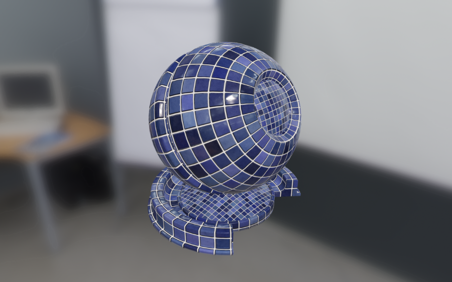
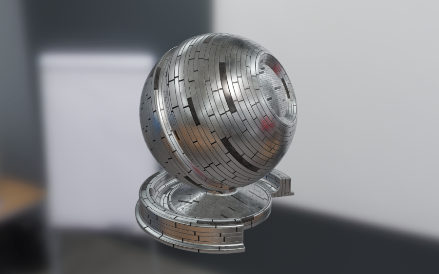
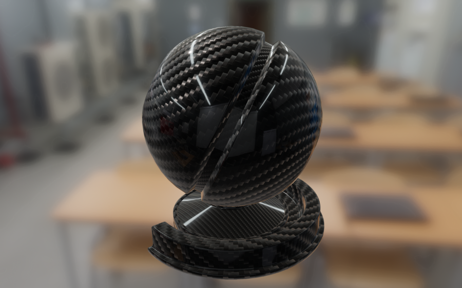

# Filament

[](https://filament-build.storage.googleapis.com/badges/build_link_android.html)
[](https://filament-build.storage.googleapis.com/badges/build_link_linux.html)
[](https://filament-build.storage.googleapis.com/badges/build_link_mac.html)
[](https://filament-build.storage.googleapis.com/badges/build_link_windows.html)
[](https://filament-build.storage.googleapis.com/badges/build_link_web.html)

Filament is a real-time physically based rendering engine for Android, Linux, macOS and Windows.
This rendering engine was designed to be as small as possible and as efficient as possible
on Android.

Filament is currently used in the
[Sceneform](https://developers.google.com/ar/develop/java/sceneform/) library both at runtime on
Android devices and as the renderer inside the Android Studio plugin.

## Download

[Download Filament releases](https://github.com/google/filament/releases) to access stable builds.

If you prefer to live on the edge, you can download continuous builds directly:
- [Android](https://filament-build.storage.googleapis.com/badges/build_link_android.html)
- [Linux](https://filament-build.storage.googleapis.com/badges/build_link_linux.html)
- [macOS](https://filament-build.storage.googleapis.com/badges/build_link_mac.html)
- [Windows](https://filament-build.storage.googleapis.com/badges/build_link_windows.html)

## Documentation

- [Filament](https://google.github.io/filament/Filament.md.html), an in-depth explanation of
  real-time physically based rendering, the graphics capabilities and implementation of Filament.
  This document explains the math and reasoning behind most of our decisions. This document is a
  good introduction to PBR for graphics programmers.
- [Materials](https://google.github.io/filament//Materials.md.html), the full reference
  documentation for our material system. This document explains our different material models, how
  to use the material compiler `matc` and how to write custom materials.
- [Material Properties](https://google.github.io/filament/Material%20Properties.pdf), a reference
  sheet for the standard material model.

## Samples

Here are a few sample materials rendered with Filament:









## Features

### APIs

- Native C++ API for Android, Linux, macOS and Windows
- Java/JNI API for Android, Linux, macOS and Windows
- [Python bindings](https://github.com/artometa/pyfilament)

### Backends

- OpenGL 4.1+ for Linux, macOS and Windows
- OpenGL ES 3.0+ for Android
- Vulkan 1.0 for Android, Linux, macOS (with MoltenVk) and Windows

### Rendering

- Clustered forward renderer
- Cook-Torrance microfacet specular BRDF
- Lambertian diffuse BRDF
- HDR/linear lighting
- Metallic workflow
- Clear coat
- Anisotropic lighting
- Approximated translucent (subsurface) materials (direct and indirect lighting)
- Cloth shading
- Normal mapping & ambient occlusion mapping
- Image-based lighting
- Physically-based camera (shutter speed, sensitivity and aperture)
- Physical light units
- Point light, spot light and directional light
- ACES-like tone-mapping
- Temporal dithering
- FXAA or MSAA
- Dynamic resolution (on Android)

### Future

Many other features have been either prototyped or planned:

- IES light profiles
- Area lights
- Fog
- Color grading
- Bloom
- TAA
- etc.

## Directory structure

- `filament`:                Filament engine and its supporting libraries and tools
  - `android`:               Android libraries and projects
    - `build`:               Custom Gradle tasks for Android builds
    - `filament-android`:    Filament library (AAR) for Android
    - `samples`:             Android-specific Filament samples
  - `art`:                   Source for various artworks (logos, PDF manuals, etc.)
  - `assets`:                3D assets to use with sample applications
  - `build`:                 CMake build scripts
  - `docs`:                  Documentation
    - `math`:                Mathematica notebooks used to explore BRDFs, equations, etc.
  - `filament`:              Filament engine
  - `ide`:                   Configuration files for IDEs (CLion, etc.)
  - `java`:                  Java bindings for Filament libraries
  - `libs`:                  Libraries
    - `bluegl`:                OpenGL bindings for macOS, Linux and Windows
    - `bluevk`:                Vulkan bindings for macOS, Linux, Windows and Android
    - `filabridge`:            Library shared by the Filament engine and host tools
    - `filaflat`:              Serialization/deserialization library used for materials
    - `filagui`:               Helper library for [Dear ImGui](https://github.com/ocornut/imgui)
    - `filamat`:               Material generation library
    - `image`:                 Image filtering and simple transforms
    - `imageio`:               Image file reading / writing, only intended for internal use
    - `math`:                  Math library
    - `utils`:                 Utility library (threads, memory, data structures, etc.)
  - `samples`:               Sample desktop applications
  - `shaders`:               Shaders used by `filamat` and `matc`
  - `third_party`:           External libraries and assets
    - `environments`:        Environment maps under CC0 license that can be used with `cmgen`
    - `textures`:            Textures under CC0 license
  - `tools`:                 Host tools
    - `cmgen`:               Image-based lighting asset generator
    - `filamesh`:            Mesh converter
    - `matc`:                Material compiler
    - `matinfo`              Displays information about materials compiled with `matc`
    - `mipgen`               Generates a series of miplevels from a source image.
    - `normal-blending`:     Tool to blend normal maps
    - `roughness-prefilter`: Pre-filters a roughness map from a normal map to reduce aliasing 
    - `skygen`:              Physically-based sky environment texture generator
    - `specular-color`:      Computes the specular color of conductors based on spectral data

## Building Filament

### Prerequisites

To build Filament, you must first install the following tools:

- CMake 3.4 (or more recent)
- clang 5.0 (or more recent)
- [ninja 1.8](https://github.com/ninja-build/ninja/wiki/Pre-built-Ninja-packages) (or more recent)

To build the Java based components of the project you can optionally install (recommended):

- OpenJDK 1.8 (or more recent)

Additional dependencies may be required for your operating system. Please refer to the appropriate
section below.

To build Filament for Android you must also install the following:

- Android Studio 3.1
- Android SDK
- Android NDK

### Environment variables

Make sure the environment variable `ANDROID_HOME` points to the location of your Android SDK.

By default our build system will attempt to compile the Java bindings. To do so, the environment
variable `JAVA_HOME` should point to the location of your JDK.

When building for WebGL, you'll also need to set `EMSDK`. See [WebAssembly](#webassembly).

### IDE

We recommend using CLion to develop for Filament. Simply open the root directory's CMakeList.txt
in CLion to obtain a usable project.

### Easy build

Once the required OS specific dependencies listed below are installed, you can use the script
located in `build.sh` to build Filament easily on macOS and Linux.

This script can be invoked from anywhere and will produce build artifacts in the `out/` directory
inside the Filament source tree.

To trigger an incremental debug build:

```
$ ./build.sh debug
```

To trigger an incremental release build:

```
$ ./build.sh release
```

To trigger both incremental debug and release builds:

```
$ ./build.sh debug release
```

To install the libraries and executables in `out/debug/` and `out/release/`, add the `-i` flag.
You can force a clean build by adding the `-c` flag. The script offers more features described
by executing `build.sh -h`.

### Disabling Java builds

By default our build system will attempt to compile the Java bindings. If you wish to skip this
compilation step simply pass the `-j` flag to `build.sh`:

```
$ ./build.sh -j release
```

If you use CMake directly instead of the build script, pass `-DENABLE_JAVA=OFF` to CMake instead.

### Linux

Make sure you've installed the following dependencies:

- `libglu1-mesa-dev`
- `libc++-dev` (`libcxx-devel` on Fedora)
- `libc++abi-dev`
- `ninja-build`

In addition your distribution might require:

- `libxi-dev`

Then invoke `cmake`:

```
$ mkdir out/cmake-release
$ cd out/cmake-release
$ cmake -G Ninja -DCMAKE_BUILD_TYPE=Release -DCMAKE_INSTALL_PREFIX=../release/filament ../..
```

If you experience link errors you must ensure that you are using `libc++abi` by passing this
extra parameter to `cmake`:

```
-DFILAMENT_REQUIRES_CXXABI=true
```

Your Linux distribution might default to `gcc` instead of `clang`, if that's the case invoke
`cmake` with the following command:

```
$ mkdir out/cmake-release
$ cd out/cmake-release
# Or use a specific version of clang, for instance /usr/bin/clang-5.0
$ CC=/usr/bin/clang CXX=/usr/bin/clang++ \
    cmake -G Ninja -DCMAKE_BUILD_TYPE=Release -DCMAKE_INSTALL_PREFIX=../release/filament ../..
```

You can also export the `CC` and `CXX` environment variables to always point to `clang`. Another
solution is to use `update-alternatives` to both change the default compiler, and point to a
specific version of clang:

```
$ update-alternatives --install /usr/bin/cc cc /usr/bin/clang 100
$ update-alternatives --install /usr/bin/c++ c++ /usr/bin/clang++ 100
$ update-alternatives --install /usr/bin/clang clang /usr/bin/clang-5.0 100
$ update-alternatives --install /usr/bin/clang++ clang++ /usr/bin/clang++-5.0 100
```

Finally, invoke `ninja`:

```
$ ninja
```

This will build Filament, its tests and samples, and various host tools.

### macOS

To compile Filament you must have the most recent version of Xcode installed and you need to
make sure the command line tools are setup by running:

```
$ xcode-select --install
```

After installing Java 1.8 you must also ensure that your `JAVA_HOME` environment variable is
properly set. If it doesn't already point to the appropriate JDK, you can simply add the following
to your `.profile`:

```
export JAVA_HOME="$(/usr/libexec/java_home)"
```

Then run `cmake` and `ninja` to trigger a build:

```
$ mkdir out/cmake-release
$ cd out/cmake-release
$ cmake -G Ninja -DCMAKE_BUILD_TYPE=Release -DCMAKE_INSTALL_PREFIX=../release/filament ../..
$ ninja
```

### Windows

The following instructions have been tested on a machine running Windows 10. They should take you
from a machine with only the operating system to a machine able to build and run Filament.

Google employees require additional steps which can be found here [go/filawin](http://go/filawin).

Install the following components:

- [Windows 10 SDK](https://developer.microsoft.com/en-us/windows/downloads/windows-10-sdk)
- [Visual Studio 2015](https://www.visualstudio.com/downloads)
- [Clang 6](http://releases.llvm.org/download.html)
- [Python 3.7](https://www.python.org/ftp/python/3.7.0/python-3.7.0.exe)
- [Git 2.16.1 or later](https://github.com/git-for-windows/git/releases/download/v2.16.1.windows.4/PortableGit-2.16.1.4-64-bit.7z.exe)
- [Cmake 3.11 or later](https://cmake.org/files/v3.11/cmake-3.11.0-rc1-win64-x64.msi)

Open an VS2015 x64 Native Tools terminal (click the start button, type "x64 native tools" and
select: "VS2015 x64 Native Tools Command Prompt").

Create a working directory:
```
> mkdir out/cmake-release
> cd out/cmake-release
```

Create the msBuild project:
```
> cmake -T"LLVM-vs2014" -G "Visual Studio 14 2015 Win64" ../..
```

Check out the output and make sure Clang for Windows frontend was found. You should see a line
showing the following ouput.
```
Clang:C:/Program Files/LLVM/msbuild-bin/cl.exe
```

You are now ready to build:
```
> msbuild  TNT.sln /t:material_sandbox /m /p:configuration=Release
```

Run it:
```
> samples\Release\lightbulb.exe ..\..\assets\models\monkey\monkey.obj
```

#### Tips

- To troubleshoot an issue, use verbose mode via `/v:d` flag.
- To build a specific project, use `/t:NAME` flag (e.g: `/t:material_sandbox`).
- To build using more than one core, use parallel build flag: `/m`.
- To build a specific profile, use `/p:configuration=` (e.g: `/p:configuration=Debug`,
  `/p:configuration=Release`, and `/p:configuration=RelWithDebInfo`).
- The msBuild project is what is used by Visual Studio behind the scene to build. Building from VS
  or from the command-line is the same thing.

#### Building with Ninja on Windows

Alternatively, you can use [Ninja](https://ninja-build.org/) to build for Windows. An MSVC
installation is still necessary.

First, install the dependencies listed under [Windows](#Windows) as well as Ninja. Then open up a
VS2015 x64 Native Tools terminal as before. Create a build directory inside Filament and run the
following CMake command:

```
cmake .. -G Ninja ^
-DCMAKE_CXX_COMPILER:PATH="C:\Program Files\LLVM\bin\clang-cl.exe" ^
-DCMAKE_C_COMPILER:PATH="C:\Program Files\LLVM\bin\clang-cl.exe" ^
-DCMAKE_LINKER:PATH="C:\Program Files\LLVM\bin\lld-link.exe" ^
-DCMAKE_BUILD_TYPE=Release
```

You should then be able to build by invoking Ninja:

```
ninja
```

#### Development tips

- Before shipping a binary, make sure you used Release profile and make sure you have no libc/libc++
  dependencies with [Dependency Walker](http://www.dependencywalker.com).
- Application Verifier and gflags.exe can be of great help to trackdown heap corruption. Application
  Verifier is easy to setup with a GUI. For gflags, use: `gflags /p /enable pheap-buggy.exe`.

#### Running a simple test

To confirm Filament was properly built, run the following command from the build directory:

```
./samples/material_sandbox --ibl=../../samples/envs/office ../../assets/models/sphere/sphere.obj
```

### Android

Before building Filament for Android, make sure to build Filament for your host. Some of the
host tools are required to successfully build for Android.

Filament can be built for the following architectures:

- ARM 64-bit (`arm64-v8a`)
- ARM 32-bit (`armeabi-v7a`)
- Intel 64-bit (`x86_64`)
- Intel 32-bit (`x86`)

Note that the main target is the ARM 64-bit target. Our implementation is optimized first and
foremost for `arm64-v8a`.

#### Easy Android build

The easiest way to build Filament for Android is to use `build.sh` and the
`-p android` flag. For instance to build the release target:

```
$ ./build.sh -p android release
```

Run `build.sh -h` for more information.

#### ARM 64-bit target (arm64-v8a)

##### Linux toolchain

```
$ $SDK/ndk-bundle/build/tools/make_standalone_toolchain.py --arch arm64 --api 24 \
        --stl libc++ --force \
        --install-dir toolchains/Linux/aarch64-linux-android-4.9
```

##### Darwin toolchain

```
$ $SDK/ndk-bundle/build/tools/make_standalone_toolchain.py --arch arm64 --api 24 \
        --stl libc++ --force \
        --install-dir toolchains/Darwin/aarch64-linux-android-4.9
```

##### Compiling

Then invoke CMake in a build directory of your choice, inside of filament's directory:

```
$ mkdir out/android-build-release-aarch64
$ cd out/android-build-release-aarch64
$ cmake -G Ninja -DCMAKE_TOOLCHAIN_FILE=../../build/toolchain-aarch64-linux-android.cmake \
        -DCMAKE_BUILD_TYPE=Release -DCMAKE_INSTALL_PREFIX=../android-release/filament ../..
```

And then invoke `ninja`:

```
$ ninja install
```

or

```
$ ninja install/strip
```

This will generate Filament's Android binaries in `out/android-release`. This location is important
to build the Android Studio projects located in `filament/android`. After install, the library
binaries should be found in `out/android-release/filament/lib/arm64-v8a`.

#### ARM 32-bit target (armeabi-v7a)

##### Linux toolchain

```
$ $SDK/ndk-bundle/build/tools/make_standalone_toolchain.py --arch arm --api 24 \
        --stl libc++ --force \
        --install-dir toolchains/Linux/arm-linux-androideabi-4.9
```

##### Darwin toolchain

```
$ $SDK/ndk-bundle/build/tools/make_standalone_toolchain.py --arch arm --api 24 \
        --stl libc++ --force \
        --install-dir toolchains/Darwin/arm-linux-androideabi-4.9
```

##### Compiling

Then invoke CMake in a build directory of your choice, inside of filament's directory:

```
$ mkdir out/android-build-release-arm
$ cd out/android-build-release-arm
$ cmake -G Ninja -DCMAKE_TOOLCHAIN_FILE=../../build/toolchain-arm7-linux-android.cmake \
        -DCMAKE_BUILD_TYPE=Release -DCMAKE_INSTALL_PREFIX=../android-release/filament ../..
```

And then invoke `ninja`:

```
$ ninja install
```

or

```
$ ninja install/strip
```

This will generate Filament's Android binaries in `out/android-release`. This location is important
to build the Android Studio projects located in `filament/android`. After install, the library
binaries should be found in `out/android-release/filament/lib/armeabi-v7a`.

#### Intel 64-bit target (x86_64)

##### Linux toolchain

```
$ $SDK/ndk-bundle/build/tools/make_standalone_toolchain.py --arch x86_64 --api 24 \
        --stl libc++ --force \
        --install-dir toolchains/Linux/x86_64-linux-android-4.9
```

##### Darwin toolchain

```
$ $SDK/ndk-bundle/build/tools/make_standalone_toolchain.py --arch x86_64 --api 24 \
        --stl libc++ --force \
        --install-dir toolchains/Darwin/x86_64-linux-android-4.9
```

##### Compiling

Then invoke CMake in a build directory of your choice, sibling of filament's directory:

```
$ mkdir out/android-build-release-x86_64
$ cd out/android-build-release-x86_64
$ cmake -G Ninja -DCMAKE_TOOLCHAIN_FILE=../../filament/build/toolchain-x86_64-linux-android.cmake \
        -DCMAKE_BUILD_TYPE=Release -DCMAKE_INSTALL_PREFIX=../out/android-release/filament ../..
```

And then invoke `ninja`:

```
$ ninja install
```

or

```
$ ninja install/strip
```

This will generate Filament's Android binaries in `out/android-release`. This location is important
to build the Android Studio projects located in `filament/android`. After install, the library
binaries should be found in `out/android-release/filament/lib/x86_64`.

#### Intel 32-bit target (x86)

##### Linux toolchain

```
$ $SDK/ndk-bundle/build/tools/make_standalone_toolchain.py --arch x86 --api 24 \
        --stl libc++ --force \
        --install-dir toolchains/Linux/i686-linux-android-4.9
```

##### Darwin toolchain

```
$ $SDK/ndk-bundle/build/tools/make_standalone_toolchain.py --arch x86 --api 24 \
        --stl libc++ --force \
        --install-dir toolchains/Darwin/i686-linux-android-4.9
```

##### Compiling

Then invoke CMake in a build directory of your choice, sibling of filament's directory:

```
$ mkdir out/android-build-release-x86
$ cd out/android-build-release-x86
$ cmake -G Ninja -DCMAKE_TOOLCHAIN_FILE=../../filament/build/toolchain-x86-linux-android.cmake \
        -DCMAKE_BUILD_TYPE=Release -DCMAKE_INSTALL_PREFIX=../out/android-release/filament ../..
```

And then invoke `ninja`:

```
$ ninja install
```

or

```
$ ninja install/strip
```

This will generate Filament's Android binaries in `out/android-release`. This location is important
to build the Android Studio projects located in `filament/android`. After install, the library
binaries should be found in `out/android-release/filament/lib/x86`.

### AAR

Before you attempt to build the AAR, make sure you've compiled and installed the native libraries
as explained in the sections above. You must have the following ABIs built in
`out/android-release/filament/lib/`:

- `arm64-v8a`
- `armeabi-v7a`
- `x86_64`
- `x86`

To build Filament's AAR simply open the Android Studio project in `android/filament-android`. The
AAR is a universal AAR that contains all supported build targets:

- `arm64-v8a`
- `armeabi-v7a`
- `x86_64`
- `x86`

To filter out unneeded ABIs, rely on the `abiFilters` of the project that links against Filament's
AAR.

Alternatively you can build the AAR from the command line by executing the following the
`android/filament-android` directory:

```
$ ./gradlew -Pfilament_dist_dir=../../out/android-release/filament assembleRelease
```

The `-Pfilament_dist_dir` can be used to specify a different installation directory (it must match
the CMake install prefix used in the previous steps).

### Using Filament's AAR

Create a new module in your project and select _Import .JAR or .AAR Package_ when prompted. Make
sure to add the newly created module as a dependency to your application.

If you do not wish to include all supported ABIs, make sure to create the appropriate flavors in
your Gradle build file. For example:

```
flavorDimensions 'cpuArch'
productFlavors {
    arm8 {
        dimension 'cpuArch'
        ndk {
            abiFilters 'arm64-v8a'
        }
    }
    arm7 {
        dimension 'cpuArch'
        ndk {
            abiFilters 'armeabi-v7a'
        }
    }
    x86_64 {
        dimension 'cpuArch'
        ndk {
            abiFilters 'x86_64'
        }
    }
    x86 {
        dimension 'cpuArch'
        ndk {
            abiFilters 'x86'
        }
    }
    universal {
        dimension 'cpuArch'
    }
}
```

### WebAssembly

As an experimental feature, the core Filament library can be cross-compiled to WebAssembly from
either macOS or Linux. To get started, install the Emscripten SDK as follows:

```
cd <your chosen home for the emscripten SDK>
curl -L https://github.com/juj/emsdk/archive/0d8576c.zip > emsdk.zip
unzip emsdk.zip
mv emsdk-* emsdk
cd emsdk
./emsdk update
./emsdk install sdk-1.38.11-64bit
./emsdk activate sdk-1.38.11-64bit
export EMSDK=$PWD
```

The last line in the above snippet is required so that our build script can find the Emscripten SDK.
After this you can invoke our standard build script with `-p webgl`.

Invoking the [easy build](#easy-build) script with `-p webgl` creates a `public` folder in
`out/cmake-web-release/samples/web`. This folder can be used as the root of a simple static web
server. Each sample app has its own handwritten html file, wasm file, and js loader. Additionally
the public folder contains meshes, textures, and the tiny `filaweb.js` library.

## Running the samples

The `samples/` directory contains several examples of how to use Filament with SDL2.

Some of the samples accept FBX/OBJ meshes while others rely on the `filamesh` file format. To
generate a `filamesh ` file from an FBX/OBJ asset, run the `filamesh` tool
(`./tools/filamesh/filamesh` in your build directory):

```
filamesh ./assets/models/monkey/monkey.obj monkey.filamesh
```

Most samples accept an IBL that must be generated using the `cmgen` tool (`./tools/filamesh/cmgen`
in your build directory). These sample apps expect a path to a directory containing the RGBM files
for the IBL. To generate an IBL simply use this command:

```
cmgen -x ./ibls/ my_ibl.exr 
```

The source environment map can be a PNG (8 or 16 bit), a PSD (16 or 32 bit), an HDR or an OpenEXR
file. The environment map can be an equirectangular projection, a horizontal cross, a vertical
cross, or a list of cubemap faces (horizontal or vertical).

`cmgen` will automatically create a directory based on the name of the source environment map. In
the example above, the final directory will be `./ibls/my_ibl/`. This directory should contain the
pre-filtered environment map (one file per cubemap face and per mip level), the environment map
texture for the skybox and a text file containing the spherical harmonics for indirect diffuse
lighting.

If you prefer a blurred background, run `cmgen` with this flag: `--extract-blur=0.5`. The numerical
value is the desired roughness between 0 and 1.

## Rendering with Filament

### Native Linux, macOS and Windows

You must create an `Engine`, a `Renderer` and a `SwapChain`. The `SwapChain` is created from a
native window pointer (an `NSView` on macOS or a `HDC` on Windows for instance):

```c++
Engine* engine = Engine::create();
SwapChain* swapChain = engine->createSwapChain(nativeWindow);
Renderer* renderer = engine->createRenderer();
```

To render a frame you must then create a `View`, a `Scene` and a `Camera`:

```c++
Camera* camera = engine->createCamera();
View* view = engine->createView();
Scene* scene = engine->createScene();

view->setCamera(camera);
view->setScene(scene);
```

Renderables are added to the scene:

```c++
Entity renderable = EntityManager::get().create();
// build a quad
RenderableManager::Builder(1)
        .boundingBox({{ -1, -1, -1 }, { 1, 1, 1 }})
        .material(0, materialInstance)
        .geometry(0, RenderableManager::PrimitiveType::TRIANGLES, vertexBuffer, indexBuffer, 0, 6)
        .culling(false)
        .build(*engine, renderable);
scene->addEntity(renderable);
```

The material instance is obtained from a material, itself loaded from a binary blob generated
by `matc`:

```c++
Material* material = Material::Builder()
        .package((void*) BAKED_MATERIAL_PACKAGE, sizeof(BAKED_MATERIAL_PACKAGE))
        .build(*engine);
MaterialInstance* materialInstance = material->createInstance();
```

To learn more about materials and `matc`, please refer to the
[materials documentation](./docs/Materials.md.html).

To render, simply pass the `View` to the `Renderer`:

```c++
// beginFrame() returns false if we need to skip a frame
if (renderer->beginFrame(swapChain)) {
    // for each View
    renderer->render(view);
    renderer->endFrame();
}
```

For complete examples of Linux, macOS and Windows Filament applications, look at the source files
in the `samples/` directory. These samples are all based on `samples/app/` which contains the code
that creates a native window with SDL2 and initializes the Filament engine, renderer and views.

### Java on Linux, macOS and Windows

After building Filament, you can use `filament-java.jar` and its companion `filament-jni` native
library to use Filament in desktop Java applications.

You must always first initialize Filament by calling `Filament.init()`.

You can use Filament either with AWT or Swing, using respectively a `FilamentCanvas` or a
`FilamentPanel`.

Following the steps above (how to use Filament from native code), create an `Engine` and a
`Renderer`, but instead of calling `beginFrame` and `endFrame` on the renderer itself, call
these methods on `FilamentCanvas` or `FilamentPanel`.

### Android

See `android/samples` for examples of how to use Filament on Android.

You must always first initialize Filament by calling `Filament.init()`.

Rendering with Filament on Android is similar to rendering from native code (the APIs are largely
the same across languages). You can render into a `Surface` by passing a `Surface` to the
`createSwapChain` method. This allows you to render to a `SurfaceTexture`, a `TextureView` or
a `SurfaceView`. To make things easier we provide an Android specific API called `UiHelper` in the
package `com.google.android.filament.android`. All you need to do is set a render callback on the
helper and attach your `SurfaceView` or `TextureView` to it. You are still responsible for
creating the swap chain in the `onNativeWindowChanged()` callback.

## Generating C++ documentation

To generate the documentation you must first install `doxygen`, then run the following commands:

```
$ cd filament/filament
$ doxygen docs/doxygen/filament.doxygen
```

Finally simply open `docs/html/index.html` in your web browser.

## Assets

To get started you can use the textures and environment maps found respectively in
`third_party/textures` and `third_party/environments`. These assets are under CC0 license. Please
refer to their respective `URL.txt` files to know more about the original authors.

## Dependencies

One of our design goals is that Filament itself should have no dependencies or as few dependencies
as possible. The current external dependencies of the runtime library include:

- STL
- robin-map (header only library)

Host tools (such as `matc` or `cmgen`) can use external dependencies freely.

## How to make contributions

Please read and follow the steps in [CONTRIBUTING.md](/CONTRIBUTING.md). Make sure you are
familiar with the [code style](/CODE_STYLE.md). 

## License

Please see [LICENSE](/LICENSE).

## Disclaimer

This is not an officially supported Google product.
