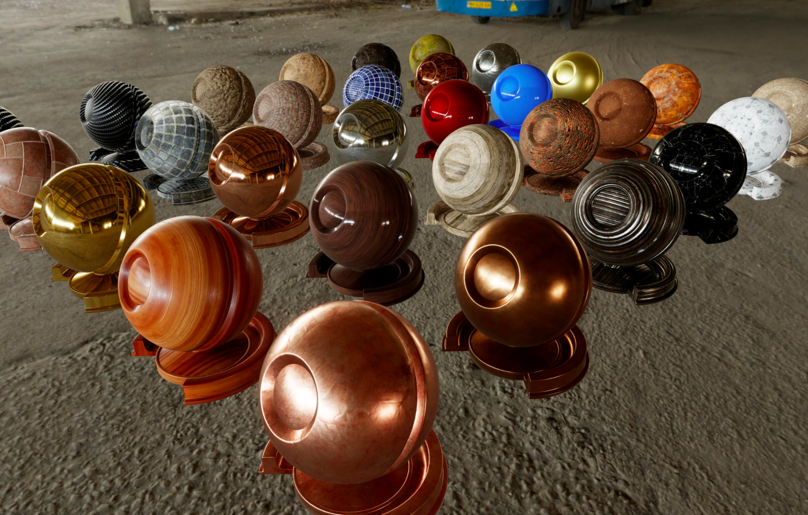
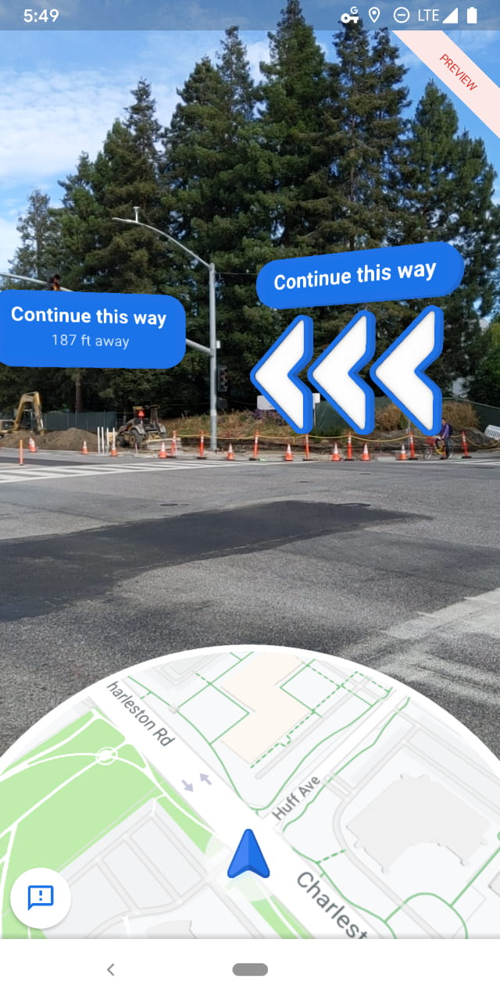

# Filament


Filament is a real-time physically based rendering engine for Android, iOS, Linux, macOS, Windows,
and WebGL. It is designed to be as small as possible and as efficient as possible on Android.

## Download

[Download Filament releases](https://github.com/google/filament/releases) to access stable builds.
Filament release archives contains host-side tools that are required to generate assets.

Make sure you always use tools from the same release as the runtime library. This is particularly
important for `matc` (material compiler).

If you'd rather build Filament yourself, please refer to our [build manual](BUILDING.md).

### Android

Android projects can simply declare Filament libraries as Maven dependencies:

```gradle
repositories {
    // ...
    mavenCentral()
}

dependencies {
    implementation 'com.google.android.filament:filament-android:1.5.2'
}
```

Here are all the libraries available in the group `com.google.android.filament`:

- `filament-android`: the Filament rendering engine itself
- `gltfio-android`: a glTF 2.0 loader for Filament, depends on `filament-android`
- `gltfio-android-lite`: trimmed version of `gltfio` that does not support some glTF features
- `filament-utils-android`: KTX loading, Kotlin math, and camera utilities, depends on `gltfio-android`
- `filament-utils-lite-android`: trimmed version of `filament-utils` that does not support some glTF features
- `filamat-android`: a runtime material builder/compiler. This library is large but contains
  a full shader compiler/validator/optimizer
- `filamat-android-lite`: a much smaller alternative to `filamat-android` that can only
  generate OpenGL shaders. It does not provide validation or optimizations

### Snapshots

If you prefer to live on the edge, you can download a continuous build by following the following
steps:

1. Find the [commit](https://github.com/google/filament/commits/master) you're interested in.
2. Click the green check mark under the commit message.
3. Click on the _Details_ link for the platform you're interested in.
4. On the top right, click on the _Artifacts_ dropdown and choose an artifact.

## Documentation

- [Filament](https://google.github.io/filament/Filament.html), an in-depth explanation of
  real-time physically based rendering, the graphics capabilities and implementation of Filament.
  This document explains the math and reasoning behind most of our decisions. This document is a
  good introduction to PBR for graphics programmers.
- [Materials](https://google.github.io/filament/Materials.html), the full reference
  documentation for our material system. This document explains our different material models, how
  to use the material compiler `matc` and how to write custom materials.
- [Material Properties](https://google.github.io/filament/Material%20Properties.pdf), a reference
  sheet for the standard material model.

## Examples

### Materials

Here are a few sample materials rendered with Filament:





### Applications

Here are a few screenshots of applications that use Filament in production:

#### Google Maps AR Navigation



#### Google Search 3D/AR Viewer on Android


## Features

### APIs

- Native C++ API for Android, iOS, Linux, macOS and Windows
- Java/JNI API for Android, Linux, macOS and Windows
- JavaScript API

### Backends

- OpenGL 4.1+ for Linux, macOS and Windows
- OpenGL ES 3.0+ for Android and iOS
- Metal for macOS and iOS
- Vulkan 1.0 for Android, Linux, macOS, and Windows
- WebGL 2.0 for all platforms

### Rendering

- Clustered forward renderer
- Cook-Torrance microfacet specular BRDF
- Lambertian diffuse BRDF
- HDR/linear lighting
- Metallic workflow
- Clear coat
- Anisotropic lighting
- Approximated translucent (subsurface) materials
- Cloth shading
- Normal mapping & ambient occlusion mapping
- Image-based lighting
- Physically-based camera (shutter speed, sensitivity and aperture)
- Physical light units
- Point lights, spot lights and directional light
- Spot and directional light shadows
- Contact shadows
- Screen-space ambient occlusion
- Screen-space refraction
- Global fog
- HDR bloom
- ACES-like tone-mapping
- Temporal dithering
- FXAA, MSAA and specular anti-aliasing
- Dynamic resolution (on Android and iOS)

## Rendering with Filament

### Native Linux, macOS and Windows

You must create an `Engine`, a `Renderer` and a `SwapChain`. The `SwapChain` is created from a
native window pointer (an `NSView` on macOS or a `HWND` on Windows for instance):

```c++
Engine* engine = Engine::create();
SwapChain* swapChain = engine->createSwapChain(nativeWindow);
Renderer* renderer = engine->createRenderer();
```

To render a frame you must then create a `View`, a `Scene` and a `Camera`:

```c++
Camera* camera = engine->createCamera();
View* view = engine->createView();
Scene* scene = engine->createScene();

view->setCamera(camera);
view->setScene(scene);
```

Renderables are added to the scene:

```c++
Entity renderable = EntityManager::get().create();
// build a quad
RenderableManager::Builder(1)
        .boundingBox({{ -1, -1, -1 }, { 1, 1, 1 }})
        .material(0, materialInstance)
        .geometry(0, RenderableManager::PrimitiveType::TRIANGLES, vertexBuffer, indexBuffer, 0, 6)
        .culling(false)
        .build(*engine, renderable);
scene->addEntity(renderable);
```

The material instance is obtained from a material, itself loaded from a binary blob generated
by `matc`:

```c++
Material* material = Material::Builder()
        .package((void*) BAKED_MATERIAL_PACKAGE, sizeof(BAKED_MATERIAL_PACKAGE))
        .build(*engine);
MaterialInstance* materialInstance = material->createInstance();
```

To learn more about materials and `matc`, please refer to the
[materials documentation](./docs/Materials.md.html).

To render, simply pass the `View` to the `Renderer`:

```c++
// beginFrame() returns false if we need to skip a frame
if (renderer->beginFrame(swapChain)) {
    // for each View
    renderer->render(view);
    renderer->endFrame();
}
```

For complete examples of Linux, macOS and Windows Filament applications, look at the source files
in the `samples/` directory. These samples are all based on `samples/app/` which contains the code
that creates a native window with SDL2 and initializes the Filament engine, renderer and views.

### Java on Linux, macOS and Windows

After building Filament, you can use `filament-java.jar` and its companion `filament-jni` native
library to use Filament in desktop Java applications.

You must always first initialize Filament by calling `Filament.init()`.

You can use Filament either with AWT or Swing, using respectively a `FilamentCanvas` or a
`FilamentPanel`.

Following the steps above (how to use Filament from native code), create an `Engine` and a
`Renderer`, but instead of calling `beginFrame` and `endFrame` on the renderer itself, call
these methods on `FilamentCanvas` or `FilamentPanel`.

### Android

See `android/samples` for examples of how to use Filament on Android.

You must always first initialize Filament by calling `Filament.init()`.

Rendering with Filament on Android is similar to rendering from native code (the APIs are largely
the same across languages). You can render into a `Surface` by passing a `Surface` to the
`createSwapChain` method. This allows you to render to a `SurfaceTexture`, a `TextureView` or
a `SurfaceView`. To make things easier we provide an Android specific API called `UiHelper` in the
package `com.google.android.filament.android`. All you need to do is set a render callback on the
helper and attach your `SurfaceView` or `TextureView` to it. You are still responsible for
creating the swap chain in the `onNativeWindowChanged()` callback.

### iOS

See `ios/samples` for examples of using Filament on iOS.

Filament on iOS is largely the same as native rendering with C++. A `CAEAGLLayer` or `CAMetalLayer`
is passed to the `createSwapChain` method. Filament for iOS supports both OpenGL ES and Vulkan via
MoltenVK.

## Assets

To get started you can use the textures and environment maps found respectively in
`third_party/textures` and `third_party/environments`. These assets are under CC0 license. Please
refer to their respective `URL.txt` files to know more about the original authors.

## How to make contributions

Please read and follow the steps in [CONTRIBUTING.md](/CONTRIBUTING.md). Make sure you are
familiar with the [code style](/CODE_STYLE.md).

## Directory structure

This repository not only contains the core Filament engine, but also its supporting libraries
and tools.

- `android`:               Android libraries and projects
  - `filamat-android`:     Filament material generation library (AAR) for Android
  - `filament-android`:    Filament library (AAR) for Android
  - `gltfio-android`:      Filament glTF loading library (AAR) for Android
  - `samples`:             Android-specific Filament samples
- `art`:                   Source for various artworks (logos, PDF manuals, etc.)
- `assets`:                3D assets to use with sample applications
- `build`:                 CMake build scripts
- `docs`:                  Documentation
  - `math`:                Mathematica notebooks used to explore BRDFs, equations, etc.
- `filament`:              Filament rendering engine (minimal dependencies)
- `ide`:                   Configuration files for IDEs (CLion, etc.)
- `ios`:                   Sample projects for iOS
- `java`:                  Java bindings for Filament libraries
- `libs`:                  Libraries
  - `bluegl`:              OpenGL bindings for macOS, Linux and Windows
  - `bluevk`:              Vulkan bindings for macOS, Linux, Windows and Android
  - `filabridge`:          Library shared by the Filament engine and host tools
  - `filaflat`:            Serialization/deserialization library used for materials
  - `filagui`:             Helper library for [Dear ImGui](https://github.com/ocornut/imgui)
  - `filamat`:             Material generation library
  - `filameshio`:          Tiny filamesh parsing library (see also `tools/filamesh`)
  - `geometry`:            Mesh-related utilities
  - `gltfio`:              Loader for glTF 2.0
  - `ibl`:                 IBL generation tools
  - `image`:               Image filtering and simple transforms
  - `imageio`:             Image file reading / writing, only intended for internal use
  - `matdbg`:              DebugServer for inspecting shaders at run-time (debug builds only)
  - `math`:                Math library
  - `utils`:               Utility library (threads, memory, data structures, etc.)
- `samples`:               Sample desktop applications
- `shaders`:               Shaders used by `filamat` and `matc`
- `third_party`:           External libraries and assets
  - `environments`:        Environment maps under CC0 license that can be used with `cmgen`
  - `models`:              Models under permissive licenses
  - `textures`:            Textures under CC0 license
- `tools`:                 Host tools
  - `cmgen`:               Image-based lighting asset generator
  - `filamesh`:            Mesh converter
  - `glslminifier`:        Minifies GLSL source code
  - `matc`:                Material compiler
  - `matinfo`              Displays information about materials compiled with `matc`
  - `mipgen`               Generates a series of miplevels from a source image
  - `normal-blending`:     Tool to blend normal maps
  - `resgen`               Aggregates binary blobs into embeddable resources
  - `roughness-prefilter`: Pre-filters a roughness map from a normal map to reduce aliasing
  - `skygen`:              Physically-based sky environment texture generator
  - `specular-color`:      Computes the specular color of conductors based on spectral data
- `web`:                   JavaScript bindings, documentation, and samples

## License

Please see [LICENSE](/LICENSE).

## Disclaimer

This is not an officially supported Google product.
