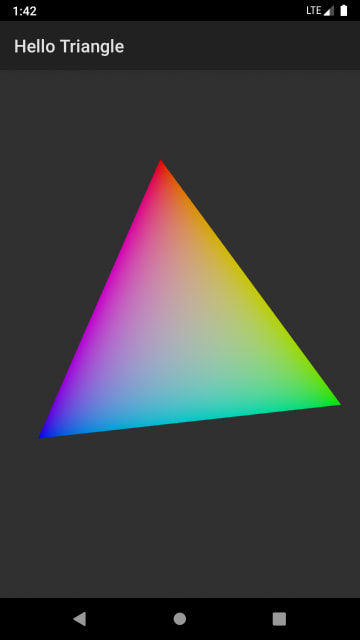
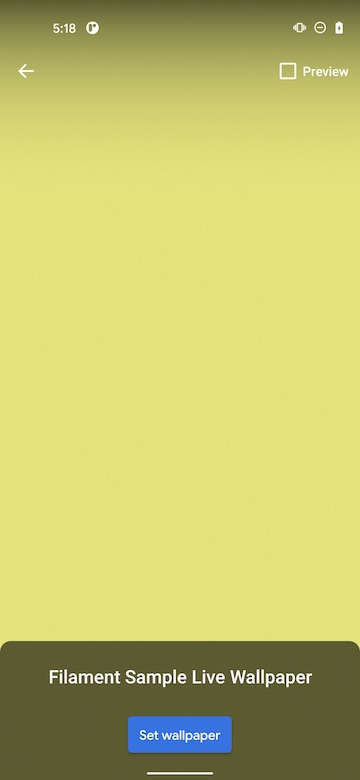
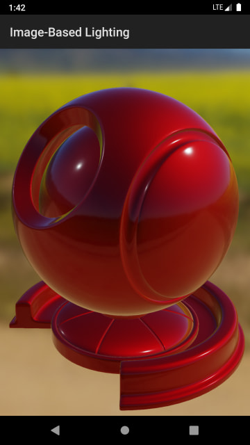
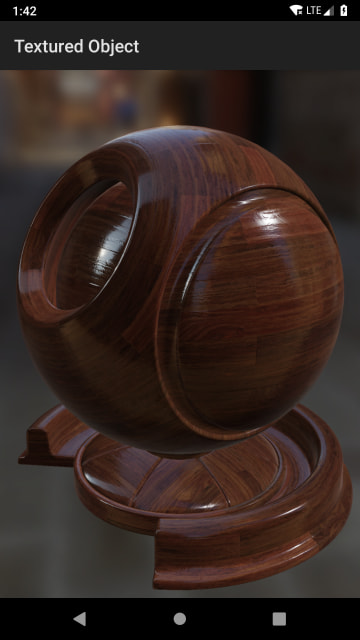
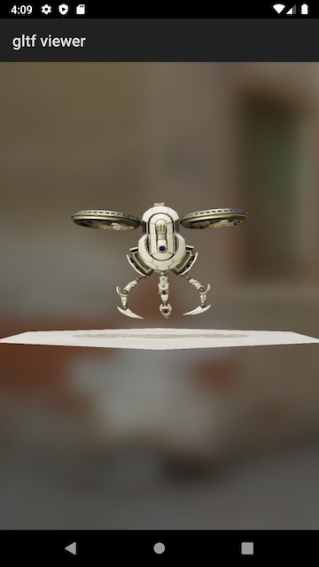
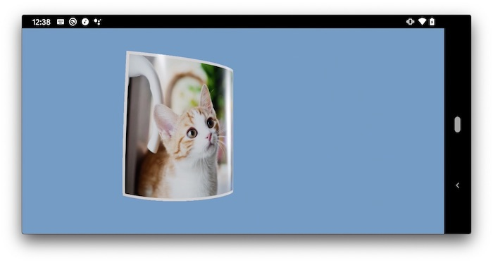
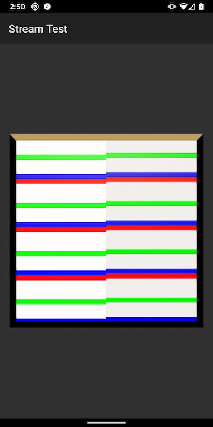

# Filament sample Android apps

This directory contains several sample Android applications that demonstrate how to use the
Filament APIs:

### `hello-triangle`

Demonstrates how to setup a rendering surface for Filament:



### `lit-cube`

Demonstrates how to create a light and a mesh with the attributes required for lighting:


### `live-wallpaper`

Demonstrates how to use Filament as renderer for an Android Live Wallpaper.



### `image-based-lighting`

Demonstrates how to create image-based lights and load complex meshes:



### `textured-object`

Demonstrates how to load and use textures for complex materials:



### `transparent-rendering`

Demonstrates how to render into a transparent `SurfaceView`:


### `texture-view`

Demonstrates how to render into a `TextureView` instead of a `SurfaceView`:


### `material-builder`

Demonstrates how to programmatically generate Filament materials, as opposed to compiling them on
the host machine:


### `gltf-viewer`

Demonstrates how to load glTF models and use the camera manipulator:



### `hello-camera`

Demonstrates how to use `Stream` with Android's Camera2 API:


### `page-curl`

Pure Java app that demonstrates custom vertex shader animation and two-sided texturing.
Applies the deformation described in "Deforming Pages of Electronic Books" by Hong et al.
Users can drag horizontally to turn the page.



### `stream-test`

Tests the various ways to interact with `Stream` by drawing into an external texture using Canvas.
See the following screenshot; if the two sets of stripes are perfectly aligned, then the Filament
frame and the external texture are perfectly synchronized.



## Prerequisites

Before you start, make sure to read [Filament's README](../../README.md). You need to be able to
compile Filament's native library and Filament's AAR for this project. The easiest way to proceed
is to install all the required dependencies and to run the following commands at the root of the
source tree:

```shell
./build.sh -p desktop -i release
./build.sh -p android release
```

This will build all the native components and the AAR required by this sample application.

If you do not use the build script, you must set the `filament_tools_dir` property when invoking
Gradle, either from the command line or from `local.properties`. This property must point to the
distribution/install directory for desktop (produced by make/ninja install). This directory must
contain `bin/matc` and `bin/cmgen`.

Example:
```shell
./gradlew -Pfilament_tools_dir=../../dist-release assembleDebug
```

## Important: SDK location

Either ensure your `ANDROID_HOME` environment variable is set or make sure the root project
contains a `local.properties` file with the `sdk.dir` property pointing to your installation of
the Android SDK.

## Compiling

### Android Studio

You must use the latest stable release of Android Studio. To open the project, point Studio to the
`android` folder. After opening the project and syncing to gradle, select the sample of your choice
using the drop-down widget in the toolbar.

To compile and run each sample make sure you have selected the appropriate build variant
(arm7, arm8, x86 or x86_64). If you are not sure you can simply select the "universal"
variant which includes all the other ones.

### Command Line

From the `android` directory in the project root:

```shell
./gradlew :samples:sample-hello-triangle:installDebug
```

Replace `sample-hello-triangle` with your preferred project.
