# Filament sample Android apps

This directory contains several sample Android applications that demonstrate how to use the
Filament APIs. Click the name of a sample to browse its source code.

| [`hello-triangle`][hello-triangle] | [`lit-cube`][lit-cube] | [`textured-object`][textured-object] | [`image-based-lighting`][image-based-lighting] |
|---|---|---|---|
| 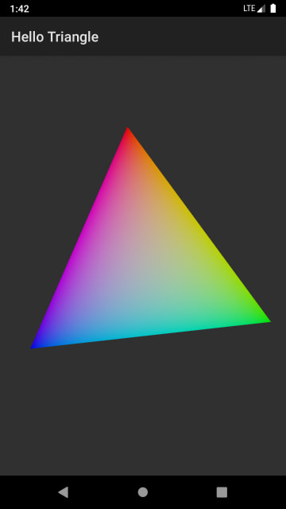 | 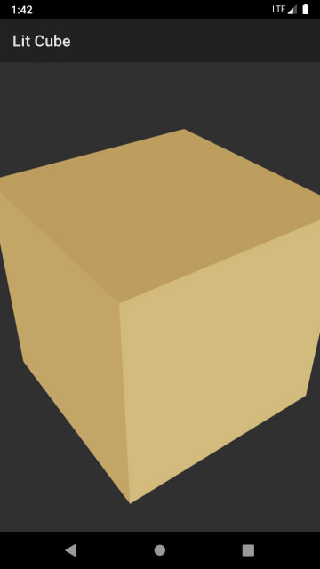 | 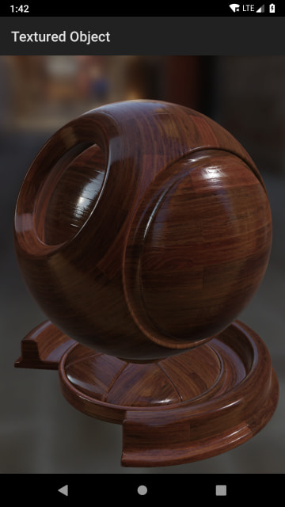 | 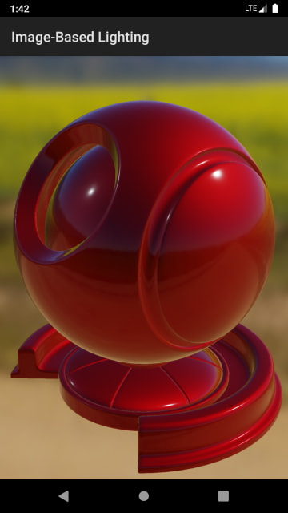 |
| Demonstrates how to set up a rendering surface for Filament and draw a simple animated triangle. This is the best starting point for learning the basic structure of a Filament app. | Demonstrates how to create a light and a mesh with the attributes required for lighting. | Demonstrates how to load and use textures for complex materials. | Demonstrates how to create image-based lights and load complex meshes. |
| **[`material-builder`][material-builder]** | **[`gltf-viewer`][gltf-viewer]** | **[`transparent-view`][transparent-view]** | **[`texture-view`][texture-view]** |
| 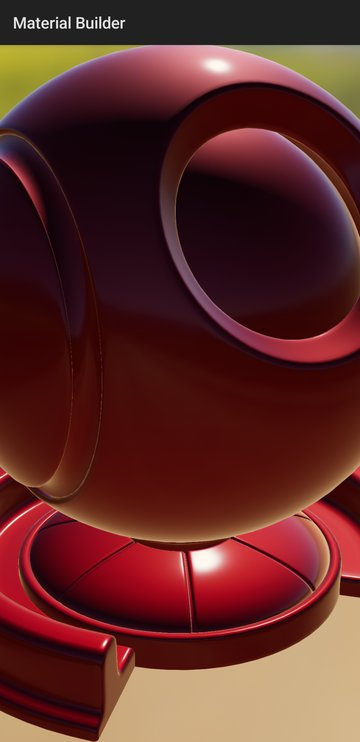 | 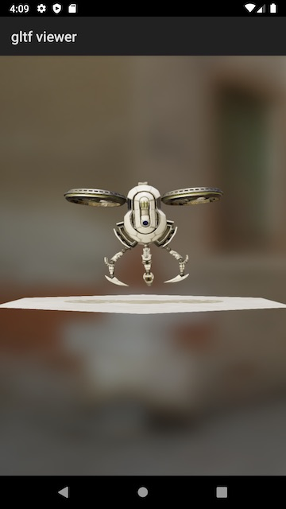 | 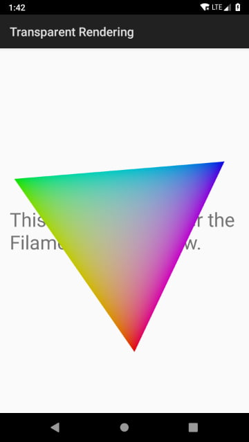 | 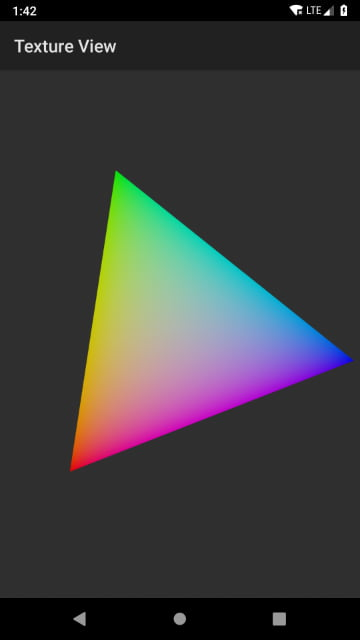 |
| Demonstrates how to programmatically generate Filament materials on the device with `MaterialBuilder`, as opposed to compiling them on the host machine with `matc`. This approach increases the size of the app because it requires the `filamat` library. | Demonstrates how to load glTF models with `ModelViewer` and how to use the camera manipulator. The app can also receive models, zipped glTF files, and HDR environments from a desktop browser through the [remote page](https://google.github.io/filament/remote/). | Demonstrates how to render into a transparent `SurfaceView` so that Android views placed beneath it remain visible. | Demonstrates how to render into a `TextureView` instead of a `SurfaceView`. |
| **[`multi-view`][multi-view]** | **[`texture-target`][texture-target]** | **[`procedural-effect`][procedural-effect]** | **[`procedural-texture-quad`][procedural-texture-quad]** |
| 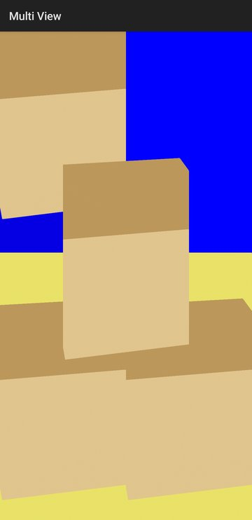 | 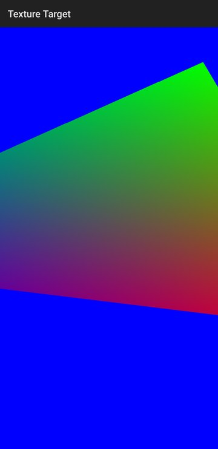 | 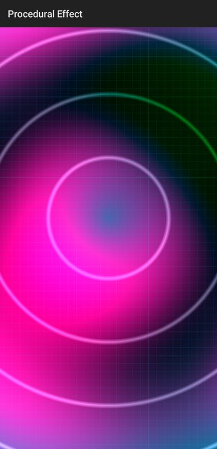 | 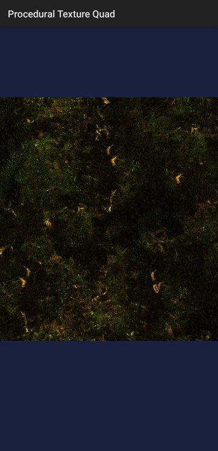 |
| Demonstrates how to render a single scene with multiple Filament `View`s, each with its own viewport. One of the views is drawn on top of the others with translucent blending. | Demonstrates how to render a scene off-screen into a texture with a `RenderTarget`, and then use that texture on a quad drawn on screen. By default, the texture is backed by an Android `HardwareBuffer` and sampled as an external texture. | Demonstrates attribute-less rendering, where the vertex shader generates a full-screen quad from the vertex index without any vertex attributes. The fragment shader then draws an animated procedural pattern driven by a time parameter. | Demonstrates how to draw a textured quad whose geometry is generated entirely in the vertex shader from the vertex index. This shows that attribute-less geometry can still be combined with regular texture sampling. |
| **[`hello-camera`][hello-camera]** | **[`stream-test`][stream-test]** | **[`time-projection`][time-projection]** | **[`material-instance-stress`][material-instance-stress]** |
| 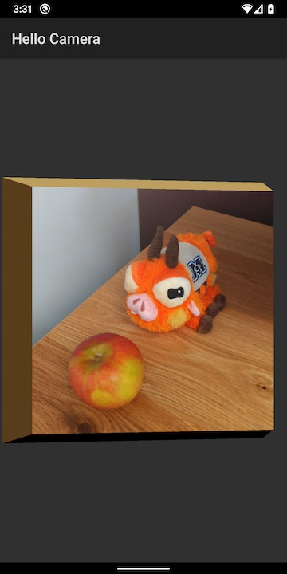 | 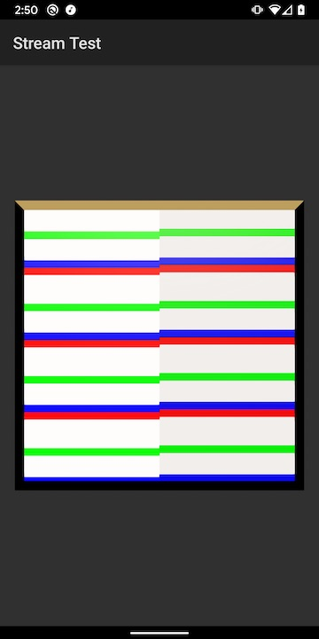 | 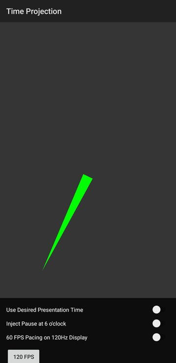 | 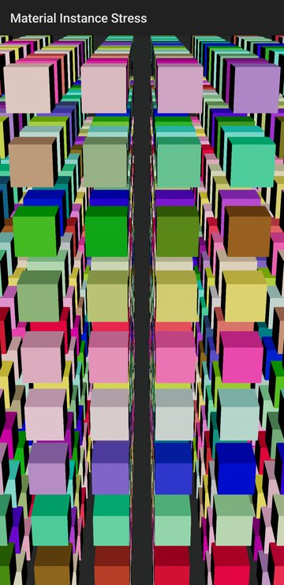 |
| Demonstrates how to use `Stream` with Android's Camera2 API. | Tests the various ways to interact with `Stream` by drawing into an external texture using Canvas. If the two sets of stripes in the screenshot are perfectly aligned, then the Filament frame and the external texture are perfectly synchronized. | Demonstrates frame pacing with `FramePacer` and how to drive material animation from the expected presentation time instead of the vsync time. The clock hand advances by exactly one step per frame, so dropped or late frames are easy to spot. Switches let you inject pauses, change the target frame rate, and compare the two timing modes. | Stress-tests the engine by rendering a grid of 1,000 cubes, each with its own `MaterialInstance`. The color, roughness, and scale of every cube are updated on each frame. |
| **[`page-curl`][page-curl]** | **[`live-wallpaper`][live-wallpaper]** | **[`render-validation`][render-validation]** | **[`cpp-viewer`][cpp-viewer]** |
| 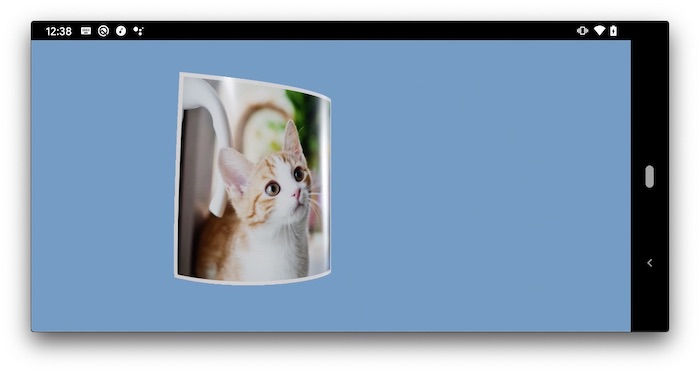 | 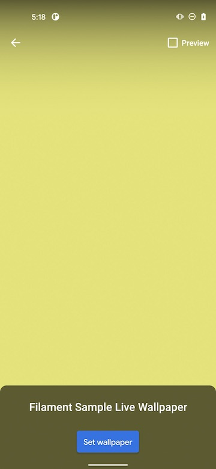 | 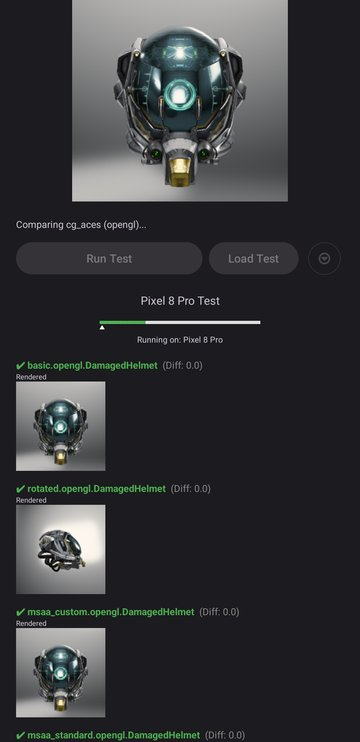 | 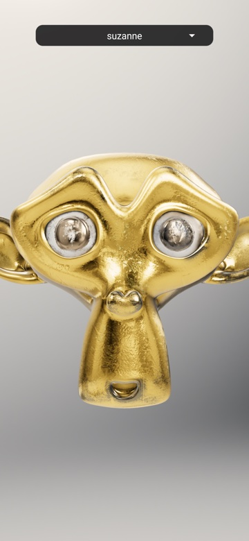 |
| Pure Java app that demonstrates custom vertex shader animation and two-sided texturing. Applies the deformation described in "Deforming Pages of Electronic Books" by Hong et al. Users can drag horizontally to turn the page. | Demonstrates how to use Filament as the renderer for an Android Live Wallpaper. | A tool that renders glTF test scenes with `ModelViewer` on each configured backend, such as OpenGL and Vulkan, and compares the results against golden images. Tests are packaged as zip bundles that contain a JSON configuration, models, and goldens, and the app can generate the goldens on the device. Failing tests are shown with their difference images. | Runs the cross-platform C++ samples from the top-level `samples/` directory on Android through JNI. A drop-down menu switches between samples such as `hellotriangle`, `suzanne`, and `shadowtest`, and a specific sample can be launched with `adb shell am start` and the `sample` extra. |

[hello-triangle]: https://github.com/google/filament/tree/main/android/samples/sample-hello-triangle
[lit-cube]: https://github.com/google/filament/tree/main/android/samples/sample-lit-cube
[textured-object]: https://github.com/google/filament/tree/main/android/samples/sample-textured-object
[image-based-lighting]: https://github.com/google/filament/tree/main/android/samples/sample-image-based-lighting
[material-builder]: https://github.com/google/filament/tree/main/android/samples/sample-material-builder
[gltf-viewer]: https://github.com/google/filament/tree/main/android/samples/sample-gltf-viewer
[transparent-view]: https://github.com/google/filament/tree/main/android/samples/sample-transparent-view
[texture-view]: https://github.com/google/filament/tree/main/android/samples/sample-texture-view
[multi-view]: https://github.com/google/filament/tree/main/android/samples/sample-multi-view
[texture-target]: https://github.com/google/filament/tree/main/android/samples/sample-texture-target
[procedural-effect]: https://github.com/google/filament/tree/main/android/samples/sample-procedural-effect
[procedural-texture-quad]: https://github.com/google/filament/tree/main/android/samples/sample-procedural-texture-quad
[hello-camera]: https://github.com/google/filament/tree/main/android/samples/sample-hello-camera
[stream-test]: https://github.com/google/filament/tree/main/android/samples/sample-stream-test
[time-projection]: https://github.com/google/filament/tree/main/android/samples/sample-time-projection
[material-instance-stress]: https://github.com/google/filament/tree/main/android/samples/sample-material-instance-stress
[page-curl]: https://github.com/google/filament/tree/main/android/samples/sample-page-curl
[live-wallpaper]: https://github.com/google/filament/tree/main/android/samples/sample-live-wallpaper
[render-validation]: https://github.com/google/filament/tree/main/android/samples/sample-render-validation
[cpp-viewer]: https://github.com/google/filament/tree/main/android/samples/sample-cpp-viewer

## Building Samples

Before you start, make sure to read [Filament's README](../../README.md). You need to be able to
compile Filament's native library and Filament's AAR for this project. The easiest way to proceed
is to install all the required dependencies and to run the following commands at the root of the
source tree.

To build the samples, please follow the steps described in [BUILDING.md](../../BUILDING.md#android)

