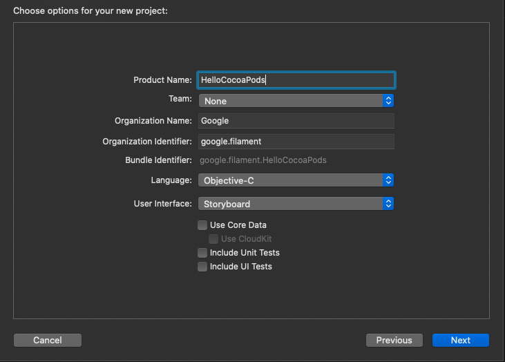
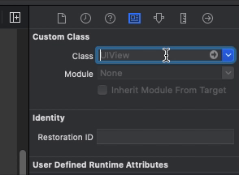
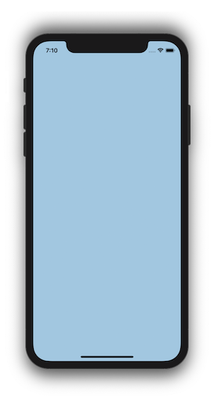
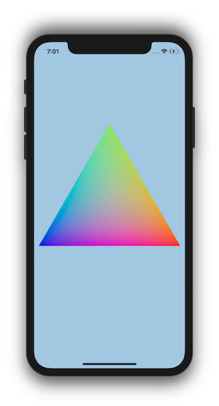

# CocoaPods Hello Triangle

As of release 1.8.0, you can install Filament in your iOS application using CocoaPods.

This guide will walk you through creating a basic "hello triangle" iOS application using Filament and the Metal backend.


The full source for this example is [here](https://github.com/google/filament/tree/main/ios/samples/HelloCocoaPods). If you're just looking to get something up and running quickly, download the project, `pod install`, build, and run.

We'll be walking through 7 steps to get the rotating triangle up and running. All of the code we'll be writing will be in a single ViewController.mm file, and you can follow along [here](https://github.com/google/filament/blob/main/ios/samples/HelloCocoaPods/HelloCocoaPods/ViewController.mm).

- [1. Creating a Boilerplate App]("#creating-a-boilerplate-app-with-filament)
- [2. Instantiating Filament](#instantiating-the-filament-engine)
- [3. Creating a SwapChain](#creating-a-swapchain)
- [4. Clearing the Screen](#clearing-the-screen)
- [5. Drawing a Triangle](#drawing-a-triangle)
- [6. Compiling a Custom Material](#compiling-a-custom-material)
- [7. Animating the Triangle](#animating-the-triangle)

## Creating a Boilerplate App with Filament

We'll start fresh by creating a new Single View App in Xcode.


Give your app a name, and use the default options.



If you haven't used CocoaPods before, I recommend watching [this Route 85 video](https://www.youtube.com/watch?v=iEAjvNRdZa0) to help you get set up.

Create a Podfile in the Xcode project directory with the following:

```
platform :ios, '11.0'

target 'HelloCocoaPods' do
    pod 'Filament'
end
```

Then run:

```shell
pod install
```

Close the project and then re-open the newly created HelloCocoaPods.xcworkspace file.

## Instantiating the Filament Engine

Before we do anything with Filament, we first need to include the appropriate headers. Filament exposes a C++ API, so any files that include Filament headers need to be compiled in a variant of C++. We'll be using Objective-C++.

You should be able to simply change the extension of the default ViewController from .m to .mm, though I've found Xcode to be buggy with this on occasion. To make sure Xcode recognizes it as an Objective-C++ file, check that the type of file is "Objective-C++ Source".


Then, add the following to the top of ViewController.

```obj-c
#include <filament/Engine.h>

using namespace filament;
```

We'll need to keep track of a few Filament objects, so let's add a section for private instance variables and add a pointer for our `Engine` instance.

```obj-c
@implementation Viewcontroller {
     Engine* _engine;
}
```

The Filament `Engine` is our main entrypoint into Filament. We start by instantiating it inside `viewDidLoad`.

```obj-c
- (void)viewDidLoad {
    [super viewDidLoad];

    _engine = Engine::create(Engine::Backend::METAL);
}
```

We specify `Engine::Backend::METAL` to select the Metal backend. Filament also supports OpenGL on iOS, but we strongly recommend sticking to Metal.

Every Filament object we create must also be destroyed. Add the `dealloc` method and the following:

```obj-c
- (void)dealloc {
    _engine->destroy(&_engine);
}
```

If you compile and run the app now you should see output similar to the following:

```
FEngine (64 bits) created at 0x10ab94000 (threading is enabled)
FEngine resolved backend: Metal
```

## Creating a SwapChain

Before we can render anything, we'll first need to create a `SwapChain`. The `SwapChain` represents a platform-specific surface that can be rendered into. On iOS with Metal, it's a [`CAMetalLayer`](https://developer.apple.com/documentation/quartzcore/cametallayer).

We could set up our own `CAMetalLayer` if we wanted to, but Apple provides a `MTKView` that is already backed by a `CAMetalLayer`. It also has a delegate protocol with some methods that will make things easier for us.

Inside Main.storyboard, change the type of ViewController's view to a `MTKView`.




Include the SwapChain.h and MTKView.h headers and make the `ViewController` conform to the `MTKViewDelegate` protocol.

```obj-c
#include <filament/SwapChain.h>

#import <MetalKit/MTKView.h>

@interface ViewController () <MTKViewDelegate>

@end
```

Add a new private var:

```obj-c
SwapChain* _swapChain;
```

Inside `viewDidLoad`, we'll set our `ViewController` as the `MTKView` delegate and instantiate our `SwapChain`. To instantiate the `SwapChain`, we pass in `view.layer` which, because we set our `View` to a `MTKView`, will be a `CAMetalLayer`. Filament's API is platform-agnostic, which is why we need to cast the layer to a `void*`.

```obj-c
MTKView* mtkView = (MTKView*) self.view;
mtkView.delegate = self;
_swapChain = _engine->createSwapChain((__bridge void*) mtkView.layer);
```

The `SwapChain` needs to be destroyed in our `dealloc` function. We'll destroy the objects in the reverse order we created them; the `Engine` object should always be the the last object we destroy.

```obj-c
_engine->destroy(_swapChain);
_engine->destroy(&_engine);
```

Finally, add stubs for some `MTKViewDelegate` methods, which we'll fill in later.

```obj-c
- (void)mtkView:(nonnull MTKView*)view drawableSizeWillChange:(CGSize)size {
    // todo
}

- (void)drawInMTKView:(nonnull MTKView*)view {
    // todo
}
```

## Clearing The Screen

We now have a Filament `Engine` and `SwapChain` set up. We'll need a few more objects before we can render anything.

A Filament `Renderer` gives us an API to render frames into the `SwapChain`. It takes a `View`, which defines a `Viewport`, `Scene` and `Camera` for rendering. The `Camera` represents a vantage point into a `Scene`, which contains references to all the entities we want to render.

Creating these are objects is straightforward. First, include the appropriate headers

```c++
#include <filament/Renderer.h>
#include <filament/View.h>
#include <filament/Camera.h>
#include <filament/Scene.h>
#include <filament/Viewport.h>

#include <utils/Entity.h>
#include <utils/EntityManager.h>

using namespace utils;
```

add the following private vars

```obj-c
Renderer* _renderer;
View* _view;
Scene* _scene;
Camera* _camera;
Entity _cameraEntity;
```

and then instantiate them

```obj-c
_renderer = _engine->createRenderer();
_view = _engine->createView();
_scene = _engine->createScene();
```

The camera is a bit special. Filament uses an entity-component system, so we'll first need to create an `Entity` which we then attach a `Camera` component to.

```obj-c
_cameraEntity = EntityManager::get().create();
_camera = _engine->createCamera(_cameraEntity);
```

Let's also inform our `Renderer` to clear to a light blue clear color, so we can know everything is working.

```obj-c
_renderer->setClearOptions({
    .clearColor = {0.25f, 0.5f, 1.0f, 1.0f},
    .clear = true
});
```

The `Camera` and `Scene` need to be wired up to the `View`.

```obj-c
_view->setScene(_scene);
_view->setCamera(_camera);
```

Our newly created objects get cleaned up inside `dealloc`.

```obj-c
_engine->destroyCameraComponent(_cameraEntity);
EntityManager::get().destroy(_cameraEntity);
_engine->destroy(_scene);
_engine->destroy(_view);
_engine->destroy(_renderer);
```

We need to set the `Viewport` on our `View`, which we want to do whenever the size of our `SwapChain` changes. We'll also update the projection matrix on our camera.

Let's create a new method, `resize:`, which will update the `Viewport` on our `View` to a given size. We'll call it in the `mtkView:drawableSizeWillChange:` delegate method, and at the end of `viewDidLoad`:

```obj-c
- (void)resize:(CGSize)size {
    _view->setViewport({0, 0, (uint32_t) size.width, (uint32_t) size.height});

    const double aspect = size.width / size.height;
    const double left   = -2.0 * aspect;
    const double right  =  2.0 * aspect;
    const double bottom = -2.0;
    const double top    =  2.0;
    const double near   =  0.0;
    const double far    =  1.0;
    _camera->setProjection(Camera::Projection::ORTHO, left, right, bottom, top, near, far);
}

- (void)viewDidLoad {
    ...

    // Give our View a starting size based on the drawable size.
    [self resize:mtkView.drawableSize];
}

- (void)mtkView(nonnull MTKView*)view drawableSizeWillChange:(CGSize)size {
    [self resize:size];
}
```

Lastly, in order to render, we'll call a few Filament API methods inside the `drawInMTKView:` method:

```obj-c
- (void)drawInMTKView:(nonnull MTKView*)view {
    if (_renderer->beginFrame(_swapChain)) {
        _renderer->render(_view);
        _renderer->endFrame();
    }
}
```

The `beginFrame` method instructs Filament to start rendering to our specific `SwapChain` instance. It returns `true` if the engine is ready for another frame. It returns `false` to signal us to skip this frame, which could happen if we're sending frames down too quickly for the GPU to process.

At this point, you should be able to build and run the app, and you'll see a blue screen.



## Drawing a Triangle

In order to draw a triangle, we need to create vertex and index buffers to define its geometry. We'll then create a `Renderable` component.

We'll start by including some additional headers and adding a few new private vars:

```obj-c
#include <filament/VertexBuffer.h>
#include <filament/IndexBuffer.h>
#include <filament/RenderableManager.h>

...

VertexBuffer* _vertexBuffer;
IndexBuffer* _indexBuffer;
Entity _triangle;
```

First, we'll define the data for a single vertex.

```obj-c
struct Vertex {
    math::float2 position;
    math::float3 color;
};
```

Creating a `VertexBuffer` and `IndexBuffer` is a matter of giving Filament a pointer to the data, along with information on its layout and size. Filament uses `BufferDescriptors` to accomplish this.

Inside `viewDidLoad`, we'll statically define some verticies and indices and create a `BufferDescriptor` for each.

```obj-c
static const Vertex TRIANGLE_VERTICES[3] = {
    { { 0.867, -0.500}, {1.0, 0.0, 0.0} },
    { { 0.000,  1.000}, {0.0, 1.0, 0.0} },
    { {-0.867, -0.500}, {0.0, 0.0, 1.0} },
};
static const uint16_t TRIANGLE_INDICES[3] = { 0, 1, 2 };

VertexBuffer::BufferDescriptor vertices(TRIANGLE_VERTICES, sizeof(Vertex) * 3, nullptr);
IndexBuffer::BufferDescriptor indices(TRIANGLE_INDICES, sizeof(uint16_t) * 3, nullptr);
```

The last argument is an optional callback function, which will be called after Filament is done uploading the data to the GPU. Inside the callback, you'd typically release the memory of any buffers via a `free` or `delete` call. We pass `nullptr` because we don't need a callback as our vertex and index buffer memory is static.

Now we can instantiate our `VertexBuffer` and `IndexBuffer`.

```obj-c
using Type = VertexBuffer::AttributeType;

const uint8_t stride = sizeof(Vertex);
_vertexBuffer = VertexBuffer::Builder()
    .vertexCount(3)
    .bufferCount(1)
    .attribute(VertexAttribute::POSITION, 0, Type::FLOAT2, offsetof(Vertex, position), stride)
    .attribute(VertexAttribute::COLOR,    0, Type::FLOAT3, offsetof(Vertex, color),    stride)
    .build(*_engine);

_indexBuffer = IndexBuffer::Builder()
    .indexCount(3)
    .bufferType(IndexBuffer::IndexType::USHORT)
    .build(*_engine);

_vertexBuffer->setBufferAt(*_engine, 0, std::move(vertices));
_indexBuffer->setBuffer(*_engine, std::move(indices));
```

We first create an `Entity` like we did for our camera. This time, we're attaching a `Renderable` component to the entity. The `Renderable` component takes geometry defined by our vertex and index buffers, and makes the entity visible in our scene.

```obj-c
_triangle = utils::EntityManager::get().create();

using Primitive = RenderableManager::PrimitiveType;
RenderableManager::Builder(1)
    .geometry(0, Primitive::TRIANGLES, _vertexBuffer, _indexBuffer, 0, 3)
    .culling(false)
    .receiveShadows(false)
    .castShadows(false)
    .build(*_engine, _triangle);

// Add the triangle to the scene.
_scene->addEntity(_triangle);
```

Destroy the entity and buffers in `dealloc`.

```obj-c
_engine->destroy(_triangle);
EntityManager::get().destroy(_triangle);
_engine->destroy(_indexBuffer);
_engine->destroy(_vertexBuffer);
```

If you build and run the app now, you should see a plain white triangle. When we created the renderable, we didn't specify any specific `Material` to use, so Filament used a default, white material. Let's create a custom material to color the triangle.


## Compiling a Custom Material

For simplicity, we're going to compile a custom material at runtime. For production, we recommend using our matc tool to compile materials offline. You can download it as part of one of our [releases](https://github.com/google/filament/releases).

First, add a few more headers. We'll be using Filament's filamat library to compile a custom material.

```c++
#include <filament/Material.h>
#include <filament/MaterialInstance.h>

#include <filamat/MaterialBuilder.h>
```

We'll store our material in a new private var. We'll also need one to store a material _instance_. You can think of a material as a "template", where a material instance is an instantiation of the template (similar to OOP classes and instances). For more information on Filament materials, read the [Filament Materials Guide](https://google.github.io/filament/Materials.html).

```obj-c
Material* _material;
MaterialInstance* _materialInstance;
```

We'll use the filamat library to compile a material into a  package, which we can then load into Filament. The material will be simple; it will load the interpolated color attribute and set it as the `baseColor`.

Make sure to insert this code into `viewDidLoad` _before_ we create our `Renderable`.

```obj-c
// init must be called before we can build any materials.
filamat::MaterialBuilder::init();

// Compile a custom material to use on the triangle.
filamat::Package pkg = filamat::MaterialBuilder()
    // The material name, only used for debugging purposes.
    .name("Triangle material")
    // Use the unlit shading mode, because we don't have any lights in our scene.
    .shading(filamat::MaterialBuilder::Shading::UNLIT)
    // Expose the COLOR attribute visible to our shader code.
    .require(VertexAttribute::COLOR)
    // Custom GLSL fragment shader
    .material("void material (inout MaterialInputs material) {"
              "  prepareMaterial(material);"
              "  material.baseColor = getColor();"
              "}")
    // Compile for Metal on mobile platforms.
    .targetApi(filamat::MaterialBuilder::TargetApi::METAL)
    .platform(filamat::MaterialBuilder::Platform::MOBILE)
    .build();
assert(pkg.isValid());

// shutdown should be called after all materials are built.
filamat::MaterialBuilder::shutdown();
```

Now that we have a `filamat::Package` representing the material, we can use it to instantiate a Filament `Material`. Note that again, we recommend using the matc command-line tool to compile material packages during your app's compilation phase if possible, instead of at run-time.

```obj-c
// Create a Filament material from the Package.
_material = Material::Builder()
    .package(pkg.getData(), pkg.getSize())
    .build(*_engine);
_materialInstance = _material->getDefaultInstance();
```

Now we can use the `MaterialInstance` when creating our `Renderable`.

```obj-c
// Create a renderable using our geometry and material.
using Primitive = RenderableManager::PrimitiveType;
RenderableManager::Builder(1)
    .geometry(0, Primitive::TRIANGLES, _vertexBuffer, _indexBuffer, 0, 3)
    // Use the MaterialInstance we just created.
    .material(0, _materialInstance)
    .culling(false)
    .receiveShadows(false)
    .castShadows(false)
    .build(*_engine, _triangle);
```

Lastly, we make sure to destroy everything inside `dealloc`.

```obj-c
_engine->destroy(_materialInstance);
_engine->destroy(_material);
```

Build and run. You should see the same triangle, but with colors.



## Animating the Triangle

We'll do this by animating a transform on our triangle entity. First, include a new header.

```obj-c
#include <filament/TransformManager.h>
```

When we create our triangle entity, we'll also attach a transform component. We've already seen two other components: `Renderable` and `Camera`. The `Transform` component allows us to set world-space transformations on entities.

Inside `viewDidLoad`, after we create the triangle entity's `Renderable` component, we'll also attach a `Transform` component.

```obj-c
// Add a Transform component to the triangle, so we can animate it.
_engine->getTransformManager().create(_triangle);
```

Create a new function, `update`, and add call it inside the `drawInMTKView:` method.

```obj-c
- (void)update {
    auto& tm = _engine->getTransformManager();
    auto i = tm.getInstance(_triangle);
    const auto time = CACurrentMediaTime();
    tm.setTransform(i, math::mat4f::rotation(time, math::float3 {0.0, 0.0, 1.0}));
}

- (void)drawInMTKView:(nonnull MTKView*)view {
    [self update];
    if (_renderer->beginFrame(_swapChain)) {
        _renderer->render(_view);
        _renderer->endFrame();
    }
}
```

Now we should see the triangle rotate around its z axis.


## Next Steps

In this guide we've covered how to install Filament with CocoaPods and get rendering using the Metal backend. We also compiled a custom material. Again, here's the [complete sample code](https://github.com/google/filament/tree/main/ios/samples/HelloCocoaPods) for the app. If you're interesting in learning more, check out Filament's additional [iOS samples](https://github.com/google/filament/tree/main/ios/samples). If you have any problems, feel free to open an [issue](https://github.com/google/filament/issues).
