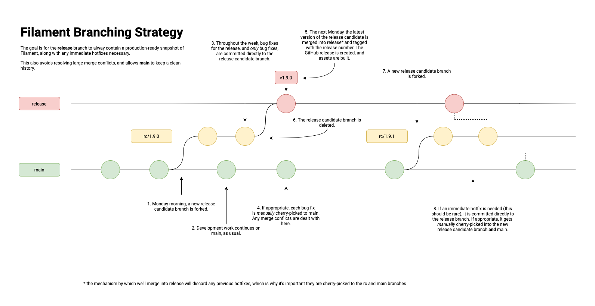

# Branching

## Which branch do I open my PR against?

For normal development, open PRs against main. Once they're merged, no further action is necessary.

If you discover a bug with the latest *release candidate*, open a bug fix PR against the release
candidate branch (rc/1.9.0, for example). Once the PR is merged, decide whether it makes sense for
the fix to also go into main. If it was a temporary fix, simply make the _correct_ fix in main as
you would any other change. If the fix is good for main as well, use `git cherry-pick <sha>` to
cherry-pick it into main.

If an immediate hotfix is needed on the *release* branch, open a PR against the release branch. Once
the PR is merged, decide whether the fix is temporary or permanent. If the fix was temporary, make
the _correct_ fix in both the next release candidate branch _and_ main. If the fix is good, use `git
cherry-pick <sha>` to cherry-pick it into the relase candidate branch and main.

## What consitutes a bug?

Only bug fix PRs should be opened against the *release candidate* branch.

Bugs are defined as one of the following _introduced since the prior release_:

- crashes
- rendering issues
- unintentional binary size increases
- unintentional public API changes

For example, a long-standing crash just recently discovered would not necessitate a bug fix PR.
