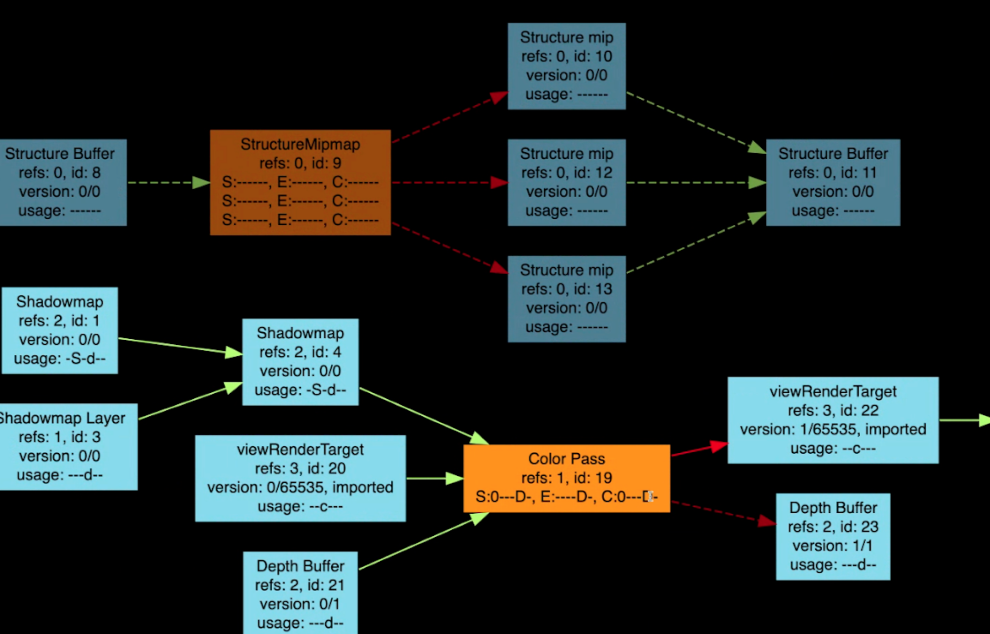

# FrameGraph

FrameGraph is a framework within Filament for computing resources needed to
render a frame. The framework enables declaring dependencies between resources.

For example, when rendering shadows, we would need to first compute and store the
shadow map into a texture resource, and then the later color pass would then
sample that texture to attenuate the final output color. That creates a
dependency on the shadow map from the color pass. Filament uses FrameGraph to
declare that dependency.

## Details

### Dependency Graph

The core of this framework is
[a class that defines a dependency graph][dependency_graph] — that is, the class
defines nodes and connections between nodes. This class makes assumptions about
the types of its nodes. Like many other classes within Filament, this class is
without virtual function declaration to avoid paying the cost of virtual calls.

This class has additional functions to detect whether there is a cycle in the
graph, and it is able to cull unreachable nodes.

### FrameGraph

A frame graph consists of two types of nodes

*   Resource
    *   This represents a generic resource such as a texture
    *   90% of the time, this is a texture.
*   Pass
    *   This represents a "computation/rendering process"
    *   It takes a set of resources
    *   It outputs a set of resources

Edges can be created in the following three directions:

*   Resource → Pass = A read
*   Pass → Resource = A write
*   Resource → Resource = A resource/subresource relationship.

### An example

To better understand FrameGraph, we consider the following graphical
representation of a real graph. In this graph, blue nodes denote "Resources" and
orange nodes denote "Passes."



In this graph, we see that the "Color Pass" takes as input the "Shadowmap",
which has edges going into it, meaning that it's a texture array. The output of
the "Color Pass" are "viewRenderTarget" and "Depth Buffer."

Note that there is an outgoing edge from "viewRenderTarget", where the color
buffer will be used as input in the post-processing passes. But since "Depth
Buffer" is not relevant to the rest of the rendering, it does not have an
outgoing edge.

Since the graph is guaranteed to be acyclic, we can produce a
dependency-respecting ordering of the nodes by traversal of the graph (e.g.
topological sort).

### Example code

We take a snippet of in production code to look through the details of building
a graph.

```
struct StructurePassData {
    FrameGraphId<FrameGraphTexture> depth;
    FrameGraphId<FrameGraphTexture> picking;
};

...

// generate depth pass at the requested resolution
auto& structurePass = fg.addPass<StructurePassData>("Structure Pass",
        [&](FrameGraph::Builder& builder, auto& data) {
            bool const isES2 = mEngine.getDriverApi().getFeatureLevel() == FeatureLevel::FEATURE_LEVEL_0;
            data.depth = builder.createTexture("Structure Buffer", {
                    .width = width, .height = height,
                    .levels = uint8_t(levelCount),
                    .format = isES2 ? TextureFormat::DEPTH24 : TextureFormat::DEPTH32F });

            // workaround: since we have levels, this implies SAMPLEABLE (because of the gl
            // backend, which implements non-sampleables with renderbuffers, which don't have levels).
            // (should the gl driver revert to textures, in that case?)
            data.depth = builder.write(data.depth,
                    FrameGraphTexture::Usage::DEPTH_ATTACHMENT | FrameGraphTexture::Usage::SAMPLEABLE);

            if (config.picking) {
                data.picking = builder.createTexture("Picking Buffer", {
                        .width = width, .height = height,
                        .format = isES2 ? TextureFormat::RGBA8 : TextureFormat::RG32F });

                data.picking = builder.write(data.picking,
                        FrameGraphTexture::Usage::COLOR_ATTACHMENT);
            }

            builder.declareRenderPass("Structure Target", {
                    .attachments = { .color = { data.picking }, .depth = data.depth },
                    .clearFlags = TargetBufferFlags::COLOR0 | TargetBufferFlags::DEPTH
            });
        },
        [=, renderPass = pass](FrameGraphResources const& resources,
                auto const&, DriverApi&) mutable {
            Variant structureVariant(Variant::DEPTH_VARIANT);
            structureVariant.setPicking(config.picking);

            auto out = resources.getRenderPassInfo();
            renderPass.setRenderFlags(structureRenderFlags);
            renderPass.setVariant(structureVariant);
            renderPass.appendCommands(mEngine, RenderPass::CommandTypeFlags::SSAO);
            renderPass.sortCommands(mEngine);
            renderPass.execute(mEngine, resources.getPassName(), out.target, out.params);
        }
);

```

The `addPass` method creates a node and it take in two lambda functions as its
parameter. The first lambda sets up the resources that will be used in the
execution of the Pass. This lambda is executed immediately and synchronously when
`addPass` is called. The second lambda is the actual execution of the pass; it is
executed when the graph has been completed and is traversed.

### What does it do?

In the above, we see through a graph and code what a frame graph looks like and
how to build it. We provide here a more detailed description of what it does:

*   Manages the lifetime of the resources
    *   Know how the resources are allocated, when it is used, and when it can
        be freed
*   Calculates the usage bit of the texture resource
    *   The usage bit is used to indicate what the resources are used for: for
        example, will it be blitted to or sampled from?
*   Calculates the load/store bits of the rendertargets within a renderpass.
    *   For example, if we are rendering into a texture, we would want to mark
        it with the bit "keep" as oppose to "discard".

## Additional details

*   In a previous version of FrameGraph, there were only edges between Resource
    and Pass. For example, a Pass and Pass edge would not make logical sense.
    The following iteration, allowed for edges between two Resource nodes to
    indicate that one is a subresource of another (i.e. a layer in a mip-mapped
    texture).
*   There are two extra features of FrameGraph that are important but has a lot
    subtlety, and, incidentally, their inclusion added great complexity to the
    implementation
    *   Importing/exporting resources outside of the graph
        *   In most cases, the graph and its resources are "alive" for only for
            a frame.
        *   For techniques like TAA (Temporal Anti-aliasing), we need to be able
            to import past output into the current FrameGraph
*   Future Work
    *   For CPU only passes, explore multi-threading and re-ordering of the Pass
        nodes
    *   A graphical debugger for online debugging session in the spirit of
        `matdbg`.
*   "RenderGraph" might be a more fitting name for this framework.

[dependency_graph]: https://github.com/google/filament/blob/main/libs/gltfio/src/DependencyGraph.h
