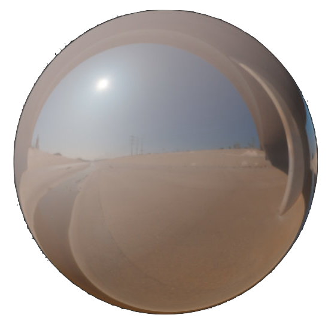

# CRAFTING PHYSICALLY-BASED MATERIALS

## BASE COLOR/sRGB
Defines the perceived color of an object (sometimes called **albedo**). More precisely:

   → the **diffuse color** of a **non-metallic** object\
   → the **specular color** of a **metallic object**

### BASE COLOR LUMINOSITY

  

  

    
&nbsp 

    

      

      

        
 Non-metal range 

        
 10 - 240 

      

      

    

    
&nbsp 

  

  

    
&nbsp 

    

      

      

        
 Metal range 

        
 170 - 255 

      

      

    

  

### METALLIC SAMPLES

<table>
  <tbody>
    <tr>
        <td style="min-width:70px;height:42px;padding-left:0px;border-color:transparent;">
            

            

        </td>
        <td style="min-width:70px;height:42px;padding-left:0px;border-color:transparent;">
            

            

        </td>
        <td style="min-width:70px;height:42px;padding-left:0px;border-color:transparent;">
            

            

        </td>
        <td style="min-width:70px;height:42px;padding-left:0px;border-color:transparent;">
            

            

        </td>
        <td style="min-width:70px;height:42px;padding-left:0px;border-color:transparent;">
            

            

        </td>
        <td style="min-width:70px;height:42px;padding-left:0px;border-color:transparent;">
            

            

        </td>
        <td style="min-width:70px;height:42px;padding-left:0px;border-color:transparent;">
            

            

        </td>
        <td style="min-width:70px;height:42px;padding-left:0px;border-color:transparent;">
            

            

        </td>
    </tr>
    <tr style="background-color:transparent">
        <td style="border-color:transparent;padding:3px 10px"> Silver </td>
        <td style="border-color:transparent;padding:3px 10px"> Aluminum </td>
        <td style="border-color:transparent;padding:3px 10px"> Platinum </td>
        <td style="border-color:transparent;padding:3px 10px"> Iron </td>
        <td style="border-color:transparent;padding:3px 10px"> Titanium </td>
        <td style="border-color:transparent;padding:3px 10px"> Copper </td>
        <td style="border-color:transparent;padding:3px 10px"> Gold </td>
        <td style="border-color:transparent;padding:3px 10px"> Brass </td>
    </tr>
    <tr style="background-color:transparent">
        <td style="border-color:transparent;padding:3px 10px"> 250,249,245 </td>
        <td style="border-color:transparent;padding:3px 10px"> 244,245,245 </td>
        <td style="border-color:transparent;padding:3px 10px"> 214,209,200 </td>
        <td style="border-color:transparent;padding:3px 10px"> 192,189,186 </td>
        <td style="border-color:transparent;padding:3px 10px"> 206,200,194 </td>
        <td style="border-color:transparent;padding:3px 10px"> 251,216,184 </td>
        <td style="border-color:transparent;padding:3px 10px"> 255,220,157 </td>
        <td style="border-color:transparent;padding:3px 10px"> 244,228,173 </td>
    </tr>
    <tr style="background-color:transparent">
        <td style="border-color:transparent;padding:3px 10px"> #faf9f5 </td>
        <td style="border-color:transparent;padding:3px 10px"> #faf5f5 </td>
        <td style="border-color:transparent;padding:3px 10px"> #d6d1c8 </td>
        <td style="border-color:transparent;padding:3px 10px"> #c0bdba </td>
        <td style="border-color:transparent;padding:3px 10px"> #cec8c2 </td>
        <td style="border-color:transparent;padding:3px 10px"> #fbd8b8 </td>
        <td style="border-color:transparent;padding:3px 10px"> #fedc9d </td>
        <td style="border-color:transparent;padding:3px 10px"> #f4e4ad </td>
    </tr>
  </tbody>
</table>

### NON-METALLIC SAMPLES

<table>
  <tbody>
    <tr>
        <td style="min-width:70px;height:42px;padding-left:0px;border-color:transparent;">
            

            

        </td>
        <td style="min-width:70px;height:42px;padding-left:0px;border-color:transparent;">
            

            

        </td>
        <td style="min-width:70px;height:42px;padding-left:0px;border-color:transparent;">
            

            

        </td>
        <td style="min-width:70px;height:42px;padding-left:0px;border-color:transparent;">
            

            

        </td>
        <td style="min-width:70px;height:42px;padding-left:0px;border-color:transparent;">
            

            

        </td>
        <td style="min-width:70px;height:42px;padding-left:0px;border-color:transparent;">
            

            

        </td>
        <td style="min-width:70px;height:42px;padding-left:0px;border-color:transparent;">
            

            

        </td>
        <td style="min-width:70px;height:42px;padding-left:0px;border-color:transparent;">
            

            

        </td>
    </tr>
    <tr style="background-color:transparent">
        <td style="border-color:transparent;padding:3px 10px"> Coal </td>
        <td style="border-color:transparent;padding:3px 10px"> Rubber </td>
        <td style="border-color:transparent;padding:3px 10px"> Mud </td>
        <td style="border-color:transparent;padding:3px 10px"> Wood </td>
        <td style="border-color:transparent;padding:3px 10px"> Vegetation </td>
        <td style="border-color:transparent;padding:3px 10px"> Brick </td>
        <td style="border-color:transparent;padding:3px 10px"> Sand </td>
        <td style="border-color:transparent;padding:3px 10px"> Concrete </td>
    </tr>
    <tr style="background-color:transparent">
        <td style="border-color:transparent;padding:3px 10px"> 50,50,50 </td>
        <td style="border-color:transparent;padding:3px 10px"> 53,53,53 </td>
        <td style="border-color:transparent;padding:3px 10px"> 85,61,49 </td>
        <td style="border-color:transparent;padding:3px 10px"> 135,92,60 </td>
        <td style="border-color:transparent;padding:3px 10px"> 123,130,78 </td>
        <td style="border-color:transparent;padding:3px 10px"> 148,125,117 </td>
        <td style="border-color:transparent;padding:3px 10px"> 177,168,132 </td>
        <td style="border-color:transparent;padding:3px 10px"> 192,191,187 </td>
    </tr>
    <tr style="background-color:transparent">
        <td style="border-color:transparent;padding:3px 10px"> #323232 </td>
        <td style="border-color:transparent;padding:3px 10px"> #353535 </td>
        <td style="border-color:transparent;padding:3px 10px"> #553d31 </td>
        <td style="border-color:transparent;padding:3px 10px"> #875c3c </td>
        <td style="border-color:transparent;padding:3px 10px"> #7b824e </td>
        <td style="border-color:transparent;padding:3px 10px"> #947d75 </td>
        <td style="border-color:transparent;padding:3px 10px"> #b1a884 </td>
        <td style="border-color:transparent;padding:3px 10px"> #c0bfbb </td>
    </tr>
  </tbody>
</table>

## METALLIC/GRAYSCALE
Defines whether a surface is **dielectric** (0.0, **non-metal**) or **conductor** (1.0, **metal**).
Pure, unweathered surfaces are rare and will be either **0.0** or **1.0**.
Rust is not a conductor.

<table>
  <thead style="background-color:transparent">
    <tr style="border-color:transparent">
      <th>0.0</th><th>0.1</th><th>0.2</th><th>0.3</th><th>0.4</th><th>0.5</th><th>0.6</th><th>0.7</th><th>0.8</th><th>0.9</th><th>1.0</th>
    </tr>
  </thead>
  <tbody>
    <tr>
        <td style="padding:0;border-color:transparent"></img></td>
        <td style="padding:0;border-color:transparent"></img></td>
        <td style="padding:0;border-color:transparent"></img></td>
        <td style="padding:0;border-color:transparent"></img></td>
        <td style="padding:0;border-color:transparent"></img></td>
        <td style="padding:0;border-color:transparent"></img></td>
        <td style="padding:0;border-color:transparent"></img></td>
        <td style="padding:0;border-color:transparent"></img></td>
        <td style="padding:0;border-color:transparent"></img></td>
        <td style="padding:0;border-color:transparent"></img></td>
        <td style="padding:0;border-color:transparent"></img></td>
    </tr>
    <tr style="background-color:transparent">
      <td colspan="5" style="border-color:transparent">NON-METAL/DIELECTRIC</td>
      <td colspan="6" style="border-color:transparent;text-align:right">METAL/CONDUCTOR</td>
    </tr>
  </tbody>
</table>

## ROUGHNESS/GRAYSCALE
Defines the perceived **smoothness** (0.0) or **roughness** (1.0).
It is sometimes called **glossiness**.

### NON-METALLIC

<table>
  <thead style="background-color:transparent">
    <tr style="border-color:transparent">
      <th>0.0</th><th>0.1</th><th>0.2</th><th>0.3</th><th>0.4</th><th>0.5</th><th>0.6</th><th>0.7</th><th>0.8</th><th>0.9</th><th>1.0</th>
    </tr>
  </thead>
  <tbody>
    <tr>
        <td style="padding:0;border-color:transparent"></img></td>
        <td style="padding:0;border-color:transparent"></img></td>
        <td style="padding:0;border-color:transparent"></img></td>
        <td style="padding:0;border-color:transparent"></img></td>
        <td style="padding:0;border-color:transparent"></img></td>
        <td style="padding:0;border-color:transparent"></img></td>
        <td style="padding:0;border-color:transparent"></img></td>
        <td style="padding:0;border-color:transparent"></img></td>
        <td style="padding:0;border-color:transparent"></img></td>
        <td style="padding:0;border-color:transparent"></img></td>
        <td style="padding:0;border-color:transparent"></img></td>
    </tr>
  </tbody>
</table>

### METALLIC

<table>
  <thead style="background-color:transparent">
    <tr style="border-color:transparent">
      <th>0.0</th><th>0.1</th><th>0.2</th><th>0.3</th><th>0.4</th><th>0.5</th><th>0.6</th><th>0.7</th><th>0.8</th><th>0.9</th><th>1.0</th>
    </tr>
  </thead>
  <tbody>
    <tr>
        <td style="padding:0;border-color:transparent"></img></td>
        <td style="padding:0;border-color:transparent"></img></td>
        <td style="padding:0;border-color:transparent"></img></td>
        <td style="padding:0;border-color:transparent"></img></td>
        <td style="padding:0;border-color:transparent"></img></td>
        <td style="padding:0;border-color:transparent"></img></td>
        <td style="padding:0;border-color:transparent"></img></td>
        <td style="padding:0;border-color:transparent"></img></td>
        <td style="padding:0;border-color:transparent"></img></td>
        <td style="padding:0;border-color:transparent"></img></td>
        <td style="padding:0;border-color:transparent"></img></td>
    </tr>
  </tbody>
</table>

## REFLECTANCE/GRAYSCALE
Specular intensity for **non-metals**. The default is **0.5**, or **4%** reflectance.

<table>
  <thead style="background-color:transparent">
    <tr style="border-color:transparent">
      <th>0.0</th><th>0.1</th><th>0.2</th><th>0.3</th><th>0.4</th><th>0.5</th><th>0.6</th><th>0.7</th><th>0.8</th><th>0.9</th><th>1.0</th>
    </tr>
  </thead>
  <tbody>
    <tr>
        <td style="padding:0;border-color:transparent"></img></td>
        <td style="padding:0;border-color:transparent"></img></td>
        <td style="padding:0;border-color:transparent"></img></td>
        <td style="padding:0;border-color:transparent"></img></td>
        <td style="padding:0;border-color:transparent"></img></td>
        <td style="padding:0;border-color:transparent"></img></td>
        <td style="padding:0;border-color:transparent"></img></td>
        <td style="padding:0;border-color:transparent"></img></td>
        <td style="padding:0;border-color:transparent"></img></td>
        <td style="padding:0;border-color:transparent"></img></td>
        <td style="padding:0;border-color:transparent"></img></td>
    </tr>
  </tbody>
</table>

  

    

      

      

        
 No real-world material 

      

      

    

    

        2%
    

    

      

      

        
 Common dielectrics 

      

      

    

    

        5%
    

    

      

    

    

        16%
    

  

  

      Gemstones
  

  

    
&nbsp 

    

      

      

        
 All dielectrics 

      

      

    

  

### SAMPLES

<table>
  <tbody>
    <tr>
        <td style="min-width:70px;height:42px;padding-left:0px;border-color:transparent;">
            

            

        </td>
        <td style="min-width:70px;height:42px;padding-left:0px;border-color:transparent;">
            

            

        </td>
        <td style="min-width:70px;height:42px;padding-left:0px;border-color:transparent;">
            

                

                

            

        </td>
        <td style="min-width:70px;height:42px;padding-left:0px;border-color:transparent;">
            

            

        </td>
        <td style="min-width:70px;height:42px;padding-left:0px;border-color:transparent;">
            

                

                

            

        </td>
        <td style="min-width:70px;height:42px;padding-left:0px;border-color:transparent;">
            

            

        </td>
        <td style="min-width:70px;height:42px;padding-left:0px;border-color:transparent;">
            

            

        </td>
        <td style="min-width:70px;height:42px;padding-left:0px;border-color:transparent;">
            

                

                

            

        </td>
    </tr>
    <tr style="background-color:transparent">
        <td style="border-color:transparent;padding:3px 10px"> Water </td>
        <td style="border-color:transparent;padding:3px 10px"> Glass </td>
        <td style="border-color:transparent;padding:3px 10px"> Liquids </td>
        <td style="border-color:transparent;padding:3px 10px"> Defaults </td>
        <td style="border-color:transparent;padding:3px 10px"> Others </td>
        <td style="border-color:transparent;padding:3px 10px"> Ruby </td>
        <td style="border-color:transparent;padding:3px 10px"> Diamond </td>
        <td style="border-color:transparent;padding:3px 10px"> Gemstones </td>
    </tr>
    <tr style="background-color:transparent">
        <td style="border-color:transparent;padding:3px 10px"> 90,90,90 </td>
        <td style="border-color:transparent;padding:3px 10px"> 119,119,119 </td>
        <td style="border-color:transparent;padding:3px 10px">  </td>
        <td style="border-color:transparent;padding:3px 10px"> 127,127,127 </td>
        <td style="border-color:transparent;padding:3px 10px">  </td>
        <td style="border-color:transparent;padding:3px 10px"> 180,180,180 </td>
        <td style="border-color:transparent;padding:3px 10px"> 255,255,255 </td>
        <td style="border-color:transparent;padding:3px 10px">  </td>
    </tr>
    <tr style="background-color:transparent">
        <td style="border-color:transparent;padding:3px 10px"> 2% </td>
        <td style="border-color:transparent;padding:3px 10px"> 3.5% </td>
        <td style="border-color:transparent;padding:3px 10px"> 2% to 4% </td>
        <td style="border-color:transparent;padding:3px 10px"> 4%</td>
        <td style="border-color:transparent;padding:3px 10px"> 2% to 5% </td>
        <td style="border-color:transparent;padding:3px 10px"> 8% </td>
        <td style="border-color:transparent;padding:3px 10px"> 16% </td>
        <td style="border-color:transparent;padding:3px 10px"> 5% to 16% </td>
    </tr>
  </tbody>
</table>

## CLEAR COAT/GRAYSCALE
Strength of the clear coat layer on top of a base **dielectric** or **conductor** layer.
The clear coat layer will commonly be set to **0.0** or **1.0**.
This layer has a fixed index of refraction of 1.5.

<table>
  <thead style="background-color:transparent">
    <tr style="border-color:transparent">
      <th>0.0</th><th>0.1</th><th>0.2</th><th>0.3</th><th>0.4</th><th>0.5</th><th>0.6</th><th>0.7</th><th>0.8</th><th>0.9</th><th>1.0</th>
    </tr>
  </thead>
  <tbody>
    <tr>
        <td style="padding:0;border-color:transparent"></img></td>
        <td style="padding:0;border-color:transparent"></img></td>
        <td style="padding:0;border-color:transparent"></img></td>
        <td style="padding:0;border-color:transparent"></img></td>
        <td style="padding:0;border-color:transparent"></img></td>
        <td style="padding:0;border-color:transparent"></img></td>
        <td style="padding:0;border-color:transparent"></img></td>
        <td style="padding:0;border-color:transparent"></img></td>
        <td style="padding:0;border-color:transparent"></img></td>
        <td style="padding:0;border-color:transparent"></img></td>
        <td style="padding:0;border-color:transparent"></img></td>
    </tr>
    <tr style="background-color:transparent">
      <td colspan="5" style="border-color:transparent">NO CLEAR COAT</td>
      <td colspan="6" style="border-color:transparent;text-align:right">FULL CLEAR COAT</td>
    </tr>
  </tbody>
</table>

## CLEAR COAT ROUGHNESS/GRAYSCALE
Defines the perceived **smoothness** (0.0) or **roughness** (1.0) of the clear coat layer.
It is sometimes called **glossiness**.
This may affect the roughness of the base layer.

<table>
  <thead style="background-color:transparent">
    <tr style="border-color:transparent">
      <th>0.0</th><th>0.1</th><th>0.2</th><th>0.3</th><th>0.4</th><th>0.5</th><th>0.6</th><th>0.7</th><th>0.8</th><th>0.9</th><th>1.0</th>
    </tr>
  </thead>
  <tbody>
    <tr>
        <td style="padding:0;border-color:transparent"></img></td>
        <td style="padding:0;border-color:transparent"></img></td>
        <td style="padding:0;border-color:transparent"></img></td>
        <td style="padding:0;border-color:transparent"></img></td>
        <td style="padding:0;border-color:transparent"></img></td>
        <td style="padding:0;border-color:transparent"></img></td>
        <td style="padding:0;border-color:transparent"></img></td>
        <td style="padding:0;border-color:transparent"></img></td>
        <td style="padding:0;border-color:transparent"></img></td>
        <td style="padding:0;border-color:transparent"></img></td>
        <td style="padding:0;border-color:transparent"></img></td>
    </tr>
    <tr style="background-color:transparent">
      <td colspan="5" style="border-color:transparent">GLOSSY CLEAR COAT</td>
      <td colspan="6" style="border-color:transparent;text-align:right">ROUGH CLEAR COAT</td>
    </tr>
  </tbody>
</table>

## ANISOTROPY/GRAYSCALE
Defines whether the material appearance is **directionally dependent**, that is **isotropic** (0.0)
or **anisotropic** (1.0). Brushed metals are **anisotropic**.
Values can be **negative** to change the orientation of the specular reflections.

<table>
  <thead style="background-color:transparent">
    <tr style="border-color:transparent">
      <th>0.0</th><th>0.1</th><th>0.2</th><th>0.3</th><th>0.4</th><th>0.5</th><th>0.6</th><th>0.7</th><th>0.8</th><th>0.9</th><th>1.0</th>
    </tr>
  </thead>
  <tbody>
    <tr>
        <td style="padding:0;border-color:transparent"></img></td>
        <td style="padding:0;border-color:transparent"></img></td>
        <td style="padding:0;border-color:transparent"></img></td>
        <td style="padding:0;border-color:transparent"></img></td>
        <td style="padding:0;border-color:transparent"></img></td>
        <td style="padding:0;border-color:transparent"></img></td>
        <td style="padding:0;border-color:transparent"></img></td>
        <td style="padding:0;border-color:transparent"></img></td>
        <td style="padding:0;border-color:transparent"></img></td>
        <td style="padding:0;border-color:transparent"></img></td>
        <td style="padding:0;border-color:transparent"></img></td>
    </tr>
    <tr style="background-color:transparent">
      <td colspan="5" style="border-color:transparent">ISOTROPIC</td>
      <td colspan="6" style="border-color:transparent;text-align:right">ANISOTROPIC</td>
    </tr>
  </tbody>
</table>

