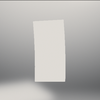

# Web Samples

Here are some additional standalone examples demonstrating Filament's capabilities in WebGL:

    <a href="animation.md" class="sample-card">
        
        animation
    </a>
    <a href="cube_fl0.md" class="sample-card">
        
        cube_fl0
    </a>
    <a href="helmet.md" class="sample-card">
        
        helmet
    </a>
    <a href="morphing.md" class="sample-card">
        
        morphing
    </a>
    <a href="parquet.md" class="sample-card">
        
        parquet
    </a>
    <a href="skinning.md" class="sample-card">
        
        skinning
    </a>

