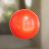

# Web Tutorials

Here are the step-by-step tutorials to get you started with Filament on the Web.

    <a href="triangle.md" class="sample-card">
        
        triangle
    </a>
    <a href="redball.md" class="sample-card">
        
        redball
    </a>
    <a href="suzanne.md" class="sample-card">
        
        suzanne
    </a>

