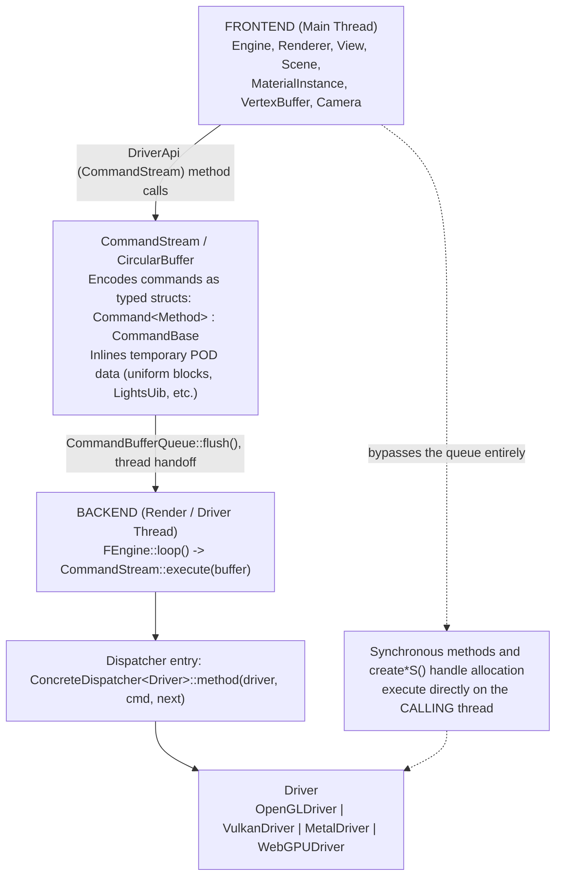
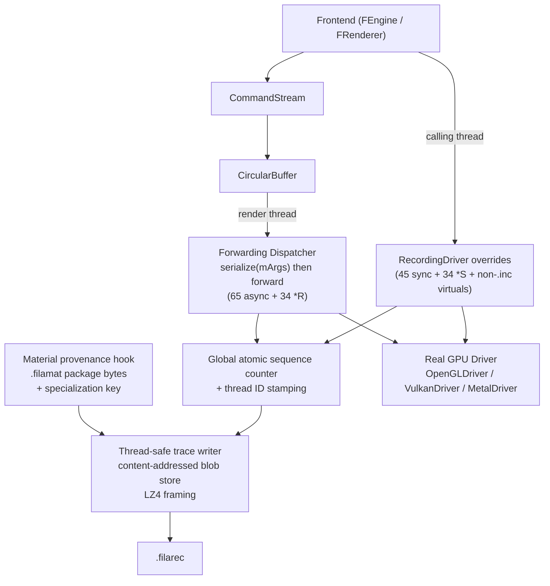
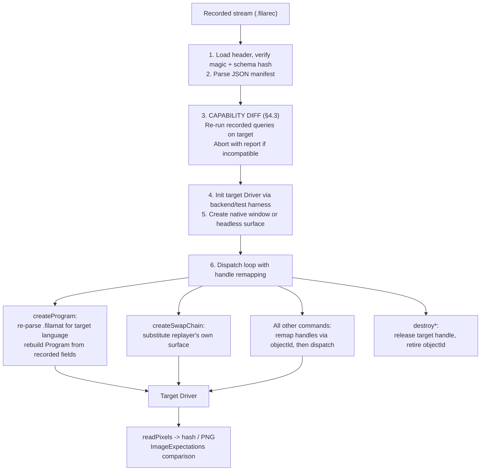
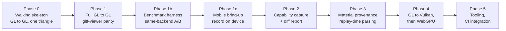

# Filament Backend Command Recording & Replay

We propose to record the commands, buffers, textures, and state that cross Filament's
frontend/backend boundary, so that they can later be replayed against a target graphics driver. This
document examines whether such a system is feasible, what stands in its way, and how we would build
it.

---

## 0. Goals, Non-Goals & Success Criteria

| Use case | Needs | Conflicts with |
| :--- | :--- | :--- |
| **A. Performance benchmarking / driver A-B** | A fixed, reproducible workload with per-frame CPU/GPU instrumentation | Little: timestamps must be regenerated rather than replayed (§7.4) |
| **B. Cross-backend conformance in CI** | Bit-determinism, small traces, fast replay | Nothing; it wants the same fixed workload as (A) |
| **C. GPU-vendor bug repro** | A self-contained artifact that ideally replays without a Filament build | Re-parsing `.filamat` at replay time (§4.1), which obliges us to link `filaflat` |

### Priority

These use cases pull the design in different directions, so we rank them.

**1. Primary: (A) performance benchmarking and driver A-B.** A trace is a fixed workload, and that is
what makes it valuable. Benchmarking a live application on two backends is not a controlled
experiment: the frontend re-runs culling, framegraph compilation, and scene traversal each time;
dynamic resolution and LOD selection react to each backend's timing; camera and animation drift alter
the content. Replaying a trace removes all of these confounds at once, because the replayer has no
frontend and both backends execute the same command stream.

**2. Secondary: (B) cross-backend conformance.** This comes nearly free once (A) exists, and it is
also a prerequisite for trusting any performance number, since a backend that renders the wrong thing
quickly is not faster.

**3. Tertiary: (C) vendor bug repro.** This follows from the work above, provided the trace format
stays self-describing.

### Recording on mobile is a first-class target

Mobile is where Filament's performance questions actually arise, so recording on Android is a
requirement of the design rather than a later port. GL-versus-Vulkan on a tiled mobile GPU is
precisely the comparison a driver A-B is wanted for. Three consequences run through the document:

- **Trace volume becomes the binding constraint** (Barrier 8). A handset has limited free space and
  slow sequential write, and the recorder's writes compete with the application for I/O.
- **Record-time perturbation is worse** (Barrier 7). A phone has less CPU headroom and throttles under
  sustained load, so recording is more likely to change the frame pacing being recorded.
- **The replay harness does not run there yet** (§7.1). `filament/backend/test/` has Linux and macOS
  entry points only, so an Android runner is work we must budget for.

Recording and replay are separable. Replaying a mobile-recorded trace on a workstation is useful on
its own and is how we expect most analysis to be done; it is the *recorder* that must run on the
device.

### What a cross-backend number claims

The frontend chooses which commands to emit according to what the recording device reported it
supports (§4.3). A GL trace replayed on Vulkan therefore measures Vulkan executing GL's choices. This
matters only when the two backends answer the frontend's queries differently; if they agree on every
query the trace made, the frontend would have emitted the same commands either way. A cross-backend
measurement therefore supports one of three claims:

| Claim | Requires | States |
|---|---|---|
| **driver-overhead** | Nothing | *"Backend X runs this identical command stream N% faster."* |
| **app-level** | Recorder and target agree on every capability the trace queried (§4.3) and share a texture-space convention (§4.4.1) | *"Our application would be N% faster on backend X."* |
| **native-vs-native** | Two separate recordings, one per backend | *"Backend X, taking its own preferred path, is N% faster."* This answers a different question, since each backend chooses its own stream. |

The **app-level** claim is our goal, and its precondition is checkable by machine: §4.3 enumerates the
predicates that must match and defines `--require-equivalence`, which declines to label a run
app-level unless they do. **driver-overhead** remains available as a fallback, and
**native-vs-native** is worth running alongside either as a cross-check.

### Success criteria

- **S1, same-backend parity.** A recorded OpenGL session of `sample-gltf-viewer` replays on
  `OpenGLDriver` and reproduces the original frames.

  A normal session never calls `readPixels`, so a trace offers nothing to compare against. We
  therefore propose a `--capture-reference` recording mode that injects a `readPixels` of the default
  render target **immediately before each swapchain `commit`**, and stores the resulting frame hashes,
  and optionally the images, in the trace. The placement matters: `FRenderer::endFrame()` issues
  `commit` *before* `driver.endFrame()`, so a readback at `endFrame` would read a back buffer that has
  already been presented, which is undefined on GL and impossible on Vulkan and Metal.

  We aim for bit-identity on the same GPU and driver, which should be reachable because all recorded
  uniform data replays verbatim, but we would keep a perceptual tolerance as the fallback bar.
- **S2, cross-backend parity.** The same trace replays on `VulkanDriver` within a defined perceptual
  tolerance of the reference.
- **S3, graceful failure.** A trace that cannot run on the target fails at startup with a readable
  capability report (§4.3), not with a crash inside the driver.
- **S4, durability.** A trace recorded against commit X declines to load on a replayer built from
  commit Y when the driver API schema has changed (§6.5).

### Non-goals

- **Mid-stream state snapshotting.** Infeasible against the current `Driver` interface (Barrier 6).
- **Runtime shader transpilation.** The replayer will not link `glslangValidator`, `SPIRV-Cross`, or
  `tint`.
- **Frontend-level constructs** (scene graph, materials-as-objects, framegraph). We work strictly at
  the `Driver` boundary.
- **Device-farm operation.** Recording on a handset is a goal; operating a rack of them unattended is
  not. The replayer still supports `createSwapChainHeadless` because CI requires it.
- **Adaptive feedback loops.** We assume dynamic resolution and frame-time-driven pacing are disabled
  (§4.4.2). They make what the frontend emits a function of how fast the recording machine happened
  to run, which is what a fixed workload is meant to eliminate.

---

## 1. How Commands Reach the Driver

Filament divides into two halves:

- **Frontend (`filament`)**: scene graph, material parsing, culling, lighting and froxelization,
  shadow passes, framegraph orchestration.
- **Backend (`filament/backend`)**: the graphics API abstraction and its implementations,
  `OpenGLDriver`, `VulkanDriver`, `MetalDriver`, `WebGPUDriver`, `NoopDriver`.

The two meet at `DriverApi`, an alias for `CommandStream`
(`filament/backend/include/backend/DriverApiForward.h`), which dispatches to the concrete `Driver`
(`filament/backend/include/private/backend/Driver.h`).

### Command flow and the thread boundary



1. The frontend runs on the main thread and issues commands through `DriverApi`.
2. Asynchronous commands are placed as `Command<Method>` objects in a `CircularBuffer`, capturing
   their arguments in a `std::tuple<ARGS...> mArgs`.
3. `CommandBufferQueue` hands memory slices to the render thread in `FEngine::loop()`.
4. `CommandStream::execute(void* buffer)` walks the sequence, calling `p = p->execute(d)` on each
   command.
5. `CommandBase::execute` jumps through a `Dispatcher` function pointer. Each entry is a
   `ConcreteDispatcher<ConcreteDriver>::method`, which `static_cast`s the `Driver&` to the concrete
   type, unpacks `mArgs` with `std::apply`, and calls the method.

Two properties of this path shape everything that follows.

> [!IMPORTANT]
> **The dashed path.** Synchronous methods and `create*S()` handle allocation never touch the
> `CircularBuffer`; they run inline on whichever thread called them. A recorder that assumes a single
> render-thread choke point will miss half the API (Barrier 7).

> [!IMPORTANT]
> **Asynchronous methods are not virtual.** `Driver.h` declares them as empty non-virtual stubs
> "only to provide a type to `CommandStream`"; the real call is resolved by the `static_cast` in the
> dispatcher entry. A wrapper installed as the `CommandStream`'s `Driver&` therefore cannot intercept
> async commands by overriding them. It must supply its own `Dispatcher` from `getDispatcher()`, or
> the real backend will be cast from the wrong object (§5.1).

### The 144 `DriverAPI.inc` methods

The backend API is defined by macro tables in `filament/backend/include/private/backend/DriverAPI.inc`.
The counts below are exact at the time of writing and will drift, which is why the trace carries a
schema hash (§6.5).

| Group | Macro | Count | Where it runs |
|---|---|---|---|
| Asynchronous commands (`beginRenderPass`, `draw`, `commit`, …) | `DECL_DRIVER_API_N` / `_0` | 65 | Render thread |
| Handle creators (`createTexture`, `createProgram`, …) | `DECL_DRIVER_API_TAGGED_R_N` | 29 | `*S()` on the calling thread, `*R()` on the render thread |
| Async uploads and jobs returning `AsyncCallId` | `DECL_DRIVER_API_R_N` | 5 | Same split as creators |
| Synchronous queries and controls (`getFeatureLevel`, `isTextureFormatSupported`, …) | `DECL_DRIVER_API_SYNCHRONOUS_*` | 45 | Calling thread |

Three details deserve attention.

**The five `R_N` methods are not handle creators.** They are `setVertexBufferObjectAsync`,
`updateIndexBufferAsync`, `updateBufferObjectAsync`, `update3DImageAsync`, and `queueCommandAsync`.
The first four carry real upload work, a `BufferDescriptor` or `PixelBufferDescriptor`, together
with a `CallbackHandler*`, an `AsyncCallback`, and a `void* user`, and their `AsyncCallId` can be
passed to `cancelAsyncJob`. The frontend uses them from `FVertexBuffer`, `FIndexBuffer`, and
`FTexture`. Six of the tagged creators (`createTextureAsync`, `createBufferObjectAsync`,
`createVertexBufferAsync`, `createIndexBufferAsync`, `createTextureViewSwizzleAsync`,
`importTextureAsync`) carry the same callback triple. Barrier 5 treats this family as a whole.

**All 29 creators are `TAGGED`.** They carry a debug-name argument outside the normal argument
pack, as in `filament/src/MaterialDefinition.cpp`:

```cpp
auto const program = engine.getDriverApi().createProgram(
        std::move(pb), ImmutableCString{name.c_str_safe()});
//                     ^^^^^^^^^^^^^^^^ the tag, not part of the Program
```

The serializer must treat the tag as a field in its own right rather than as `mArgs[N]`. Two
synchronous methods, `createStreamNative` and `createStreamAcquired`, also return a handle through a
`SYNCHRONOUS_TAGGED_N` variant, so handle creation is not confined to the `*S()` path.

**Not everything is in `DriverAPI.inc`.** `Driver` also declares plain virtuals outside the macro
table: `getShaderModel()`, `getShaderLanguages()`, `purge()`, `scheduleCallback()`, `execute()`,
`setUnrecoverableError()`, and `debugCommandBegin/End()`. The first two are capability queries the
frontend consumes, and any tooling that enumerates the API by walking `DriverAPI.inc` will miss them
(§3, §4.3). `debugCommandBegin/End` are worth knowing about for a different reason: when
`FILAMENT_DEBUG_COMMANDS` is enabled, `CommandStream` already calls them on the calling thread around
every method, synchronous or not, which gives a ready-made enqueue-time sequence point.

---

## 2. Technical Barriers

Each barrier is stated with the evidence we found in the tree and, where we have one, the remedy we
propose.

### Barrier 1: Handle remapping

Every GPU-backed entity is a typed wrapper around a 32-bit integer, `Handle<HwBase>`
(`filament/backend/include/backend/Handle.h`). Live, `createVertexBuffer(...)` in `CommandStream.h`
runs:

```cpp
RetType result = mDriver.createVertexBufferS(); // allocates a HandleId on the calling thread
new(p) Cmd(..., RetType(result), ...);          // enqueues createVertexBufferR with that id
return result;                                  // the frontend uses it immediately
```

On a fresh driver or machine, `createVertexBufferS()` returns a different ID, since handle reuse,
freelists, and arena offsets all diverge between runs. The replayer therefore maintains a remapping
table, and every command that consumes a handle has its handle arguments rewritten before dispatch.

#### Barrier 1a: Recorded handle IDs get recycled

> [!CAUTION]
> Writing raw driver handle IDs into the trace is a correctness bug, not an inefficiency. The same
> 32-bit value denotes different objects at different points in a session, so a replayer keyed on it
> binds the wrong resource and offers no diagnostic when it does.

`HandleAllocator` packs a 4-bit age into the ID to catch use-after-free
(`HANDLE_AGE_BIT_COUNT = 4`, `HANDLE_AGE_SHIFT = 27`, `HANDLE_INDEX_MASK = 0x07FFFFFF`). The age wraps
after sixteen alloc/free cycles of the same slot, and a `gltf-viewer` session churns render
primitives, textures, and descriptor sets continuously, so we must expect bit-identical IDs for
different objects.

**The recorder never writes a raw handle.** At `create*S()` it assigns its own object ID from a
monotonic counter, never reused for the life of the trace, and emits that instead. The recorder keeps
a raw-handle to object-ID table to perform the rewrite, and last-writer-wins is correct for it: a
slot can only be reused after the matching `destroy*` has executed on the render thread, and every
earlier command that referenced the slot has executed before that destroy. So at any instant a raw
handle denotes exactly one live object, whether the lookup happens at enqueue time or at execute
time.

We considered emitting raw IDs and having the *replayer* disambiguate them with a map erased on every
`destroy*`. It is also correct, but only if the recorder catches all fifteen `destroy*` methods plus
`unmapBuffer`, and a single miss would bring the aliasing bug back silently. Monotonic IDs also buy
diagnostics that raw IDs cannot: use-after-destroy becomes a readable error, traces remain
interpretable if a `destroy*` was missed, and messages can say
`"object #4172 (Texture, created at seq 88301)"`. We still track destroys, but to power those
diagnostics rather than to secure correctness.

#### Handles nested in structs

The rewrite is type-directed, `if constexpr (is_handle_v<T>)`, applied while walking `mArgs`. It must
also descend into POD arguments, and `PipelineState` is the important case: it carries **six**
handles, `program`, `vertexBufferInfo`, and the four `Handle<HwDescriptorSetLayout>` entries in
`pipelineLayout.setLayout`. `MRT` and `TargetBufferInfo` carry texture handles for render targets,
and `SamplerDescriptor` carries one. A remap that rewrote only `PipelineState::program` would bind
stale layouts and vertex-buffer info on the very first draw, so this audit belongs in Phase 0, not
Phase 1.

---

### Barrier 2: Memory ownership and buffer lifecycles

Data crosses the boundary in three forms, and all of them reduce to a `BufferDescriptor`.

1. **Heap and user buffers** via `BufferDescriptor` and `PixelBufferDescriptor`: vertex data, index
   buffers, texture uploads. The frontend hands over ownership of `buffer` with a release callback,
   and the driver schedules that callback when the command completes. The recorder copies `data.size`
   bytes when the command is intercepted.
2. **Inline stream allocations** via `driver.allocate()` and `allocateFromCommandStream`:
   `UniformBuffer::toBufferDescriptor`, light records in `FScene::prepareDynamicLights`, and
   `DescriptorSetOffsetArray`. `CommandStream::allocate(size)` inserts a `NoopCommand` that skips the
   payload during playback, and the consuming command receives a descriptor whose `buffer` points into
   the stream with `callback == nullptr`.
3. **Memory-mapped buffers** via `mapBuffer`, `copyToMemoryMappedBuffer`, and `unmapBuffer`.
   `HwMemoryMappedBuffer` is an opaque empty struct, no raw CPU pointer reaches the frontend, and
   `UboManager`, the only user, writes exclusively through `copyToMemoryMappedBuffer`, which takes a
   `BufferDescriptor`. This ceases to hold the moment a mapped pointer *is* exposed, at which point the
   recorder would see the map/unmap bracket and none of the writes, so the recorder should reject
   `mapBuffer` variants it does not recognize.

Readback descriptors (`readPixels`, `readTexture`, `readBufferSubData`) point at *destination*
memory and are handled separately (Barrier 5b).

---

### Barrier 3: Shaders and bytecode

`createProgram` receives a `Program` (`filament/backend/include/backend/Program.h`) holding far more
than shader text:

- Pre-compiled blobs, `ShaderSource = std::array<ShaderBlob, SHADER_TYPE_COUNT>` with
  `SHADER_TYPE_COUNT == 3` (vertex, fragment, and compute). Vulkan takes SPIR-V; OpenGL takes
  `ESSL3` text, or `ESSL1` at feature level 0; WebGPU takes WGSL; Metal takes MSL or a
  `METAL_LIBRARY` binary.
- `specializationConstants`, which change compilation and must be recorded verbatim.
- `pushConstants` per stage, `descriptorBindings` and `descriptorLayout` per set, `cacheId`,
  `multiview`, `priorityQueue`, and the ES2-only `Uniform` list.

The `ShaderLanguage` enumerators are exactly `ESSL1`, `ESSL3`, `SPIRV`, `MSL`, `METAL_LIBRARY`,
`WGSL`, and `UNSPECIFIED`; desktop OpenGL uses `ESSL3`.

Recording on OpenGL and replaying on Vulkan leaves us with bytecode in the wrong format. The obvious
remedy, capturing every language at the driver boundary, is not available, for reasons given in
§4.1.

---

### Barrier 4: Platform and window dependencies

`createSwapChain(nativeWindow, flags)` takes an OS window pointer that means nothing on another
machine or in another process. The replayer intercepts `createSwapChain` and substitutes a window of
its own, drawn from the `filament/backend/test` platform harness, or creates an offscreen swapchain
with `createSwapChainHeadless(width, height, flags)`.

External images and streams (`createTextureExternalImage*`, `importTexture*`, `setAcquiredImage`,
`setupExternalImage*`, `setExternalStream`) depend on process-local or OS-level handles such as a GL
texture name, an `AHardwareBuffer`, or a `CVPixelBuffer`. These cannot be recorded (§9).

---

### Barrier 5: Lambdas and callbacks

#### 5a: `queueCommand` and `queueCommandAsync`

`CommandStream::queueCommand(std::function<void()>)` injects arbitrary CPU lambdas into the stream.
Its callers are `FFence` (signalling waiters), `FrameInfo` (CPU/GPU timestamp bookkeeping), and
`FRenderer::pauseRenderThread`. The driver-level `queueCommandAsync` / `cancelAsyncJob` pair is
reached only through `FEngine::runCommandAsync`, an application utility. None of these carry graphics
work, closures cannot be serialized, and so we record both as **marker tokens** that preserve
ordering and do nothing at replay.

#### 5b: Callback-bearing methods must be synthesized

A larger family of methods carries a `CallbackHandler*` and a frontend-owned function pointer, both
meaningless in a replay process, yet whose driver-side operation the replayer must still perform:

| Family | Methods | Replay policy |
|---|---|---|
| Readbacks | `readPixels`, `readTexture`, `readBufferSubData` | Allocate a replayer-owned buffer and route the result to the verification sink. **`readPixels` is not a stub**; it is how S1 and S2 are checked. |
| Async uploads | `update3DImageAsync`, `updateBufferObjectAsync`, `updateIndexBufferAsync`, `setVertexBufferObjectAsync` | Perform the upload with a replayer handler. Record the `AsyncCallStatus` delivered at record time; an upload that was cancelled before completing must not be replayed to completion. |
| Async creators | `createTextureAsync`, `createBufferObjectAsync`, `createVertexBufferAsync`, `createIndexBufferAsync`, `createTextureViewSwizzleAsync`, `importTextureAsync` | As above. |
| Compilation and sync | `compilePrograms`, `getPlatformSync` | Replayer handler; results discarded. |

`setFrameScheduledCallback` and `setFrameCompletedCallback` also take handlers, but they are set by
the application rather than by the renderer, and on Metal the former transfers responsibility for
presenting to the app. We treat both as unsupported (§9) rather than synthesize them.

#### 5c: Fences, syncs, and timer queries

`createFence`, `createSync`, `fenceWait`, `getFenceStatus`, and `getTimerQueryValue` return values
that gated frontend behavior at record time. With no frontend present most are moot, but two call for
a policy. A `fenceWait` in the stream is a real GPU sync point, and we wait. A `getTimerQueryValue`
that returned `NOT_READY` had a polling loop behind it that is now gone, so we issue recorded timer
queries and discard their results; the replayer injects timer queries of its own for benchmarking
(§7.4).

Fence status also feeds back into the recorded stream: `FrameSkipper` consults `getFenceStatus` and
drops a frame when the GPU is behind, and `UboManager` recycles slots on it. Once recorded the stream
is fixed, so this does not affect an A/B, but it means two recordings of the same session are not
identical even on the same device (Barrier 7).

---

### Barrier 6: Full-session recording vs. mid-stream capture

**Full-session recording from frame 0** records every `create*`, `update*`, `bind*`, and `draw`
from startup, and replay rebuilds all GPU state. **Mid-stream capture**, in the manner of RenderDoc,
needs to enumerate live state, and `Driver` is write-mostly: it offers no readback with which to list
allocated buffers, active mips, or bound state. Capturing mid-stream would oblige us to shadow every
texture, buffer, descriptor set, and pipeline in host RAM.

We judge full-session recording the practical choice. Whether the artifact can later be trimmed to a
window of interest is a separate question (§10).

---

### Barrier 7: The recorder is multi-threaded

The natural mental model places the recorder on the render thread, below the `CircularBuffer`. That
model is wrong:

- All 45 synchronous methods run on the **calling** thread.
- All 29 `create*S()` allocations and the five `*Async` ID allocations run on the **calling** thread,
  before the matching `*R()` runs on the render thread.
- There is at least a third thread. `FrameInfo` pushes a job that calls `driver.fenceWait` from its
  own job queue, and `Fence::wait` may be called from any application thread.

Four things follow.

1. **Global ordering.** Every packet carries a monotonic sequence number from a single atomic
   counter, together with a thread ID.
2. **A thread-safe writer.** A mutex with per-thread staging buffers is the pragmatic choice, since
   contention matters only if it perturbs record-time behavior enough to change the stream.
3. **A reconstruction rule.** Asynchronous commands are stamped when they *execute* on the render
   thread, and synchronous calls when they are *called*. The replayer replays in sequence order on a
   single thread. This places a synchronous side-effecting call such as `setAcquiredImage` or
   `fenceWait` at the point where it actually acted on the driver, relative to the render thread's
   progress. Two invariants are validated at load: every `create*S` precedes its `create*R`, and
   every synchronous call sits at its recorded sequence point.
4. **Acknowledged perturbation.** Recording adds latency on both threads, changes frame pacing, and
   hence changes what the frontend emits, including which frames `FrameSkipper` drops. A trace is
   not a faithful timing record of the uninstrumented application. On device the effect is larger, so
   we measure the recorder's own cost on the target hardware rather than extrapolating it.

---

### Barrier 8: Trace volume

Full-session recording captures every `update3DImage`, every per-frame `updateBufferObject`, and every
descriptor offset array. We have not measured the rate; steady-state `gltf-viewer` traffic is
dominated by per-frame uniform and froxel updates, which we would expect to run to tens of megabytes
per second uncompressed, with startup dominated by one-time texture uploads. Phase 1 will produce the
real number, and that number decides whether a handset can store a useful trace. A recorder whose
writes stall the application is no longer recording the application we meant to measure, so volume is
a correctness concern as well as a storage one.

We propose three mitigations, reflected in §6:

- **A content-addressed blob section.** Payloads are hashed and packets carry references. Texture
  uploads and repeated UBO contents deduplicate heavily.
- **Streaming compression**, LZ4 at record time for its low cost, or zstd in post-processing, with
  the codec ID in the header.
- **A bounded capture window**, `--max-frames N`, which we expect to be the common on-device mode.

> [!WARNING]
> A ring buffer of the *last* N frames is not self-contained: the draw-level commands it holds
> reference resources whose `create*` and `update*` happened before the window. Keeping such a window
> replayable requires retaining all resource provenance outside the ring, which is exactly the trim
> retention logic of §10. We therefore define `--max-frames N` for the first result as a **hard stop
> after N frames from startup**, which needs no retention logic, and treat a true ring buffer as
> arriving together with trim. If Phase 1c shows that a hard-stopped trace is still too large for a
> handset, trim moves up the roadmap.

---

## 3. Provenance & Metadata

Every recorded session embeds a metadata manifest with four parts:

1. **Backend and platform**: backend, OS, `Platform` implementation, feature level, shader model.
2. **Hardware and driver identification**, via `Platform::getDeviceInfo` where it exists.
3. **Capability and limits snapshot**: every capability query's arguments and return value. This
   block is load-bearing; it is the input to the §4.3 diff.
4. **Engine and build provenance**: git commit and branch, the `DriverAPI.inc` schema hash (§6.5),
   build configuration, timestamp, and hostname.

### What can be queried today

`Platform::getDeviceInfo(DeviceInfoType, Driver*)` exposes six values: `OPENGL_RENDERER`,
`OPENGL_VENDOR`, `OPENGL_VERSION`, `VULKAN_DEVICE_NAME`, `VULKAN_DRIVER_NAME`, and
`VULKAN_DRIVER_INFO`. **Metal and WebGPU device identification cannot be queried at all.** Capturing
`[MTLDevice name]`, the GPU family, or `WGPUAdapterInfo` requires new `DeviceInfoType` enumerators
implemented in every `Platform` subclass. `GL_SHADING_LANGUAGE_VERSION` and the Vulkan `vendorID`,
`deviceID`, `driverVersion`, and `apiVersion` are also unexposed. The work is small but real, and it
sits in Phase 2.

The capability snapshot comes from the 45 synchronous `DriverAPI.inc` methods **plus the two plain
virtuals `getShaderModel()` and `getShaderLanguages()`**, which must be added by hand because no
macro walk reaches them (§1). Omitting them would be an easy mistake with a specific consequence: a
trace recorded on a `MOBILE` shader-model device and replayed on a `DESKTOP` workstation differs on
exactly that query, and the gate would not see it.

---

## 4. Cross-Backend Replay

We consider what it takes to record on OpenGL and replay on Vulkan or WebGPU. Our finding is that
shader language is the *easiest* of the cross-backend problems; capability divergence (§4.3) is by
some margin the hardest.

### 4.1 Shader blobs are not visible at the driver boundary

We assume every material was compiled for all targets, which is standard practice when building
`.filamat` packages with `matc --api all`, and which removes any need for runtime transpilation.

> [!CAUTION]
> Sibling-language blobs cannot be logged from inside a driver-level `createProgram` hook, because
> the driver never sees them.

`MaterialParser` is constructed with a preferred-language list and surfaces only the chunk set for the
running backend; `MaterialDefinition::getProgramWithVariants` pulls exactly one blob per stage from
it. The `Program&&` that reaches the driver has already been filtered to one language and one
variant.

| Option | Mechanism | Trade-off |
| :--- | :--- | :--- |
| **(A) Record the `.filamat` package + program key** (recommended) | Store the raw package bytes once, content-addressed, plus the `ProgramSpecialization`, descriptor layouts, and specialization constants. The replayer re-runs `MaterialParser` for the **target** language. | Keeps the driver proxy pure and traces small. **Cost:** the replayer links `filaflat`, which hurts use case (C). |
| **(B) Frontend hook attaching sibling blobs** | Intercept `MaterialDefinition::compileProgram` and attach every language's blobs to the `Program`. | Needs the same frontend change and duplicates every variant's blobs in the stream. |

**We recommend Option (A).** It is smaller, correct on specialization constants by construction, and
language-agnostic: re-parsing yields whatever the target asks for, including `MSL` and
`METAL_LIBRARY`, so Metal is a valid replay target subject to the same capability diff as any other.

#### Where the hook goes

Filtering never destroys the package; it only selects from it. `MaterialParser` takes a private copy
of the entire `.filamat` at construction (`ManagedBuffer` does a `malloc` and `memcpy`) and
`MaterialDefinition` owns that parser for the life of the material. The hook is therefore a single
site, `MaterialDefinition::compileProgram` (`filament/src/MaterialDefinition.cpp:736`), which
receives the parser and the specialization and issues the `createProgram` call itself:

```cpp
Handle<HwProgram> MaterialDefinition::compileProgram(
        FEngine& engine, MaterialParser const& parser,            // <- the full package
        ProgramSpecialization const& specialization,              // <- the variant key
        CompilerPriorityQueue const priorityQueue) const noexcept {
    // ...
    auto const program = engine.getDriverApi().createProgram(   // <- the call we are recording
            std::move(pb), ImmutableCString{ name.c_str_safe() });
```

Two practical notes. First, `MaterialParser` exposes no accessor for its raw buffer, so Option (A)
requires adding one; that is the whole of the frontend API change. Second, the blob store should hash
the package bytes itself rather than reuse `MaterialParser::getCrc32()`, which returns the 32-bit CRC
embedded by `matc` when one exists rather than a hash of the bytes in hand. The cost is one pass per
package, not per program.

**No frontend changes are needed for the command stream**; material provenance needs exactly this one
hook.

### 4.2 Invariants the implementation assumes

**1. Dynamic uniform offsets recorded on one backend are valid on the other.**

Under the §4.3 gate this comes free, since a matching `getUniformBufferOffsetAlignment()` makes the
recorder's offsets valid on the target by construction. Outside the gate we must check it. Filament
has three `DYNAMIC_OFFSET` descriptors: `OBJECT_UNIFORMS` and `BONES_UNIFORMS` in
`libs/filabridge/src/DescriptorSets.cpp`, and `MATERIAL_PARAMS`, emitted by `filamat`. Only
`MATERIAL_PARAMS` consults the alignment query, through `UboManager`'s slot size. `OBJECT_UNIFORMS`
is 256-safe because `sizeof(PerRenderableData) == 256` is static-asserted. `BONES_UNIFORMS` is
`offset * sizeof(BoneData)` with a 64-byte `BoneData`, and `FRenderableManager::setSkinningBuffer`
stores the offset unaligned as the user supplied it, so it is 256-safe only when the offset is a
multiple of 4.

> **Requires:** under `--portable`, assert that every emitted dynamic offset is a multiple of 256 and
> abort naming the offending renderable. We validate rather than change engine behavior.

> [!NOTE]
> The bone-offset gap is not specific to this project. The same arithmetic runs on Vulkan today, so an
> application calling `setSkinningBuffer` with a non-multiple-of-4 offset on a device reporting
> `minUniformBufferOffsetAlignment == 256` ought to trip validation. It is probably latent because
> `offset = 0` dominates. It merits a targeted test and a separate report.

**2. Clip-space convention needs no special handling under Option (A).**

`OpenGLDriver::getClipSpaceParams()` returns `{1, 0}` with `EXT_clip_control` and `{2, -1}` without
it, and the frontend writes the value into the PerView UBO as `clipControl`. In the shaders, however,
`clipControl` is consumed only inside
`#if !defined(TARGET_VULKAN_ENVIRONMENT) && !defined(TARGET_METAL_ENVIRONMENT) && !defined(TARGET_WEBGPU_ENVIRONMENT)`.
Because the replayer re-parses the material for the target language, a Vulkan replay runs the Vulkan
shader, which ignores the recorded value. Requiring `EXT_clip_control` at record time would exclude
GL devices for no benefit, so we do not.

> **Requires:** nothing of us. The manifest records the value for diagnostics.

**3. Descriptor sets and viewports need no special handling.**

Descriptor calls are identical across backends and layouts travel with the recorded program.
`VulkanDriver` flips viewports internally (`VulkanRenderTarget::transformViewportToPlatform`), so
OpenGL-recorded viewports forward unchanged.

> **Requires:** nothing of us.

### 4.3 Capability divergence

The recorded stream is shaped by record-time query results. `FRenderer`'s constructor caches five
of them up front:

```cpp
mFeatureLevel                           = driver.getFeatureLevel();
mIsRGB8Supported                        = driver.isRenderTargetFormatSupported(TextureFormat::RGB8);
mIsFrameBufferFetchSupported            = driver.isFrameBufferFetchSupported();
mIsFrameBufferFetchMultiSampleSupported = driver.isFrameBufferFetchMultiSampleSupported();
mIsAutoDepthResolveSupported            = driver.isAutoDepthResolveSupported();
```

These feed the framegraph and change which passes are built (`RendererUtils.cpp`:
`canAutoResolveDepth = config.isAutoDepthResolveSupported`). `PostProcessManager` does likewise with
`isDepthStencilResolveSupported`, and `FSwapChain` gates on `isSRGBSwapChainSupported()` and
`isProtectedContentSupported()`. Altogether the frontend branches on these predicates before
emitting a command:

```
isTextureFormatSupported          isRenderTargetFormatSupported    isTextureFormatMipmappable
isTextureFormatFilterable         isTextureSwizzleSupported        isFrameBufferFetchSupported
isFrameBufferFetchMultiSampleSupported                             isAutoDepthResolveSupported
isDepthStencilResolveSupported    isDepthStencilBlitSupported      isMSAASwapChainSupported
isSRGBSwapChainSupported          isStereoSupported                isDepthClampSupported
isProtectedContentSupported       isProtectedTexturesSupported     isParallelShaderCompileSupported
isFrameTimeSupported              isCompositorTimingSupported      isAsynchronousModeEnabled
getMaxDrawBuffers                 getMaxUniformBufferSize          getMaxTextureSize
getMaxArrayTextureLayers          getFeatureLevel                  getUniformBufferOffsetAlignment
isWorkaroundNeeded(Workaround)    getShaderModel*                  getShaderLanguages*
```

The two starred entries are plain `Driver` virtuals rather than `DriverAPI.inc` methods (§1) and
must be captured by hand.

What makes divergence serious is that a missing pass cannot be recovered at replay. Had the recorder
reported `isAutoDepthResolveSupported() == false`, the trace carries explicit resolve passes the
target neither needs nor expects; had it reported `true`, the trace lacks resolve passes the target
requires.

#### The capability-equivalence class

The determinism that creates the problem also makes it checkable. For a given set of answers, the
frontend emits the same commands on either backend, so if two backends agree on every query the
trace made, nothing GL-specific remains in it.

> **Definition.** Two backend/device configurations are **capability-equivalent for a given trace**
> if every capability query the trace actually made returns the same value on both.

Two refinements make this usable. First, we scope the class to the trace rather than the whole API:
if the trace never queried `ETC2_RGB8`, disagreement there is irrelevant. Recording each query with
its arguments turns a gate that would always fail into one that will often pass. Second,
`isWorkaroundNeeded` belongs in the class and is the most likely thing to break it. The frontend
consumes it in ten places, each of which changes the work emitted:

| Site | Workaround |
|---|---|
| `filament/src/details/Material.cpp:177` | `DISABLE_DEPTH_PRECACHE_FOR_DEFAULT_MATERIAL` |
| `filament/src/components/RenderableManager.cpp:731,785` | `ADRENO_UNIFORM_ARRAY_CRASH` |
| `filament/src/PostProcessManager.cpp:366,368` | `SPLIT_EASU`, `ALLOW_READ_ONLY_ANCILLARY_FEEDBACK_LOOP` |
| `filament/src/MaterialDefinition.cpp:87,547,551,558` | `EMULATE_SRGB_SWAPCHAIN`, `POWER_VR_SHADER_WORKAROUNDS` |
| `filament/src/ShadowMapManager.cpp:94` | `DISABLE_BLIT_INTO_TEXTURE_ARRAY` |

Workarounds key on GPU vendor and driver version, so they are precisely where a GL/Vulkan pair on the
same physical GPU is most likely to diverge.

We should be honest about one limit of the equivalence argument. It says that *given the same
answers* the frontend emits the same stream; it does not say that two recordings would be identical,
because fence status (`FrameSkipper`, `UboManager`) and wall-clock timing also shape a recording. The
app-level claim is therefore "this stream is one the application would have produced on the target",
not "the application would have produced this exact stream".

#### Capability recording and the gate

1. **Record every capability query**, method, arguments, and return value, into the manifest and the
   stream.
2. **Re-run the same queries** on the target at replay startup.
3. **Diff and report** before executing a command:
   ```
   TRACE INCOMPATIBLE WITH TARGET BACKEND (Vulkan)
     isTextureFormatSupported(ETC2_RGB8):  recorded=true  target=false  (14 textures affected)
     isFrameBufferFetchSupported():        recorded=true  target=false  (2 render passes affected)
     getMaxUniformBufferSize():            recorded=65536 target=16384  (1 buffer exceeds limit)
   ```
4. **Gate the claim on the result:**

   | Flag | Behavior |
   |---|---|
   | *(default)* | Replay if executable; label the output **driver-overhead**. |
   | `--require-equivalence` | Abort unless every queried capability matches; label the output **app-level**. |
   | `--force` | Replay despite hard incompatibilities; mark the output **untrusted**. |
   | `--strict` (CI default) | Abort on any diff. |

> [!IMPORTANT]
> The claim label goes in the benchmark output itself, next to every number it affects. The failure we
> are guarding against is a driver-overhead number being quoted as an app-level conclusion months later
> by someone who did not run it.

This also gives a precise meaning to "replayable on backend X", which is what **S3** requires.

### 4.4 What capability equality does not cover

#### 4.4.1 The frontend branches on backend identity

A few sites switch on the `Backend` enum directly. A sweep of `filament/src/` and `libs/filabridge/`
finds these:

| Site | Effect |
|---|---|
| `filament/src/details/Engine.cpp:411` (`textureSpaceYFlipped`) | `mUvFromClipMatrix`, a `mat4f` |
| `filament/src/ShadowMapManager.cpp:995,1153,1232` (`textureSpaceFlipped`) | populates `ShadowMap::Info` |
| `filament/src/ShadowMap.cpp:678,1320` | flip matrix folded into the light-space matrix; a clamp rectangle |
| `filament/src/PostProcessManager.cpp:2942` | negates TAA `jitter.y` |
| `filament/src/fsr.cpp:50` | changes `yoffset` inside `FSRUniforms` |

**This is one predicate, not six.** Every site tests `METAL || VULKAN || WEBGPU`, and `Engine.cpp:411`
already names it `textureSpaceYFlipped`. The three other `Backend::` comparisons in the tree do not
count: `Engine.cpp:926` is inside `#if FILAMENT_ENABLE_MATDBG`, and `MaterialDefinition.cpp:219,799`
test for `Backend::NOOP`.

**Every one of these sites changes only uniform data.** None alters the number of passes, draws,
render targets, or the bind pattern. For performance, the workload is therefore already identical
across the GL/non-GL boundary. The cost lands on conformance: a GL trace replayed on Vulkan renders
inverted shadow lookups and mirrored TAA jitter, because those bytes are baked into recorded buffer
contents and cannot be patched at replay. That costs us image comparison as a sanity check on the
performance run.

**We propose hoisting the predicate** into one accessor, `FEngine::isTextureSpaceYFlipped()`,
defaulting to today's backend test but overridable through `Engine::Builder`. Recording with the
override set to the target's convention yields a convention-neutral trace and restores image
comparison. Until then, VK/Metal/WebGPU already share a convention, and GL-to-anything supports the
app-level claim for performance but should not be image-compared.

#### 4.4.2 Adaptive feedback loops

We assume these are off and do not support them. Dynamic resolution
(`FView::setDynamicResolutionOptions`) and frame-time-driven pacing change command-stream shape,
viewport and render-target dimensions, and are not a function of capabilities, so the gate cannot see
them. A trace recorded on a slow machine bakes in a low resolution scale; both backends still run the
same fixed workload on replay, but it is no longer the workload anyone intended to benchmark.

> **Requires:** the recorder declines to produce a benchmark-grade trace when dynamic resolution is
> active with `minScale != maxScale`, and records the setting in the manifest either way.

---

## 5. Recorder Design

### 5.1 Where the recorder sits

`FEngine` holds one `Driver*` and one `CommandStream` built on it. The recorder is a
`RecordingDriver` that wraps the real driver and is handed to the `CommandStream` in its place. It
intercepts three kinds of traffic in three different ways.

**Synchronous methods and `*S()` allocations** are virtual on `Driver`, so the proxy overrides them,
records them, and forwards to the real driver. This covers the 45 synchronous methods, the 29
`create*S()` and five `*AsyncS()` entry points, and the non-`.inc` virtuals (`getShaderModel`,
`getShaderLanguages`, `purge`, `scheduleCallback`, `execute`, `debugCommandBegin/End`).

**Asynchronous commands** are not virtual (§1). `CommandStream::execute` passes its `Driver&`, which
is now the proxy, to each dispatcher entry, and the real backend's entries would `static_cast` it to
the wrong type. The proxy's `getDispatcher()` therefore returns a **forwarding dispatcher**, generated
from `DriverAPI.inc`, whose entries serialize the command and then call the real driver's dispatcher
entry with the real driver reference:

```cpp
// Conceptually, what the macro expands to for one async entry in DriverAPI.inc:
static void methodName(Driver& driver, CommandBase* base, intptr_t* next) {
    auto& proxy = static_cast<RecordingDriver&>(driver);
    using Cmd = COMMAND_TYPE(methodName);
    proxy.serialize<Cmd>(CommandId::methodName, base);         // walks mArgs, rewrites handles
    proxy.realDispatcher().methodName_(proxy.realDriver(), base, next);
}
```

The real driver's dispatcher must be captured per instance, because `OpenGLDriver::getDispatcher()`
patches entries depending on the GL context. `serialize<Cmd>` needs access to `Command::mArgs`, which
is private today; a friend declaration is the extent of the change to `CommandStream.h`. The argument
walker is modelled on the `printParameterPack` used by `log()` under `DEBUG_COMMAND_STREAM`, but it
cannot reuse it directly, since that path requires RTTI and `operator<<` on every argument type. We
write one `serialize` overload per argument *type*, of which there are a few dozen, not per method.

**`queueCommand` lambdas** are `CustomCommand`s that never pass through the dispatcher; the proxy
cannot see them. We record them as markers from `CommandStream::queueCommand` itself, which is a
one-line addition.

Three things follow from this arrangement. The command stream needs no frontend changes and no
`CircularBuffer` changes. The design adapts to new `DriverAPI.inc` methods automatically, and the
schema hash (§6.5) catches what it cannot. And the serialization point for async commands is on the
render thread at execute time, which is the sequence point Barrier 7 asks for.

### 5.2 Data flow



---

## 6. File Format (`.filarec`)

```
+-------------------------------------------------------------------------------+
|                             FILE HEADER (80 bytes)                            |
+-------------------------------------------------------------------------------+
|                       METADATA MANIFEST (JSON string)                         |
|  backend, device, driver, full capability snapshot, limits, feature level,    |
|  git commit, schema hash, timestamps                                          |
+-------------------------------------------------------------------------------+
|                    CONTENT-ADDRESSED BLOB SECTION                             |
|  hash -> payload. Texture uploads, .filamat packages, repeated UBO contents.  |
|  Deduplicated; LZ4/zstd framed.                                               |
+-------------------------------------------------------------------------------+
|                         BINARY COMMAND STREAM (packets)                       |
|  Packet header: seq (u64) | threadId (u16) | CommandId (u16) | size (u32)     |
|  Payload: primitives, object IDs, POD structs, blob references                |
|  FRAME_BEGIN(frameId) ... FRAME_END(frameId)                                  |
+-------------------------------------------------------------------------------+
|                    FRAME INDEX TABLE (footer)                                 |
|  frameId -> byte offset, enabling O(1) seek to frame N                        |
+-------------------------------------------------------------------------------+
```

### 6.1 Header

```cpp
struct RecordFileHeader {
    char     magic[4];              // {'F','I','L','R'}
    uint32_t version;               // container format version
    uint32_t headerSize;            // sizeof(RecordFileHeader)
    uint32_t flags;                 // bit 0: trimmed, bit 1: little-endian, ...
    uint8_t  compressionCodec;      // 0=none, 1=LZ4, 2=zstd
    uint8_t  reserved[7];           // explicit padding up to the next u64 boundary
    uint64_t manifestOffset;
    uint64_t manifestSize;
    uint64_t blobSectionOffset;
    uint64_t commandStreamOffset;
    uint64_t frameIndexOffset;      // 0 if absent
    uint64_t packetCount;
    uint32_t frameCount;
    uint32_t headerCrc32;
};
static_assert(sizeof(RecordFileHeader) == 80, "RecordFileHeader layout changed");
```

`reserved[7]` is declared explicitly because without it the compiler would insert seven bytes of
silent padding before `manifestOffset`, and a header whose stated size disagrees with its layout is a
portability bug waiting to happen. All multi-byte integers are little-endian and all packet payloads
are 8-byte aligned. Recording on ARM and replaying on x86 is an expected workflow.

### 6.2 Manifest example

```json
{
  "filament": {
    "version": "1.56.0", "gitCommit": "9a7f3b1c", "gitBranch": "backend-record",
    "driverApiSchemaHash": "sha256:4f2a...c91d", "buildType": "Release",
    "timestamp": "2026-09-09T21:40:00Z", "hostname": "build-machine-07"
  },
  "recording": {
    "recordedBackend": "OpenGL", "platformImpl": "PlatformCocoaGL",
    "mode": "full-session", "maxFrames": 600, "portable": true,
    "materialProvenance": "filamat-packages", "dynamicResolution": "disabled"
  },
  "device": { "renderer": "Apple M2 Max", "vendor": "Apple", "version": "OpenGL 4.1 Metal - 88.1" },
  "capabilities": {
    "getFeatureLevel": 3, "getShaderModel": "DESKTOP", "getShaderLanguages": ["ESSL3"],
    "getUniformBufferOffsetAlignment": 256, "getMaxUniformBufferSize": 65536,
    "getMaxTextureSize": { "SAMPLER_2D": 16384, "SAMPLER_CUBEMAP": 16384 },
    "getClipSpaceParams": [1.0, 0.0],
    "isFrameBufferFetchSupported": true,
    "isTextureFormatSupported": { "ETC2_RGB8": false, "DXT1_RGB": true },
    "isWorkaroundNeeded": { "SPLIT_EASU": false, "ALLOW_READ_ONLY_ANCILLARY_FEEDBACK_LOOP": true }
  },
  "initialSurface": { "width": 1920, "height": 1080 }
}
```

The `capabilities` block is the input to the §4.3 diff and must be exhaustive.

### 6.3 `createProgram` packet

Under Option (A) the packet references a `.filamat` blob rather than embedding shader blobs, and
carries everything else that `Program` holds:

| Field | Notes |
| :--- | :--- |
| `objectId` (u32) | Monotonic object ID, never reused within a trace (Barrier 1a) |
| `tag` | The `ImmutableCString` debug name |
| `filamatBlobRef` (u64) | Hash reference into the blob section |
| `variant`, `vertexVariant`, `fragmentVariant` | Specialization key and filtered variants |
| `materialDomain`, `shaderModel` | Needed to select the chunk at re-parse |
| `specConstants[]` | `{ id, type, value }` records, recorded verbatim |
| `pushConstants[3]` | One per `SHADER_TYPE_COUNT` stage |
| `descriptorSets[MAX_DESCRIPTOR_SET_COUNT]` | Layout and bindings |
| `cacheId`, `multiview`, `priorityQueue`, `es2Uniforms` | As held by `Program` |

Every field is load-bearing. Omitting the third shader stage or a specialization constant produces
silently different shaders at replay, with no error and a visual difference that is very hard to
trace back to the serializer.

### 6.4 Frame framing and seeking

Each frame is bracketed by `FRAME_BEGIN(frameId)` and `FRAME_END(frameId)` markers, and the footer
holds a `frameId -> byteOffset` table, which is what lets `fila-replay --frame 412` work without
parsing the whole file.

`beginFrame(monotonic_clock_ns, refreshIntervalNs, frameId)` carries real time, and the backends
consume it: `OpenGLDriver::beginFrame` forwards to `mPlatform.beginFrame`, and
`VulkanDriver::beginFrame` drives `setPresentFrameId`. The replayer **regenerates** these to match the
pacing it applies; only `--pace=recorded` replays the original deltas (§7.4).

### 6.5 Compatibility and versioning

Three things can change independently underneath a trace:

| Axis | Mechanism | On mismatch |
| :--- | :--- | :--- |
| **Container format** (header, sections, packet framing) | `version` in `RecordFileHeader`, bumped by hand | Refuse to load, name both versions |
| **Driver API schema** (methods and argument types in `DriverAPI.inc`) | Schema hash computed at build time, stored in the manifest | Refuse to load, name both commits (**S4**) |
| **Filament build** (everything else) | Git commit recorded in the manifest | Load, but report the delta |

We do not add a hand-maintained Driver API version number; it would have to be bumped by whoever
edits `DriverAPI.inc`, which is precisely what we cannot rely on. A derived hash, ideally per method
so a diagnostic can name what moved, affords no ordering but needs none: both traces in an A/B must
come from one recorder build anyway. The container does need its own version, because a tool like
`filarec-info` should be able to read the header and manifest of a trace it cannot replay in order to
say why.

We deliberately do not support replaying a trace on a Filament build with a different Driver API.
Traces are cheap to re-record, and the rule is simple: **re-record when Filament changes.**

> [!CAUTION]
> This is the cheapest bug class to prevent and the most expensive to debug. A format keyed by ordinal
> `CommandId` with no schema check does not fail loudly across Filament versions. It misparses, and the
> replayer executes plausible-looking garbage.

---

## 7. Replay Engine (`fila-replay`)

### 7.1 Build on the existing backend test harness

`filament/backend/test/` already stands up a `Platform`, a `Driver`, and a swapchain with no
frontend, and performs golden-image comparison across backends:

| Component | What it provides |
| :--- | :--- |
| `BackendTest.h/.cpp` | `init(Backend, OperatingSystem, bool isMobilePlatform, ...)`, `getDriverApi()`, `createSwapChain(flags)` |
| `PlatformRunner`, `linux_runner.cpp`, `mac_runner.mm` | Per-OS native window and platform selection |
| `Lifetimes.h` | Scoped handle cleanup |
| `ImageExpectations.h/.cpp` | `addExpectation(...)` / `evaluate()`, with `expected_images/` in the repo |

This is the whole of `fila-replay`'s bootstrap and all of Phase 5's frame diffing, already written
and exercised in CI. The abstraction accommodates mobile (`OperatingSystem::LINUX` is documented as
covering Android handsets), but there is no Android runner. Writing one is contained work, and we
budget for it in Phase 1c.

### 7.2 Pipeline



### 7.3 Dispatch: generic by default

> [!IMPORTANT]
> If the recorder serializes generically but the replayer deserializes through a hand-written
> 144-case `switch`, we have merely moved the maintenance problem to the other side of the trace. The
> replay side must be symmetric: a macro-generated deserializer driven by the same `DriverAPI.inc`.

For each method, the same macro expansion that produces the `Driver` declaration also produces a
reader that pops typed arguments in order, remaps handles where the type calls for it, and invokes
the target driver:

```cpp
// Conceptually, per DriverAPI.inc entry:
#define DECL_DRIVER_API_N(method, ...)                                  \
    case CommandId::method: {                                           \
        auto args = deserializeArgs<ArgsOf<&Driver::method>>(packet);   \
        remapHandlesInPlace(handleMap, args);  /* recurses into PODs */ \
        std::apply([&](auto&&... a) {                                   \
            targetDriver->method(std::forward<decltype(a)>(a)...);      \
        }, std::move(args));                                            \
        break;                                                          \
    }
```

`remapHandlesInPlace` recurses into `PipelineState`, `MRT`, `TargetBufferInfo`, and
`SamplerDescriptor`, so `draw` and `bindPipeline` need no hand-written case. Only commands whose
*semantics* differ at replay do, and the list should stay closed:

| Command | Why it is special |
| :--- | :--- |
| `createProgram` | Re-parse the `.filamat` blob for the target language (§4.1) |
| `createSwapChain` | The recorded `nativeWindow` is meaningless; substitute (Barrier 4) |
| `readPixels`, `readTexture`, `readBufferSubData` | Replayer-owned destination buffer; routed to the verification sink |
| Async uploads and async creators | Replayer-owned `CallbackHandler`; honour the recorded `AsyncCallStatus` (Barrier 5b) |
| `destroy*` (15) + `unmapBuffer` | Release the target handle and retire the object ID |
| `compilePrograms`, `getPlatformSync` | Handler substitution |
| Lambda markers | No-ops that preserve ordering (Barrier 5a) |
| External image and stream methods, `importTexture*` | Stubbed (§9) |

The representative hand-written cases:

```cpp
std::unordered_map<uint32_t, HandleId> handleMap;   // keyed by recorder object ID

switch (packet.commandId) {
    case CMD_createProgram: {
        auto args = packet.read<CreateProgramArgs>();
        auto h = targetDriver->createProgramS();
        handleMap[args.objectId] = h.getId();
        auto const& package = blobStore.get(args.filamatBlobRef);
        MaterialParser parser(targetDriver->getShaderLanguages(preferredLanguage),
                package.data(), package.size());
        Program p = rebuildProgram(parser, args);   // target-language shaders + recorded fields
        targetDriver->createProgramR(h, std::move(p), ImmutableCString{ args.tag });
        break;
    }
    case CMD_createSwapChain: {
        auto args = packet.read<CreateSwapChainArgs>();
        auto h = replayApp.headless
                ? targetDriver->createSwapChainHeadless(args.width, args.height, args.flags)
                : targetDriver->createSwapChain(replayApp.nativeWindow(), args.flags);
        handleMap[args.objectId] = h.getId();
        break;
    }
    case CMD_update3DImageAsync: {
        auto args = packet.read<Update3DImageAsyncArgs>();
        if (args.recordedStatus == AsyncCallStatus::CANCELLED) break;   // never landed on the GPU
        auto th = Handle<HwTexture>(remap(handleMap, args.thObjectId));
        auto id = targetDriver->update3DImageAsync(th, args.level, /* ... */,
                std::move(args.data), replayApp.handler(), &ReplayApp::onAsync, nullptr);
        (void) id;   // replay does not cancel
        break;
    }
    case CMD_destroyProgram: {
        auto args = packet.read<DestroyArgs>();
        auto it = handleMap.find(args.objectId);
        FILAMENT_CHECK_PRECONDITION(it != handleMap.end()) << "destroy of unmapped object";
        targetDriver->destroyProgram(Handle<HwProgram>(it->second));
        handleMap.erase(it);
        break;
    }
    case CMD_readPixels: {
        auto args = packet.read<ReadPixelsArgs>();
        replayApp.scheduleReadback(remap(handleMap, args.srcObjectId), args);
        break;
    }
    case CMD_MARKER_LAMBDA:
        break;
}
```

### 7.4 Performance measurement

Measurement is a first-class feature of the replayer, since it serves the primary use case.

**Claim label.** Cross-backend runs carry the label from §0, computed from the trace-scoped
capability check and the texture-space check, and emitted as a field in the results:

```
backend=vulkan  claim=app-level
  capability match:     PASS (41 recorded query results, trace-scoped)
  texture-space:        MATCH (textureSpaceYFlipped=true both)
  dynamic resolution:   disabled at record time
```

The recorder's own overhead does not bias the comparison: it perturbed which frames were captured,
but once the trace exists it is a constant input to both arms of the A/B.

**Pacing is separate from measurement.**

| Mode | Behavior | Use for |
| :--- | :--- | :--- |
| `--pace=unthrottled` | Frames submitted back to back | Driver CPU overhead, throughput. **Default for A-B.** |
| `--pace=fixed=<ms>` | One frame every *N* ms | Duty-cycle, thermal, and power behavior |
| `--pace=recorded` | Reproduce recorded inter-frame deltas | Reproducing a pacing-dependent bug |

A fixed interval does not by itself produce a comparison and may conceal one: 5 ms and 12 ms per
frame both fit a 16.67 ms budget. We choose the pacing that models the duty cycle of interest and take
the numbers from instrumentation. Under any mode other than `recorded`, the replayer synthesizes the
`beginFrame` timestamps to match the pacing it applies, since the platforms consume them (§6.4).

**Instrumentation.**

| Metric | Mechanism |
| :--- | :--- |
| GPU frame time | Timer queries injected by the replayer around each frame |
| Driver CPU time | Wall time inside the dispatch loop, excluding deserialization and decompression, which are measured and subtracted |
| Throughput | Wall time across *N* frames under `--pace=unthrottled` |
| Pipeline creation | First `createProgram` to first successful draw, reported separately |

> [!WARNING]
> GPU timing is not available everywhere. `WebGPUDriver::isFrameTimeSupported()` returns `false`,
> `OpenGLDriver` depends on `EXT_disjoint_timer_query`, and `VulkanDriver` and `MetalDriver` return
> `true` unconditionally. We probe up front and report which metrics are unavailable rather than
> emitting zeros.

**Warm-up and steady state are reported separately.** First-frame costs differ enormously across
backends, and folding SPIR-V pipeline creation or GLSL compilation into an average frame time yields a
meaningless number. We report cold pipeline cost and steady-state frame cost (after discarding the
first *W* frames, default 30) as two figures.

**Statistics.** Single-run comparisons on real hardware are dominated by thermal drift and background
load. The harness interleaves the A and B arms (ABAB…), reports p50/p95/p99 rather than means, runs
*N* repetitions with variance rejection, pins affinity and disables frequency scaling where the
platform allows, and records device temperature and battery state alongside the results. The
capability diff is printed next to the numbers, since any divergence is a confound.

---

## 8. Roadmap

We front-load a walking skeleton and defer everything cross-backend. Same-backend replay validates
serialization, handle remapping, thread ordering, and swapchain substitution at no cross-backend
risk.



Sizes are relative: **S** (days), **M** (a few weeks), **L** (a month or more). Phases 1 and 4
dominate, Phase 1 because full API coverage and destroy-path correctness are where the long tail of
bugs lives, and Phase 4 because capability divergence is open-ended.

### Phase 0: Walking skeleton (GL to GL, one triangle) · S

- `RecordingDriver` with virtual overrides for sync and `*S()` methods, and the forwarding dispatcher
  for async commands (§5.1).
- Global sequence counter and thread-safe writer, async commands stamped at execute time (Barrier 7).
- Recorder object IDs assigned at `*S()`, with the nested-handle rewrite covering `PipelineState`,
  `MRT`, `TargetBufferInfo`, and `SamplerDescriptor` (Barrier 1a). The triangle goes through
  `bindPipeline`, so this cannot wait.
- Header, manifest, uncompressed packet stream.
- Macro-generated replay dispatch (§7.3) with `createSwapChain` substitution, on the `BackendTest`
  harness.

**Exit:** a recorded triangle replays on `OpenGLDriver` and a `readPixels` issued before `commit`
matches.

### Phase 1: Full GL to GL parity · L

- All 144 methods covered, including the async upload and async creator family with
  `AsyncCallStatus` capture (Barrier 5b); destroy-path correctness.
- `--capture-reference` injecting a `readPixels` before each swapchain `commit` (§0).
- Use-after-destroy diagnostics on the ID table.
- Content-addressed blob store and LZ4 framing; `FRAME_BEGIN`/`FRAME_END` and the footer index.
- Schema hash enforcement (§6.5).
- Measured bytes-per-second on a real scene, which is the early warning for Phase 1c.

**Exit: S1.** `sample-gltf-viewer` replays on `OpenGLDriver` matching the captured reference frames.

> [!IMPORTANT]
> This is the kill point. If S1 proves unreachable here, we stop: cross-backend replay is strictly
> harder and shares every one of these mechanisms.

### Phase 1b: Benchmark harness, same-backend · M

- `--pace=unthrottled|fixed=<ms>|recorded` with `beginFrame` regeneration.
- Injected timer queries and `isFrameTimeSupported()` probing with explicit "unavailable" reporting.
- Driver CPU time isolated from deserialization and decompression.
- Cold-pipeline versus steady-state split; interleaved A/B runner with p50/p95/p99 and variance
  rejection.

This is useful before cross-backend replay exists: we can A/B a Filament commit against its parent on
one backend, giving a driver-side performance regression gate.

**Exit:** replaying one trace twice on the same backend yields a p50 frame time stable within a
defined tolerance. That figure is the noise floor, and any cross-backend delta below it is not a
result.

### Phase 1c: Mobile bring-up · M

- An Android runner for `filament/backend/test/` (§7.1).
- Recorder deployment to a handset, with the trace written to device storage.
- Measured recorder cost on device: added frame time, I/O bandwidth, and throttling under sustained
  capture.
- Volume characterization on a real scene, with `--max-frames N` (hard stop) as the default on-device
  mode. If hard-stopped traces are still too large for a handset, trim (§10) moves ahead of Phase 2.

**Exit:** a `sample-gltf-viewer` session recorded on an Android device replays on a workstation to the
S1 bar, and the recorder's measured overhead on device is documented.

### Phase 2: Capability capture, diffing, and the equivalence gate · M

- Record every capability query's arguments and return value, including `getShaderModel` and
  `getShaderLanguages` by hand (§3).
- Replay-time re-query, diff, and readable report; `--strict`, `--force`, `--require-equivalence`.
- Record dynamic-resolution settings; reject non-fixed scale for benchmark-grade traces (§4.4.2).
- Add the missing `DeviceInfoType` enumerators for Metal and WebGPU, plus GL shading-language version
  and Vulkan `vendorID`/`deviceID`/`driverVersion`/`apiVersion` (§3).

**Exit: S3.** An intentionally incompatible trace produces a clear report rather than a crash, and the
gate classifies a known-equivalent pair as **app-level** and a known-divergent pair as
**driver-overhead**.

### Phase 3: Material provenance · M

- Frontend hook capturing `.filamat` package bytes plus the specialization key (§4.1), with the
  raw-buffer accessor on `MaterialParser`.
- Replay-time `MaterialParser` re-parse for the target language and full `Program` reconstruction
  (§6.3).

**Exit:** a GL trace reconstructs byte-identical GL programs through the re-parse path.

### Phase 4: Cross-backend · L

- The record-time dynamic-offset validator under `--portable` (§4.2).
- Hoist `textureSpaceYFlipped` into one overridable `FEngine` accessor (§4.4.1). This is needed for
  GL/Vulkan image comparison but not for GL/Vulkan performance comparison, so it may follow a first
  app-level timing result rather than block it.
- `VulkanDriver` replay target, then `WebGPUDriver`.

**Exit: S2.** GL-recorded `sample-gltf-viewer` replays on Vulkan within tolerance.

### Phase 5: Tooling, validation, CI · M

- Reuse `ImageExpectations` for frame comparison.
- Frame-step mode and seek-to-frame.
- A `filarec-info` inspector dumping the manifest and per-frame command histograms.
- CI integration as a combined conformance and performance-regression gate.

---

## 9. Unsupported

The following surfaces do not reproduce their original effect on replay. We record each of them
anyway, so the stream stays well-formed and diagnosable, and the recorder flags any trace that uses
them.

| Surface | Why | Mitigation |
| :--- | :--- | :--- |
| External images and streams (`createTextureExternalImage*`, `setAcquiredImage`, `setupExternalImage*`, `setExternalStream`) | Backed by OS handles (`SurfaceTexture`, `AHardwareBuffer`, `CVPixelBuffer`) with no portable representation | Stub with a solid-color placeholder, or record decoded pixels at high cost |
| `importTexture` / `importTextureAsync` | The imported `intptr_t id` is a process-local GL name or `VkImage` | Stub with a placeholder texture of the recorded dimensions and format |
| Protected content (`TextureUsage::PROTECTED`) | Contents are unreadable by definition | Substitute unprotected resources, flag in the manifest |
| `setFrameScheduledCallback` | Application-supplied. On Metal it also transfers responsibility for presenting to the app (`MetalHandles.h`), so a replayer that stubbed it would never present | Not replayed; the replayer drives its own present |
| `setFrameCompletedCallback` | Application-supplied, no driver-side effect | Not replayed |
| `queueCommand`, `queueCommandAsync`, `cancelAsyncJob` | Closures cannot be serialized; the only frontend path to the async pair is `FEngine::runCommandAsync`, which emits no graphics commands | Ordering markers (Barrier 5a) |
| Native swapchain identity | Window pointers are process-local | Substituted at replay (Barrier 4) |
| Absolute wall-clock reproduction | Recording perturbs frame pacing (Barrier 7) | Harmless for A/B work (§7.4) |
| Adaptive feedback loops | Output depends on how fast the recording machine ran | Assumed disabled; benchmark-grade traces that use them are rejected (§4.4.2) |
| Multi-threaded execution order beyond the recorded sequence | The recorded order is one valid interleaving, not the only one | Replay is single-threaded by design |

Traces embed application textures, geometry, and uniform data. Shipped to a GPU vendor for bug
reproduction (use case C) they might carry user or proprietary content, so `filarec-info` reports
what a trace holds.

---

## 10. Future Work

### Trim

Full-session recording does not require that the artifact hold the full session. A post-processing
trim pass keeps every `create*`, `update*`, and `destroy*` from frame 0, since they are resource
provenance and cannot be reconstructed, and drops draw-level commands for frames before frame *K*.

Two caveats temper the benefit. First, trim is not exact for temporally-dependent rendering: render
target contents are state produced by the draws trim discards, so TAA history, bloom and SSAO
buffers, cached shadow maps, and auto-exposure all differ. Trim therefore retains a warm-up window of
*N* frames before *K*, recorded in the manifest so the replayer can report *"frame 412, warm-up from
404"*. Second, keeping every `update*` from frame 0 keeps the per-frame uniform traffic that dominates
steady-state volume, so trim only attacks volume if updates to dropped frames are coalesced to the
last write per buffer range, which the format must make possible.

Trim is worth having for trace size, shareable artifacts, and single-frame microbenchmarks, and it is
also the retention logic that a true last-N-frames ring buffer needs (Barrier 8). It is the first
item to pull forward if Phase 1c shows that hard-stopped traces are too large for a handset.

### Other candidates

- A self-describing method signature table, so a newer replayer can partially interpret an older
  trace instead of refusing it (§6.5).
- The `DeviceInfoType` gaps and the `textureSpaceYFlipped` hoist are small changes that stand on
  their own merits independent of this project.

---

## 11. Summary

The project is tractable for three reasons. `Driver` is a narrow, macro-declared interface whose
argument tuples can be walked generically. Heap, inline, and memory-mapped buffers all reduce to a
`BufferDescriptor`, so one serialization path covers all bulk data. And `filament/backend/test/`
already boots a frontend-free driver and performs golden-image comparison, so on desktop most of the
replayer and all of the validation harness exist today.

Four things are most likely to go wrong:

1. **Handle ID recycling** (Barrier 1a). Raw driver IDs repeat after sixteen reuses. The recorder
   assigns its own monotonic object IDs at `*S()` and rewrites every handle-typed argument, including
   the six inside `PipelineState`.
2. **Capability divergence** (§4.3). A GL trace is a GL-shaped trace. If both backends answer every
   query the trace made identically, including `getShaderModel`, the frontend would have emitted the
   same commands either way, and `--require-equivalence` is what turns a driver-overhead number into
   an app-level one.
3. **Trace volume on device** (Barrier 8). Deduplication, LZ4 framing, and a hard-stopped capture
   window are the first answer; trim is the second, and a true ring buffer depends on it.
4. **Multi-target shaders are not visible at the driver boundary** (§4.1). We record `.filamat`
   packages and re-parse them at replay, at the cost of one frontend hook and a `filaflat`
   dependency in the replayer.

Two mechanical facts about the backend shape the recorder more than anything else: async driver
methods are not virtual, so the proxy must supply a forwarding dispatcher (§5.1); and half the API
runs on the calling thread, so the recorder is multi-threaded from day one (Barrier 7).

We recommend proving GL to GL parity on a real scene first (Phase 1), since that single milestone
exercises every mechanism the cross-backend work depends upon.
