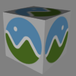

# Box Textured

## Tags

[core](../../Models-core.md), [issues](../../Models-issues.md), [testing](../../Models-testing.md)

## Summary

Box with a power-of-2 texture. [Issues: non-Khronos mark]

## Operations

* [Display](https://github.khronos.org/glTF-Sample-Viewer-Release/?model=https://raw.GithubUserContent.com/KhronosGroup/glTF-Sample-Assets/main/./Models/BoxTextured/glTF-Binary/BoxTextured.glb) in SampleViewer
* [Download GLB](https://raw.GithubUserContent.com/KhronosGroup/glTF-Sample-Assets/main/./Models/BoxTextured/glTF-Binary/BoxTextured.glb)
* [Model Directory](./)

## Screenshot

## Description

Box with a power-of-2 texture, using the Cesium logo.

## Legal

&copy; 2017, Cesium. [CC-BY 4.0 International with Trademark Limitations]()

 - Cesium for Everything

&copy; 2015, Cesium. [Cesium Trademark or Logo]()

 - Non-copyrightable logo for Cesium logo

#### Assembled by modelmetadata