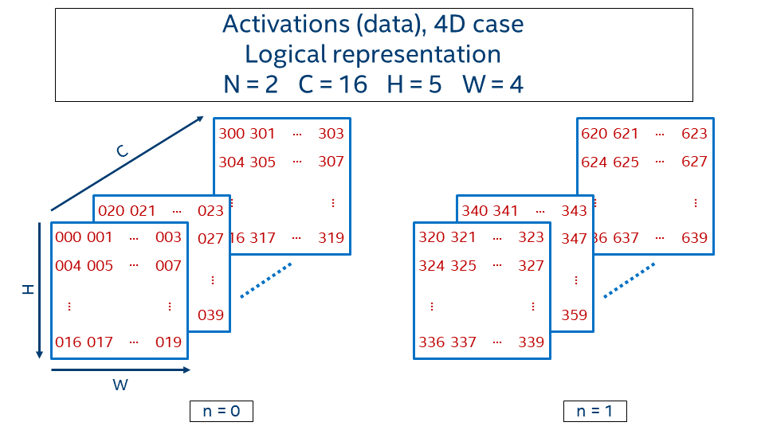
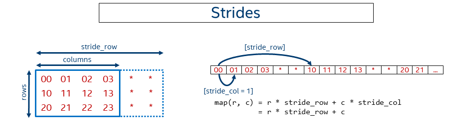
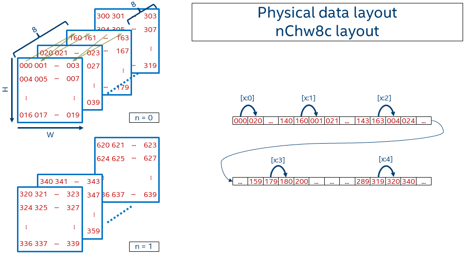
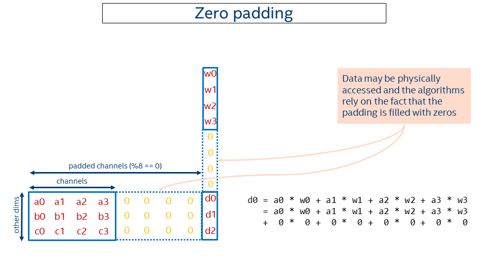

Understanding Memory Formats {#understanding_memory_formats}
============================================================

## Introduction

Most of the computations are about data: analyzing data, adjusting
data, reading and storing data, generating data... DNN domain is no
exception. Images, weights/filters, sound, and text require
efficient representation in computer memory to perform operations fast and in
the most convenient way.

This article is devoted to **data format** -- one form of data
representation that describes how multidimensional arrays (nD) are stored in
linear (1D) memory address space and why this is important for
[Intel(R) Math Kernel Library for Deep Neural Networks (Intel(R) MKL-DNN)](https://github.com/intel/mkl-dnn/).

> Note: for the purpose of this article data *format* and *layout*
>       are used interchangeably.

### Nomenclature used

- Channels mean the same as feature maps
- Upper-case letters denote the dimensions (e.g. `N`)
- Lower-case letters denote the index (e.g. `n`, where `0 <= n < N`)
- The notation for the activations:

  *batch*         **N**,
  *channels*      **C**,
  *depth*         **D**,
  *height*        **H**,
  *width*         **W**

- The notation for the weights:

  *groups*            **G**,
  *output channels*   **O**,
  *input channels*    **I**,
  *depth*             **D**,
  *height*            **H**,
  *width*             **W**

## Data formats

Let's first focus on data formats for activations (images).

Activations consist of channels (aka feature maps) and a spatial domain,
1D, 2D or 3D. Spatial domain together with channels form an image.
During the training phase images are typically grouped together in batches.
Even if there is only one image, we would still assume there is a batch
with batch size equal to 1.
Hence, the overall dimensionality of activations is 4D (**N**, **C**, **H**,
and **W**) or 5D (**N**, **C**, **D**, **H**, and **W**).

In this article for the sake of simplicity we will use 2D spatial only.

### Plain data formats

It would be simpler to start with an example.

Consider 4D activations with batch equals 2, 16 channels, and 5 x 4 spatial
domain.
Logical representation is given on the picture below.

The value at the position (n, c, h, w) is generated with the following formula:
~~~
    value(n, c, h, w) = n * CHW + c * HW + h * W + w
~~~

In order to define how data in this 4D-tensor is laid out in memory we need to
define how to map it to a 1D tensor via an **offset** function that takes
logical index (n, c, h, w) as an input and returns an address displacement to
where the value is located:
~~~
    offset : (int, int, int, int) --> int
~~~

#### NCHW

Let's describe the order in which the tensor values are laid out in memory
for one the very popular format **NCHW**.
The `[a:?]` marks refer to the jumps shown in the picture below that
shows the 1D representation of an NCHW tensor in memory.

-
  `[a:0]`
  First within a line, from left to right

-
  `[a:1]`
  Then line by line from top to bottom

-
  `[a:2]`
  Then go from one plane to another (in depth)

-
  `[a:3]`
  And finally switch from one image in a batch (**n** = 0)
  to another (**n** = 1)

Then the offset function is:
~~~
    offset_nchw(n, c, h, w) = n * CHW + c * HW + h * W + w
~~~

We use `nchw` here to denote that `w` is the inner-most dimension, meaning that
two elements adjacent in memory would share the same indices of `n`, `c`,
and `h`, and their index of `w` would be different by `1`. This is of course
true only for non-border elements. On the contrary `n` is the outermost dimension
here, meaning that if you need to take the same pixel `(c, h, w)` but on the
next image you have to jump over the whole image size `C*H*W`.

This data format is called **NCHW** and used by default in BVLC\* Caffe.
TensorFlow\* also supports this data format.

> Note: It is just a coincidence that `offset_nchw()` is the same as `value()`
>       in this example.

One can create memory with **NCHW** data layout using
#mkldnn_nchw of the enum type #mkldnn_format_tag_t defined in
[mkldnn_types.h](https://github.com/intel/mkl-dnn/blob/master/include/mkldnn_types.h)
for C API and mkldnn::memory::nchw defined in
[mkldnn.hpp](https://github.com/intel/mkl-dnn/blob/master/include/mkldnn.hpp)
for C++ API.

#### NHWC

Another quite popular data format is **NHWC**
and it uses the following offset function:
~~~
    offset_nhwc(n, c, h, w) = n * HWC + h * WC + w * C + c
~~~

In this case the inner-most dimension is channels (`[b:0]`) that is followed
by width (`[b:1]`), height (`[b:2]`), and finally batch (`[b:3]`).

For a single image (**N** = 1), this format is very similar to how
[BMP-file format](https://en.wikipedia.org/wiki/BMP_file_format) works,
where the image is kept pixel by pixel and every pixel contains all
required information about colors (for instance 3 channels for 24bit BMP).

NHWC data format is the default one for
[TensorFlow](https://www.tensorflow.org/performance/performance_guide#data_formats).

This layout corresponds to #mkldnn_nhwc or mkldnn::memory::nhwc.

#### CHWN

The last example here for the plain data layout is **CHWN** which is used by
[Neon](https://neon.nervanasys.com/index.html/design.html#data-layout).
This layout might be very interesting from a vectorization perspective if
an appropriate batch size is used, but on the other hand users cannot always
have *good* batch size
(e.g. in case of real-time inference batch is typically 1).

The dimensions order is (from inner-most to outer-most):
batch (`[c:0]`), width (`[c:1]`), height (`[c:2]`), channels (`[c:3]`).

The offset function for **CHWN** format is defined as:
~~~
    offset_chwn(n, c, h, w) = c * HWN + h * WN + w * N + n
~~~

This layout corresponds to #mkldnn_chwn or mkldnn::memory::chwn.

#### Relevant reading

[TensorFlow Doc. Shapes and Layout](https://www.tensorflow.org/performance/xla/shapes)

### Generalization of the plain data layout

#### Strides

In the previous examples the data was kept packed or in dense form, meaning
pixels follow one another.
Sometimes it might be necessary to not keep data contiguous in memory.
For instance some might need to work with sub-tensor within a bigger tensor.
Sometimes it might be beneficial to artificially make the data disjoint, like
in case of GEMM with non-trivial leading dimension to get better performance
([see Tips 6](https://software.intel.com/en-us/articles/a-simple-example-to-measure-the-performance-of-an-intel-mkl-function)).

The following picture shows simplified case for 2D matrix of size
`rows x columns` kept in row-major format where rows have some non-trivial
(i.e. not equal to the number of columns) stride.

In this case the general offset function looks like:
~~~
    offset(n, c, h, w) = n * stride_n
                       + c * stride_c
                       + h * stride_h
                       + w * stride_w
~~~

Note, then **NCHW**, **NHWC**, and **CHWN** formats are just special
cases of the format with strides. For example for **NCHW** we have:
~~~
    stride_n = CHW, stride_c = HW, stride_h = W, stride_w = 1
~~~

Intel MKL-DNN supports strides via blocking structure. The pseudo code is:
~~~cpp
    memory_desc_t md; // memory descriptor object

    // logical description, layout independent
    md.ndims = 4;           // # dimensions
    md.dims = {N, C, H, W}; // dimensions themselves

    // physical description
    md.memory_format = mkldnn_blocked; // generic blocked format
    md.layout_desc.blocking.strides[0] = {
        stride_n, stride_c, stride_h, stride_w
    };
~~~
In particular whenever a user creates memory with #mkldnn_nchw format MKL-DNN
computes the strides and fills the structure on behalf of the user. That
can be done manually though.

## Blocked layout

Plain layouts give great flexibility and are very convenient for use. That's
why most of the frameworks and applications use either **NCHW** or **NHWC**
layouts. However depending on the operation that is performed on data it might
turn out that those layouts are sub-optimal from performance perspective.

In order to achieve better vectorization and cache re-usage Intel MKL-DNN
introduces blocked layout that splits one or several dimensions into the
blocks of fixed size. The most popular Intel MKL-DNN data format is
**nChw16c** on AVX512+ systems and **nChw8c** on SSE4.2+ systems. As one
might guess from the name the only dimension that is blocked is channels and
the block size is either 16 in the former case or 8 in the later case.

Precisely, the offset function for **nChw8c** is:
~~~
    offset_nChw8c(n, c, h, w) = n * CHW
                              + (c / 8) * HW*8
                              + h * W*8
                              + w * 8
                              + (c % 8)
~~~

Note that blocks of 8 channels are kept contiguously in memory. Pixel
by pixel the spatial domain is covered. Then next slice covers subsequent
8 channels (i.e. moving from `c=0..7` to `c=8..15`).
Once all channel blocks are covered the next image in the batch appears.

> Note: we use lower- and uppercase letters in the formats to distinguish
>       between the blocks (e.g. 8c) and the remaining co-dimension
>       (**C** = channels / 8).

The reason behind the format choice can be found in
[this paper](https://arxiv.org/pdf/1602.06709v1.pdf).

Intel MKL-DNN describes this type of memory via blocking structure
as well. The pseudo code is:
~~~cpp
    memory_desc_t md;
    // logical description, layout independent
    md.ndims = 4;           // # dimensions
    md.dims = {N, C, H, W}; // dimensions themselves

    // physical description
    md.memory_format = mkldnn_nChw8c; // blocked layout with
                                      // channels blocked by 8
    md.layout_desc.blocking.block_dims = {
        1, // no blocking by n, hence 1
        8, //    blocking by c, hence 8
        1, // no blocking by h, hence 1
        1, // no blocking by w, hence 1
    };

    ptrdiff_t stride_n = C*H*W;
    ptrdiff_t stride_C = H*W*8;
    ptrdiff_t stride_h =   W*8;
    ptrdiff_t stride_w =     8;
    ptrdiff_t stride_8c =    1;

    md.layout_desc.blocking.strides[0] = { // strides between blocks
        stride_n, stride_C, stride_h, stride_w
    };
    md.layout_desc.blocking.strides[1] = { // strides within blocks
        1,         // ignored since no blocking by n
        stride_8c, // blocks of channels are contiguous
        1,         // ignored since no blocking by h
        1,         // ignored since no blocking by w
    };
~~~

### What if channels are not multiple of 8 (or 16)?

Blocking data layout gives significant performance improvement for the
convolutions, but what to do when the number of channels is not multiple
of the block size, say 17 channels for **nChw8c** format?

Well one of the possible ways to handle that would be to use blocked layout for
as many channels as possible by rounding them down to a number that is
a multiple of the block size (in this case `16 = 17 / 8 * 8`) and process
the tail somehow. However that would lead to introduction of very special tail
processing code into many Intel MKL-DNN kernels.

So we came up with another solution using zero-padding. The idea is to round
the channels up to make them multiples of the block size and pad created tail
with zeros (in the example above `24 = div_up(17, 8) * 8`). Then primitives
like convolutions might work with rounded-up number of channels instead of
the original ones and compute the correct result (adding zeros doesn't change
the result).

That allows supporting arbitrary number of channels with almost no changes
to the kernels. The price would be some extra computations on those zeros,
but this is either negligible or the performance with overheads is still
higher than the performance with plain data layout.

The picture below depicts the idea. Note that some extra computations
happen while computing `d0`, but that does not affect the result.

The feature is supported starting with Intel MKL-DNN
[v0.15](https://github.com/intel/mkl-dnn/releases/tag/v0.15). So far the
support is limited by `f32` data type and on the AVX512+ systems. We plan
to extend the implementations for other cases as well.

Some pitfalls of the given approach:

- To keep *padded data are zeros* invariant mkldnn_memory_set_data_handle()
  and mkldnn::memory::set_data_handle() physically put zeros
  whenever user attaches a pointer to a memory that uses zero padding. That
  might affect performance if too many unnecessary calls to these functions
  are made. We might consider extending our API in future to allow attaching
  pointers without subsequent initialization with zeros, if user can guarantee
  the padding is already filled correctly

- Memory size required to keep the data cannot be computed by the formula
  `sizeof(data_type) * N * C * H * W` anymore. Actual size should always be
  queried via mkldnn_memory_primitive_desc_get_size() in C and
  mkldnn::memory::primitive_desc::get_size() in C++

- Element-wise operations that are implemented in user's code and directly
  operate on Intel MKL-DNN blocked layout like that:
  ~~~
      for (int e = 0; e < phys_size; ++e)
          x[e] = eltwise_op(x[e])
  ~~~
  are not safe if the data is padded with zeros and the `eltwise_op(0) != 0`

Relevant Intel MKL-DNN code:
~~~cpp
    const int C = 17;
    const int C_padded = div_up(17, 8) * 8; // 24

    // logical description, layout independent
    const int ndims    = 4;            // # of dimensions
    mkldnn_dims_t dims = {N, C, H, W}; // dimensions themselves

    memory_desc_t md;
    // initialize memory descriptor
    mkldnn_memory_desc_init(&md, ndims,
                                 dims,
                                 mkldnn_f32,   // single precision data type
                                 mkldnn_nChw8c // blocked layout
                                 );

    ptrdiff_t expect_stride_n = C_padded*H*W;   // note C_padded here, not C
    ptrdiff_t expect_stride_C =          H*W*8;
    ptrdiff_t expect_stride_h =            W*8;
    ptrdiff_t expect_stride_w =              8;
    ptrdiff_t expect_stride_8c =             1;

    bool expect_true = true
        && true // logical dims stay as is
        && md.dims[0] == N
        && md.dims[1] == C
        && md.dims[2] == H
        && md.dims[3] == W
        && true // padded dims are rounded accordingly
        && md.layout_desc.blocking.padding_dims[0] == N
        && md.layout_desc.blocking.padding_dims[1] == C_padded
        && md.layout_desc.blocking.padding_dims[2] == H
        && md.layout_desc.blocking.padding_dims[3] == W
        && true // strides correspond to the physcal layout
        && md.layout_desc.blocking.strides[0][0] == expect_stride_n
        && md.layout_desc.blocking.strides[0][1] == expect_stride_C
        && md.layout_desc.blocking.strides[0][2] == expect_stride_h
        && md.layout_desc.blocking.strides[0][3] == expect_stride_w
        && md.layout_desc.blocking.strides[1][1] == expect_stride_8c;

    assert(expect_true);
~~~

---

[Legal information](@ref legal_information)
