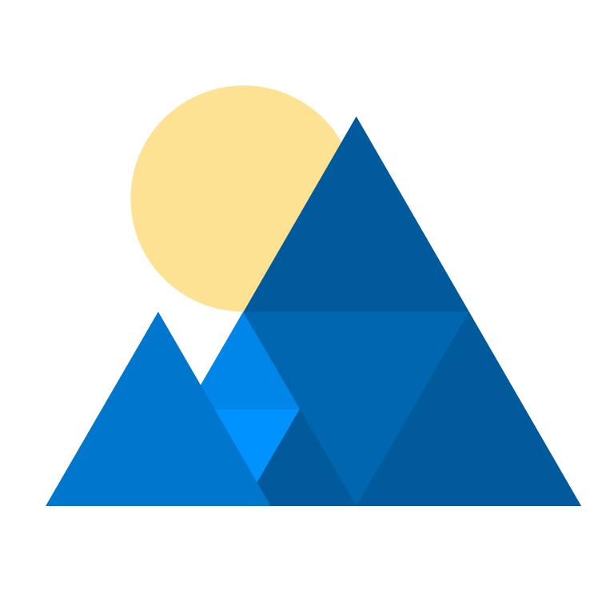

  

  
  

# Dawn, a WebGPU implementation

Dawn is an open-source and cross-platform implementation of the [WebGPU](https://webgpu.dev) standard.
More precisely it implements [`webgpu.h`](https://github.com/webgpu-native/webgpu-headers/blob/main/webgpu.h) that is a one-to-one mapping with the WebGPU IDL.
Dawn is meant to be integrated as part of a larger system and is the underlying implementation of WebGPU in Chromium.

Dawn provides several WebGPU building blocks:
 - **WebGPU C/C++ headers** that applications and other building blocks use.
   - The `webgpu.h` version that Dawn implements.
   - A C++ wrapper for the `webgpu.h`.
 - **A "native" implementation of WebGPU** using platforms' GPU APIs: D3D12, Metal, Vulkan and OpenGL. See [per API support](docs/support.md) for more details.
 - **A client-server implementation of WebGPU** for applications that are in a sandbox without access to native drivers
 - **Tint** is a compiler for the WebGPU Shader Language (WGSL) that can be used in standalone to convert shaders from and to WGSL.

Helpful links:

 - [Dawn bug tracker](https://issues.chromium.org/savedsearches/6783309) if you find issues with Dawn. Create a new issue [here](https://issues.chromium.org/issues/new?noWizard=true&component=1570784).
 - [Tint bug tracker](https://issues.chromium.org/savedsearches/6783217) if you find issues with Tint. Create a new issue [here](https://issues.chromium.org/issues/new?noWizard=true&component=1571063).
 - [Dawn's mailing list](https://groups.google.com/g/dawn-graphics) for other discussions related to Dawn.
 - [Dawn's source code](https://dawn.googlesource.com/dawn)
 - [Dawn's Matrix chatroom](https://matrix.to/#/#webgpu-dawn:matrix.org) for live discussion around contributing or using Dawn.
 - [WebGPU's Matrix chatroom](https://matrix.to/#/#WebGPU:matrix.org)
 - [Tint mirror](https://dawn.googlesource.com/tint) for standalone usage.

## Documentation table of content

Developer documentation:

 - [Dawn overview](docs/dawn/overview.md)
 - [Building](docs/building.md)
 - [Contributing](CONTRIBUTING.md)
 - [Code of Conduct](CODE_OF_CONDUCT.md)
 - [Testing Dawn](docs/dawn/testing.md)
 - [Testing Tint](docs/tint/testing.md)
 - [Debugging Dawn](docs/dawn/debugging.md)
 - [Dawn's infrastructure](docs/dawn/infra.md)
 - [Dawn errors](docs/dawn/errors.md)
 - [Tint experimental extensions](docs/tint/experimental_extensions.md)
 - [Quickstart with CMake](docs/quickstart-cmake.md)
 - [Becoming a committer](docs/becoming-committer.md)

User documentation: (TODO, figure out what overlaps with the webgpu.h docs)

## License

BSD 3-Clause License, please see [LICENSE](/LICENSE).

## Disclaimer

This is not an officially supported Google product.
