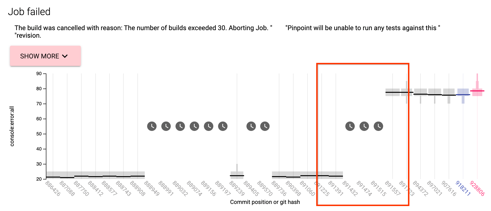
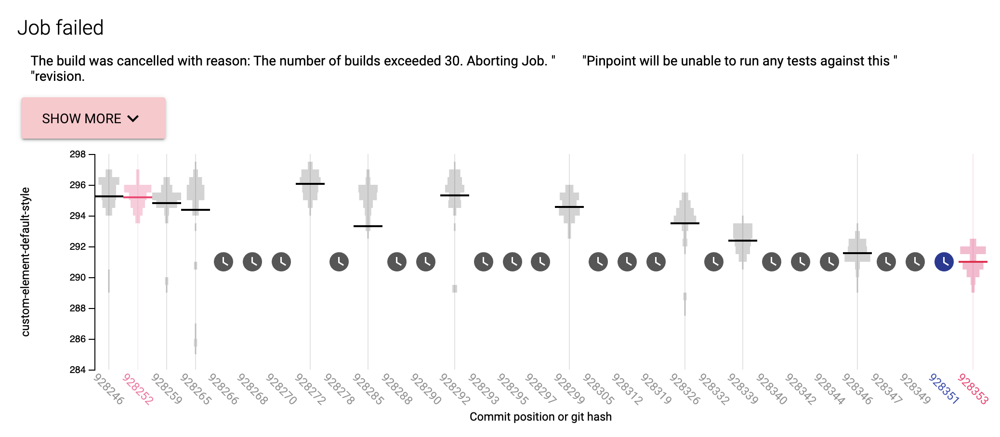
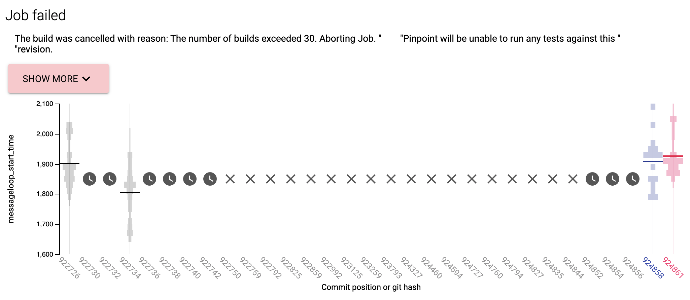

# Suggestions for what to do when Pinpoint job aborted after exceeding MAX_BUILDS

[TOC]

## Introduction

Pinpoint jobs will abort if they exceeded some number of builds. Typically jobs hit the build cap because there are multiple culprit CLs within the CL range.

This document shows some example Pinpoint jobs and how they could be rerun to get a potentially more useful result. If these suggestions do not work, then it is likely that Pinpoint would not be able to find the correct culprit CL even if the job was allowed to run indefinitely. 

## CL range is too long (>1000 CLs)

[Link to job](https://pinpoint-dot-chromeperf.appspot.com/job/16f46fc4720000)

Rerun Pinpoint over a smaller CL range, focusing on the most important regressions. In the example job, rerun around the largest regression between 891391 and 891557. 

## Many changes detected 

[Link to job](https://pinpoint-dot-chromeperf.appspot.com/job/10aedea0720000)

Sometimes a metric will fluctuate multiple times within a CL range. Here it can be hard to decipher what changes are real and what is noise. We recommend rerunning around either more significant regressions or more recent regressions. 

## Build/Test failures 

[Link to job](https://pinpoint-dot-chromeperf.appspot.com/job/11010d9bb20000) 

Sometimes a Pinpoint job will fail on a particular commit. When a commit fails, Pinpoint will schedule more jobs until it retrieves the information it needs. First, check if the start and end CLs show any significant regressions. If not, then the Pinpoint job is unlikely worth rerunning. If there is, try to investigate the cause of the failures and which CL fixed the failure. Start by clicking on any of the failed tests and look at its log. In this example, the failure is caused by a missing APK. Examining CLs within known failure (924844) and known success (924858), shows that [CL 924853](https://chromium-review.googlesource.com/c/chromium/src/+/3182648) fixes the issue. One can rerun the bisect with that CL applied.
