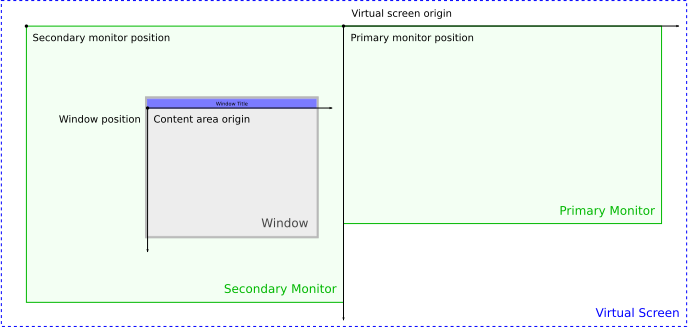

# Introduction to the API {#intro_guide}

[TOC]

This guide introduces the basic concepts of GLFW and describes initialization,
error handling and API guarantees and limitations.  For a broad but shallow
tutorial, see @ref quick_guide instead.  For details on a specific function in
this category, see the @ref init.

There are also guides for the other areas of GLFW.

 - @ref window_guide
 - @ref context_guide
 - @ref vulkan_guide
 - @ref monitor_guide
 - @ref input_guide


## Initialization and termination {#intro_init}

Before most GLFW functions may be called, the library must be initialized.
This initialization checks what features are available on the machine,
enumerates monitors, initializes the timer and performs any required
platform-specific initialization.

Only the following functions may be called before the library has been
successfully initialized, and only from the main thread.

 - @ref glfwGetVersion
 - @ref glfwGetVersionString
 - @ref glfwPlatformSupported
 - @ref glfwGetError
 - @ref glfwSetErrorCallback
 - @ref glfwInitHint
 - @ref glfwInitAllocator
 - @ref glfwInitVulkanLoader
 - @ref glfwInit
 - @ref glfwTerminate

Calling any other function before successful initialization will cause a @ref
GLFW_NOT_INITIALIZED error.


### Initializing GLFW {#intro_init_init}

The library is initialized with @ref glfwInit, which returns `GLFW_FALSE` if an
error occurred.

```c
if (!glfwInit())
{
    // Handle initialization failure
}
```

If any part of initialization fails, any parts that succeeded are terminated as
if @ref glfwTerminate had been called.  The library only needs to be initialized
once and additional calls to an already initialized library will return
`GLFW_TRUE` immediately.

Once the library has been successfully initialized, it should be terminated
before the application exits.  Modern systems are very good at freeing resources
allocated by programs that exit, but GLFW sometimes has to change global system
settings and these might not be restored without termination.

@macos When the library is initialized the main menu and dock icon are created.
These are not desirable for a command-line only program.  The creation of the
main menu and dock icon can be disabled with the @ref GLFW_COCOA_MENUBAR init
hint.


### Initialization hints {#init_hints}

Initialization hints are set before @ref glfwInit and affect how the library
behaves until termination.  Hints are set with @ref glfwInitHint.

```c
glfwInitHint(GLFW_JOYSTICK_HAT_BUTTONS, GLFW_FALSE);
```

The values you set hints to are never reset by GLFW, but they only take effect
during initialization.  Once GLFW has been initialized, any values you set will
be ignored until the library is terminated and initialized again.

Some hints are platform specific.  These may be set on any platform but they
will only affect their specific platform.  Other platforms will ignore them.
Setting these hints requires no platform specific headers or functions.


#### Shared init hints {#init_hints_shared}

@anchor GLFW_PLATFORM
__GLFW_PLATFORM__ specifies the platform to use for windowing and input.
Possible values are `GLFW_ANY_PLATFORM`, `GLFW_PLATFORM_WIN32`,
`GLFW_PLATFORM_COCOA`, `GLFW_PLATFORM_WAYLAND`, `GLFW_PLATFORM_X11` and
`GLFW_PLATFORM_NULL`.  The default value is `GLFW_ANY_PLATFORM`, which will
choose any platform the library includes support for except for the Null
backend.


@anchor GLFW_JOYSTICK_HAT_BUTTONS
__GLFW_JOYSTICK_HAT_BUTTONS__ specifies whether to also expose joystick hats as
buttons, for compatibility with earlier versions of GLFW that did not have @ref
glfwGetJoystickHats.  Possible values are `GLFW_TRUE` and `GLFW_FALSE`.

@anchor GLFW_ANGLE_PLATFORM_TYPE_hint
__GLFW_ANGLE_PLATFORM_TYPE__ specifies the platform type (rendering backend) to
request when using OpenGL ES and EGL via [ANGLE][].  If the requested platform
type is unavailable, ANGLE will use its default. Possible values are one of
`GLFW_ANGLE_PLATFORM_TYPE_NONE`, `GLFW_ANGLE_PLATFORM_TYPE_OPENGL`,
`GLFW_ANGLE_PLATFORM_TYPE_OPENGLES`, `GLFW_ANGLE_PLATFORM_TYPE_D3D9`,
`GLFW_ANGLE_PLATFORM_TYPE_D3D11`, `GLFW_ANGLE_PLATFORM_TYPE_VULKAN` and
`GLFW_ANGLE_PLATFORM_TYPE_METAL`.

[ANGLE]: https://chromium.googlesource.com/angle/angle/

The ANGLE platform type is specified via the `EGL_ANGLE_platform_angle`
extension.  This extension is not used if this hint is
`GLFW_ANGLE_PLATFORM_TYPE_NONE`, which is the default value.


#### macOS specific init hints {#init_hints_osx}

@anchor GLFW_COCOA_CHDIR_RESOURCES_hint
__GLFW_COCOA_CHDIR_RESOURCES__ specifies whether to set the current directory to
the application to the `Contents/Resources` subdirectory of the application's
bundle, if present.  Possible values are `GLFW_TRUE` and `GLFW_FALSE`.  This is
ignored on other platforms.

@anchor GLFW_COCOA_MENUBAR_hint
__GLFW_COCOA_MENUBAR__ specifies whether to create the menu bar and dock icon
when GLFW is initialized.  This applies whether the menu bar is created from
a nib or manually by GLFW.  Possible values are `GLFW_TRUE` and `GLFW_FALSE`.
This is ignored on other platforms.


#### Wayland specific init hints {#init_hints_wayland}

@anchor GLFW_WAYLAND_LIBDECOR_hint
__GLFW_WAYLAND_LIBDECOR__ specifies whether to use [libdecor][] for window
decorations where available.  Possible values are `GLFW_WAYLAND_PREFER_LIBDECOR`
and `GLFW_WAYLAND_DISABLE_LIBDECOR`.  This is ignored on other platforms.

[libdecor]: https://gitlab.freedesktop.org/libdecor/libdecor


#### X11 specific init hints {#init_hints_x11}

@anchor GLFW_X11_XCB_VULKAN_SURFACE_hint
__GLFW_X11_XCB_VULKAN_SURFACE__ specifies whether to prefer the
`VK_KHR_xcb_surface` extension for creating Vulkan surfaces, or whether to use
the `VK_KHR_xlib_surface` extension.  Possible values are `GLFW_TRUE` and
`GLFW_FALSE`.  This is ignored on other platforms.


#### Supported and default values {#init_hints_values}

Initialization hint              | Default value                   | Supported values
-------------------------------- | ------------------------------- | ----------------
@ref GLFW_PLATFORM               | `GLFW_ANY_PLATFORM`             | `GLFW_ANY_PLATFORM`, `GLFW_PLATFORM_WIN32`, `GLFW_PLATFORM_COCOA`, `GLFW_PLATFORM_WAYLAND`, `GLFW_PLATFORM_X11` or `GLFW_PLATFORM_NULL`
@ref GLFW_JOYSTICK_HAT_BUTTONS   | `GLFW_TRUE`                     | `GLFW_TRUE` or `GLFW_FALSE`
@ref GLFW_ANGLE_PLATFORM_TYPE    | `GLFW_ANGLE_PLATFORM_TYPE_NONE` | `GLFW_ANGLE_PLATFORM_TYPE_NONE`, `GLFW_ANGLE_PLATFORM_TYPE_OPENGL`, `GLFW_ANGLE_PLATFORM_TYPE_OPENGLES`, `GLFW_ANGLE_PLATFORM_TYPE_D3D9`, `GLFW_ANGLE_PLATFORM_TYPE_D3D11`, `GLFW_ANGLE_PLATFORM_TYPE_VULKAN` or `GLFW_ANGLE_PLATFORM_TYPE_METAL`
@ref GLFW_COCOA_CHDIR_RESOURCES  | `GLFW_TRUE`                     | `GLFW_TRUE` or `GLFW_FALSE`
@ref GLFW_COCOA_MENUBAR          | `GLFW_TRUE`                     | `GLFW_TRUE` or `GLFW_FALSE`
@ref GLFW_WAYLAND_LIBDECOR       | `GLFW_WAYLAND_PREFER_LIBDECOR`  | `GLFW_WAYLAND_PREFER_LIBDECOR` or `GLFW_WAYLAND_DISABLE_LIBDECOR`
@ref GLFW_X11_XCB_VULKAN_SURFACE | `GLFW_TRUE`                     | `GLFW_TRUE` or `GLFW_FALSE`


### Runtime platform selection {#platform}

GLFW can be compiled for more than one platform (window system) at once.  This lets
a single library binary support both Wayland and X11 on Linux and other Unix-like systems.

You can control platform selection via the @ref GLFW_PLATFORM initialization hint.  By
default, this is set to @ref GLFW_ANY_PLATFORM, which will look for supported window
systems in order of priority and select the first one it finds.  It can also be set to any
specific platform to have GLFW only look for that one.

```c
glfwInitHint(GLFW_PLATFORM, GLFW_PLATFORM_X11);
```

This mechanism also provides the Null platform, which is always supported but needs to be
explicitly requested.  This platform is effectively a stub, emulating a window system on
a single 1080p monitor, but will not interact with any actual window system.

```c
glfwInitHint(GLFW_PLATFORM, GLFW_PLATFORM_NULL);
```

You can test whether a library binary was compiled with support for a specific platform
with @ref glfwPlatformSupported.

```c
if (glfwPlatformSupported(GLFW_PLATFORM_WAYLAND))
    glfwInitHint(GLFW_PLATFORM, GLFW_PLATFORM_WAYLAND);
```

Once GLFW has been initialized, you can query which platform was selected with @ref
glfwGetPlatform.

```c
int platform = glfwGetPlatform();
```

If you are using any [native access functions](@ref native), especially on Linux and other
Unix-like systems, then you may need to check that you are calling the ones matching the
selected platform.


### Custom heap memory allocator {#init_allocator}

The heap memory allocator can be customized before initialization with @ref
glfwInitAllocator.

```c
GLFWallocator allocator;
allocator.allocate = my_malloc;
allocator.reallocate = my_realloc;
allocator.deallocate = my_free;
allocator.user = NULL;

glfwInitAllocator(&allocator);
```

The allocator will be made active at the beginning of initialization and will be used by
GLFW until the library has been fully terminated.  Any allocator set after initialization
will be picked up only at the next initialization.

The allocator will only be used for allocations that would have been made with
the C standard library.  Memory allocations that must be made with platform
specific APIs will still use those.

The allocation function must have a signature matching @ref GLFWallocatefun.  It receives
the desired size, in bytes, and the user pointer passed to @ref glfwInitAllocator and
returns the address to the allocated memory block.

```c
void* my_malloc(size_t size, void* user)
{
    ...
}
```

The documentation for @ref GLFWallocatefun also lists the requirements and limitations for
an allocation function.  If the active one does not meet all of these, GLFW may fail.

The reallocation function must have a function signature matching @ref GLFWreallocatefun.
It receives the memory block to be reallocated, the new desired size, in bytes, and the user
pointer passed to @ref glfwInitAllocator and returns the address to the resized memory
block.

```c
void* my_realloc(void* block, size_t size, void* user)
{
    ...
}
```

The documentation for @ref GLFWreallocatefun also lists the requirements and limitations
for a reallocation function.  If the active one does not meet all of these, GLFW may fail.

The deallocation function must have a function signature matching @ref GLFWdeallocatefun.
It receives the memory block to be deallocated and the user pointer passed to @ref
glfwInitAllocator.

```c
void my_free(void* block, void* user)
{
    ...
}
```

The documentation for @ref GLFWdeallocatefun also lists the requirements and limitations
for a deallocation function.  If the active one does not meet all of these, GLFW may fail.


### Terminating GLFW {#intro_init_terminate}

Before your application exits, you should terminate the GLFW library if it has
been initialized.  This is done with @ref glfwTerminate.

```c
glfwTerminate();
```

This will destroy any remaining window, monitor and cursor objects, restore any
modified gamma ramps, re-enable the screensaver if it had been disabled and free
any other resources allocated by GLFW.

Once the library is terminated, it is as if it had never been initialized, therefore
you will need to initialize it again before being able to use GLFW.  If the
library was not initialized or had already been terminated, it returns
immediately.


## Error handling {#error_handling}

Some GLFW functions have return values that indicate an error, but this is often
not very helpful when trying to figure out what happened or why it occurred.
Other functions have no return value reserved for errors, so error notification
needs a separate channel.  Finally, far from all GLFW functions have return
values.

The last [error code](@ref errors) for the calling thread can be queried at any
time with @ref glfwGetError.

```c
int code = glfwGetError(NULL);

if (code != GLFW_NO_ERROR)
    handle_error(code);
```

If no error has occurred since the last call, @ref GLFW_NO_ERROR (zero) is
returned.  The error is cleared before the function returns.

The error code indicates the general category of the error.  Some error codes,
such as @ref GLFW_NOT_INITIALIZED has only a single meaning, whereas others like
@ref GLFW_PLATFORM_ERROR are used for many different errors.

GLFW often has more information about an error than its general category.  You
can retrieve a UTF-8 encoded human-readable description along with the error
code.  If no error has occurred since the last call, the description is set to
`NULL`.

```c
const char* description;
int code = glfwGetError(&description);

if (description)
    display_error_message(code, description);
```

The retrieved description string is only valid until the next error occurs.
This means you must make a copy of it if you want to keep it.

You can also set an error callback, which will be called each time an error
occurs.  It is set with @ref glfwSetErrorCallback.

```c
glfwSetErrorCallback(error_callback);
```

The error callback receives the same error code and human-readable description
returned by @ref glfwGetError.

```c
void error_callback(int code, const char* description)
{
    display_error_message(code, description);
}
```

The error callback is called after the error is stored, so calling @ref
glfwGetError from within the error callback returns the same values as the
callback argument.

The description string passed to the callback is only valid until the error
callback returns.  This means you must make a copy of it if you want to keep it.

__Reported errors are never fatal.__  As long as GLFW was successfully
initialized, it will remain initialized and in a safe state until terminated
regardless of how many errors occur.  If an error occurs during initialization
that causes @ref glfwInit to fail, any part of the library that was initialized
will be safely terminated.

Do not rely on a currently invalid call to generate a specific error, as in the
future that same call may generate a different error or become valid.


## Coordinate systems {#coordinate_systems}

GLFW has two primary coordinate systems: the _virtual screen_ and the window
_content area_ or _content area_.  Both use the same unit: _virtual screen
coordinates_, or just _screen coordinates_, which don't necessarily correspond
to pixels.



Both the virtual screen and the content area coordinate systems have the X-axis
pointing to the right and the Y-axis pointing down.

Window and monitor positions are specified as the position of the upper-left
corners of their content areas relative to the virtual screen, while cursor
positions are specified relative to a window's content area.

Because the origin of the window's content area coordinate system is also the
point from which the window position is specified, you can translate content
area coordinates to the virtual screen by adding the window position.  The
window frame, when present, extends out from the content area but does not
affect the window position.

Almost all positions and sizes in GLFW are measured in screen coordinates
relative to one of the two origins above.  This includes cursor positions,
window positions and sizes, window frame sizes, monitor positions and video mode
resolutions.

Two exceptions are the [monitor physical size](@ref monitor_size), which is
measured in millimetres, and [framebuffer size](@ref window_fbsize), which is
measured in pixels.

Pixels and screen coordinates may map 1:1 on your machine, but they won't on
every other machine, for example on a Mac with a Retina display.  The ratio
between screen coordinates and pixels may also change at run-time depending on
which monitor the window is currently considered to be on.


## Guarantees and limitations {#guarantees_limitations}

This section describes the conditions under which GLFW can be expected to
function, barring bugs in the operating system or drivers.  Use of GLFW outside
these limits may work on some platforms, or on some machines, or some of the
time, or on some versions of GLFW, but it may break at any time and this will
not be considered a bug.


### Pointer lifetimes {#lifetime}

GLFW will never free any pointer you provide to it, and you must never free any
pointer it provides to you.

Many GLFW functions return pointers to dynamically allocated structures, strings
or arrays, and some callbacks are provided with strings or arrays.  These are
always managed by GLFW and should never be freed by the application.  The
lifetime of these pointers is documented for each GLFW function and callback.
If you need to keep this data, you must copy it before its lifetime expires.

Many GLFW functions accept pointers to structures or strings allocated by the
application.  These are never freed by GLFW and are always the responsibility of
the application.  If GLFW needs to keep the data in these structures or strings,
it is copied before the function returns.

Pointer lifetimes are guaranteed not to be shortened in future minor or patch
releases.


### Reentrancy {#reentrancy}

GLFW event processing and object destruction are not reentrant.  This means that
the following functions must not be called from any callback function:

 - @ref glfwDestroyWindow
 - @ref glfwDestroyCursor
 - @ref glfwPollEvents
 - @ref glfwWaitEvents
 - @ref glfwWaitEventsTimeout
 - @ref glfwTerminate

These functions may be made reentrant in future minor or patch releases, but
functions not on this list will not be made non-reentrant.


### Thread safety {#thread_safety}

Most GLFW functions must only be called from the main thread (the thread that
calls main), but some may be called from any thread once the library has been
initialized.  Before initialization the whole library is thread-unsafe.

The reference documentation for every GLFW function states whether it is limited
to the main thread.

Initialization, termination, event processing and the creation and
destruction of windows, cursors and OpenGL and OpenGL ES contexts are all
restricted to the main thread due to limitations of one or several platforms.

Because event processing must be performed on the main thread, all callbacks
except for the error callback will only be called on that thread.  The error
callback may be called on any thread, as any GLFW function may generate errors.

The error code and description may be queried from any thread.

 - @ref glfwGetError

Empty events may be posted from any thread.

 - @ref glfwPostEmptyEvent

The window user pointer and close flag may be read and written from any thread,
but this is not synchronized by GLFW.

 - @ref glfwGetWindowUserPointer
 - @ref glfwSetWindowUserPointer
 - @ref glfwWindowShouldClose
 - @ref glfwSetWindowShouldClose

These functions for working with OpenGL and OpenGL ES contexts may be called
from any thread, but the window object is not synchronized by GLFW.

 - @ref glfwMakeContextCurrent
 - @ref glfwGetCurrentContext
 - @ref glfwSwapBuffers
 - @ref glfwSwapInterval
 - @ref glfwExtensionSupported
 - @ref glfwGetProcAddress

The raw timer functions may be called from any thread.

 - @ref glfwGetTimerFrequency
 - @ref glfwGetTimerValue

The regular timer may be used from any thread, but reading and writing the timer
offset is not synchronized by GLFW.

 - @ref glfwGetTime
 - @ref glfwSetTime

Library version information may be queried from any thread.

 - @ref glfwGetVersion
 - @ref glfwGetVersionString

Platform information may be queried from any thread.

 - @ref glfwPlatformSupported
 - @ref glfwGetPlatform

All Vulkan related functions may be called from any thread.

 - @ref glfwVulkanSupported
 - @ref glfwGetRequiredInstanceExtensions
 - @ref glfwGetInstanceProcAddress
 - @ref glfwGetPhysicalDevicePresentationSupport
 - @ref glfwCreateWindowSurface

GLFW uses synchronization objects internally only to manage the per-thread
context and error states.  Additional synchronization is left to the
application.

Functions that may currently be called from any thread will always remain so,
but functions that are currently limited to the main thread may be updated to
allow calls from any thread in future releases.


### Version compatibility {#compatibility}

GLFW uses [Semantic Versioning](https://semver.org/).  This guarantees source
and binary backward compatibility with earlier minor versions of the API.  This
means that you can drop in a newer version of the library and existing programs
will continue to compile and existing binaries will continue to run.

Once a function or constant has been added, the signature of that function or
value of that constant will remain unchanged until the next major version of
GLFW.  No compatibility of any kind is guaranteed between major versions.

Undocumented behavior, i.e. behavior that is not described in the documentation,
may change at any time until it is documented.

If the reference documentation and the implementation differ, the reference
documentation will almost always take precedence and the implementation will be
fixed in the next release.  The reference documentation will also take
precedence over anything stated in a guide.


### Event order {#event_order}

The order of arrival of related events is not guaranteed to be consistent
across platforms.  The exception is synthetic key and mouse button release
events, which are always delivered after the window defocus event.


## Version management {#intro_version}

GLFW provides mechanisms for identifying what version of GLFW your application
was compiled against as well as what version it is currently running against.
If you are loading GLFW dynamically (not just linking dynamically), you can use
this to verify that the library binary is compatible with your application.


### Compile-time version {#intro_version_compile}

The compile-time version of GLFW is provided by the GLFW header with the
`GLFW_VERSION_MAJOR`, `GLFW_VERSION_MINOR` and `GLFW_VERSION_REVISION` macros.

```c
printf("Compiled against GLFW %i.%i.%i\n",
       GLFW_VERSION_MAJOR,
       GLFW_VERSION_MINOR,
       GLFW_VERSION_REVISION);
```


### Run-time version {#intro_version_runtime}

The run-time version can be retrieved with @ref glfwGetVersion, a function that
may be called regardless of whether GLFW is initialized.

```c
int major, minor, revision;
glfwGetVersion(&major, &minor, &revision);

printf("Running against GLFW %i.%i.%i\n", major, minor, revision);
```


### Version string {#intro_version_string}

GLFW 3 also provides a compile-time generated version string that describes the
version, platform, compiler and any platform-specific compile-time options.
This is primarily intended for submitting bug reports, to allow developers to
see which code paths are enabled in a binary.

The version string is returned by @ref glfwGetVersionString, a function that may
be called regardless of whether GLFW is initialized.

__Do not use the version string__ to parse the GLFW library version.  The @ref
glfwGetVersion function already provides the version of the running library
binary.

__Do not use the version string__ to parse what platforms are supported.  The @ref
glfwPlatformSupported function lets you query platform support.

__GLFW 3.4:__ The format of this string was changed to support the addition of
[runtime platform selection](@ref platform).

The format of the string is as follows:
 - The version of GLFW
 - For each supported platform:
   - The name of the window system API
   - The name of the window system specific context creation API, if applicable
 - The names of the always supported context creation APIs EGL and OSMesa
 - Any additional compile-time options, APIs and (on Windows) what compiler was used

For example, compiling GLFW 3.5 with MinGW as a DLL for Windows, may result in a version string
like this:

```c
3.5.0 Win32 WGL Null EGL OSMesa MinGW DLL
```

Compiling GLFW as a static library for Linux, with both Wayland and X11 enabled, may
result in a version string like this:

```c
3.5.0 Wayland X11 GLX Null EGL OSMesa monotonic
```

