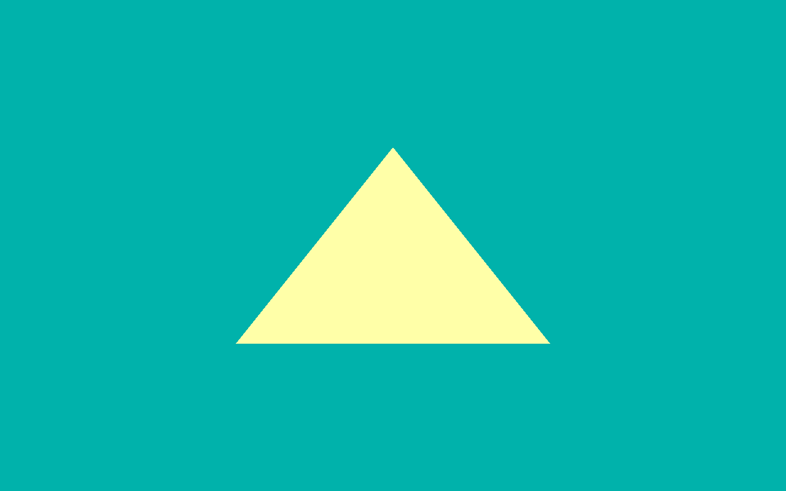

========
HelloAPI
========

Draws a basic triangle to the screen.

API
---
* OpenGL ES 2.0+

Description
-----------
A basic tutorial that guides the user, step-by-step, through the process of drawing a basic triangle to the screen.

This includes:

* initialising a window using raw OpenGL ES
* drawing a triangle with a simple shader 
* terminating the window - depending on the platform, either after a few seconds, or when the user closes the window.

Controls
--------
- Quit- Close the application
