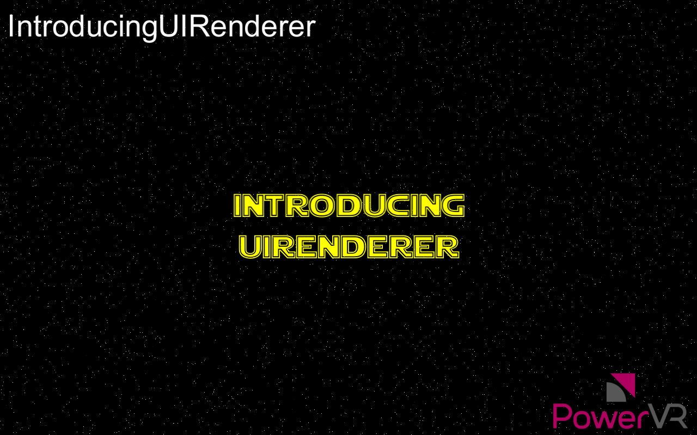

=====================
IntroducingUIRenderer
=====================

This example introduces the UIRenderer from the PVRUtils library for advanced Text tasks.

API
---
* OpenGL ES 2.0

Description
-----------
The UIRenderer allows the user to create "Sprites" (2D elements) which can be grouped in 2D and/or 3D groups to be displayed as UIs or world text. This includes:

* 2D transformations (pixel and/or NDC coordinates) both single, and in a group
* anchoring on different parts of the screen or the group  
* 3D transformations of groups of sprites

In this example, UIRendererer is used to display images and Unicode text, screen aligned, and with 3D transformations. 

Controls
--------
- Quit- Close the application
