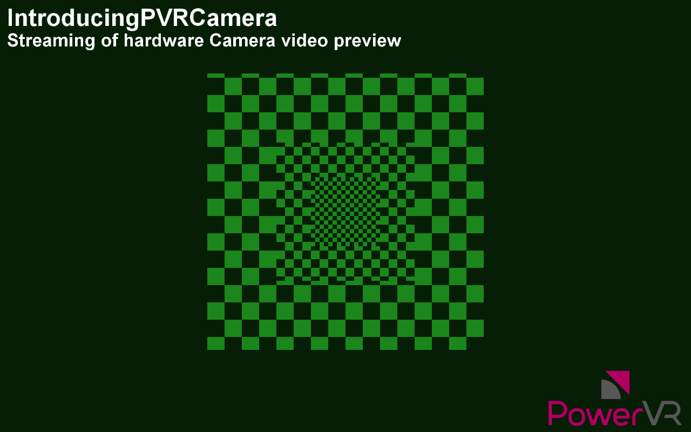

====================
IntroducingPVRCamera
====================

Uses the PVRCamera library to get the hardware camera of a device, and applies a simple colour inversion shader.

API
---
* OpenGL ES 2.0+

Description
-----------
The PVRCamera library provides a very simple, unified API to access the video feed of an iOS or Android device as an OpenGL ES texture. This example displays the texture on the screen using a very simple shader that inverts the colours.

Note: On desktop platforms, the camera interface returns a dummy static texture to aid development. On Android N and above, the Camera permission must be given to the application.

Controls
--------
- Quit- Close the application

