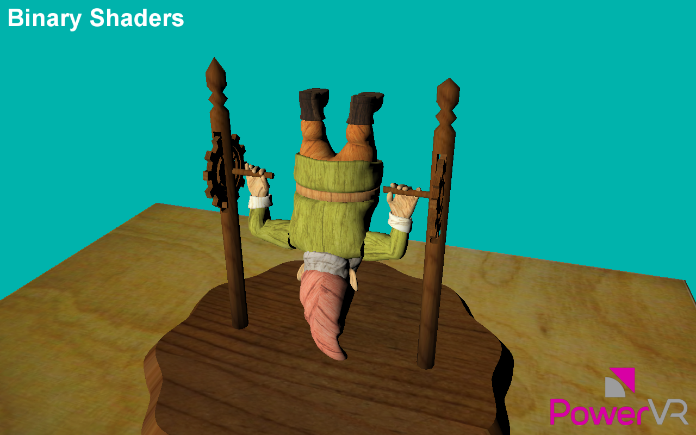

=============
BinaryShaders
=============

This examples shows how to store an OpenGLES shaders into a binary format and load it.

API
---
* OpenGL ES 3.0+

Description
-----------

This examples uses glGetProgramBinary and glProgramBinary to store a shader program into a binary buffer and then load it into a different shader program to be used.

Controls
--------
- Quit- Close the application

