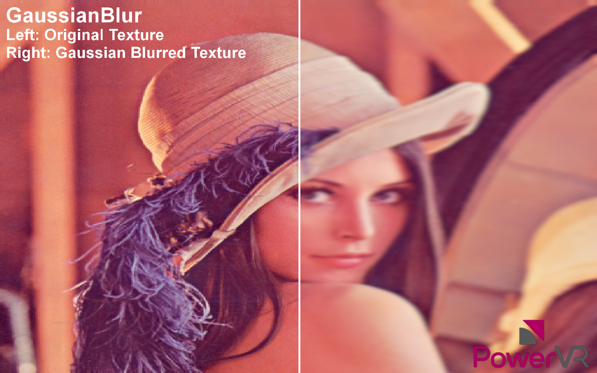

============
GaussianBlur
============

Shows how to perform a extremely wide, highly optimised Gaussian Blur using compute shaders.

API
---
* OpenGL ES 3.0+

Description
-----------
This example demonstrates how to perform a 19x19 Gaussian Blur. It uses every input and output step
to blur an image by reading from an input using compute while blurring in one direction, and then writing to 
the output with a fragment shader whilst blurring in the other direction.

This technique has been highly optimised for PowerVR and is very suitable for a very large convolution width.

Controls
--------
- Quit- Close the application
