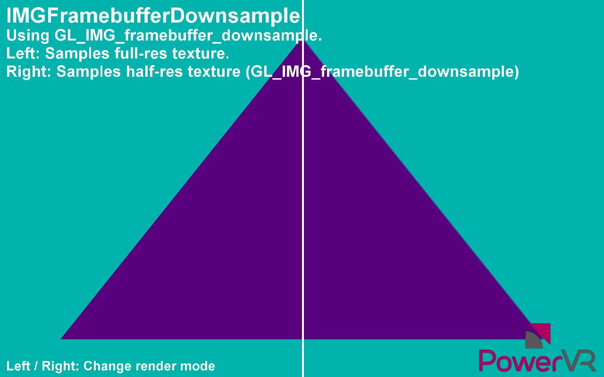

==========================
IMG_framebuffer_downsample
==========================

This example shows the power of the extension ``GL_IMG_framebuffer_downsample`` which enables automatic downsampling of textures.

API
---
* OpenGL ES 2.0+

Description
-----------
This example demonstrates the advantages of using the extension ``GL_IMG_framebuffer_downsample``. A triangle is first rendered to a special FBO with a texture of half-size set as a downsampled texture using ``glFramebufferTexture2DDownsampleIMG`` and a full-size texture set as normal. 

The application then renders to both the full-size texture and half-size texture, and the GPU automatically downsamples the colour attachment render. The left side of the rendered image samples from the full-size texture, and the right side samples from the half-size texture. 

This extension can be extremely useful for various post processing techniques where it is desirable to generate downsampled images efficiently.

Controls
--------
- Quit- Close the application
