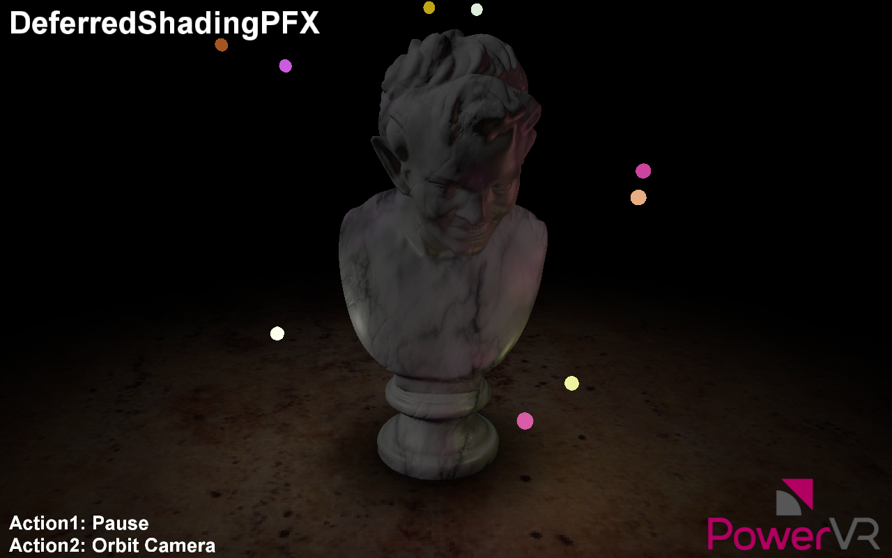

==================
DeferredShadingPFX
==================

Duplicates the DeferredShading example, using a simple PFX scene description to describe this complex rendering scenario.

API
---
* Vulkan

Description
-----------
Traditional rendering algorithms submit geometry and immediately apply shading effects to the rasterized primitives. Complex shading effects may require multiple draw calls (one per object per light) or render passes to produce the final pixel colour, with the geometry submitted every pass. 

Deferred shading is an alternative rendering technique that submits the scene geometry once, storing per-pixel attributes into local video memory to be used in the subsequent rendering passes. 

In these later passes, light volume primitives are rendered, and the per-pixel attributes contained in the buffer are retrieved at a 1:1 mapping ratio so that each pixel is shaded individually.

With the PowerVR architecture, the developer can use fast on-chip memory instead of the render target by using Subpasses with input attachments corresponding to transient, lazily allocated images.

In this example, the same technique is described in a PFX file, and rendered with the RenderManager. This avoids almost all the code in the example except for the most basic, demonstrating the power of the RenderManager combined with PFX files as a scene description.

Controls
--------
- Action1- Pause
- Action2- Orbit camera
- Quit- Close the application