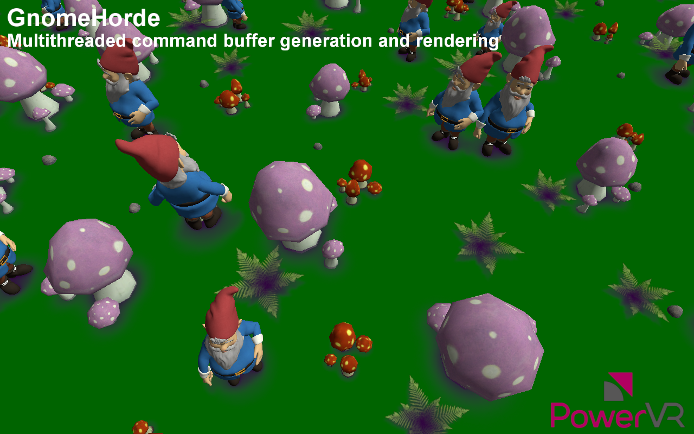

==========
GnomeHorde
==========

This example shows a very efficient technique for multithreaded command buffer generation and rendering.

API
---
* Vulkan

Description
-----------
The GnomeHorde example divides its world into tiles, each containing a small number of objects.

It uses three groups of threads:

* the Main thread - which kicks all other tasks and performs command buffer submission (rendering)
* a number of Visibility threads - which each process large groups of tiles
* a number of Tile Processing threads, which each generate command buffers for a tile. 

As required, command buffers are:

* created when the tile has just become visible
* recalculated when the level-of-detail (LOD) of the tile has changed 
* recycled when the tile has just become non-visible. 

The communication of the threads is abstracted using Producer-Consumer Queues passing the co-ordinates of tiles as parameters.

When all generation is done, the main thread collects all secondary command buffers and submits them to the GPU rendering queue.

Controls
--------
- Esc- Close