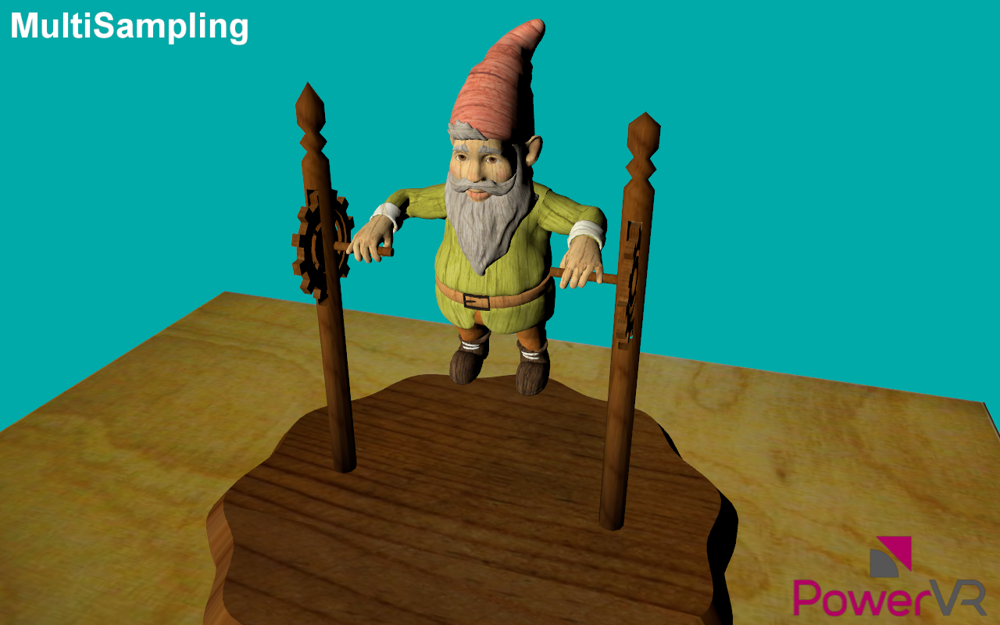

=============
MultiSampling
=============

Renders a scene to a multisampling framebuffer object.

API
---
* Vulkan

Description
-----------
This example demonstrates how to use the PowerVR Framework to render a scene using the multisampling feature.

Controls
--------
- Quit- Close the application
