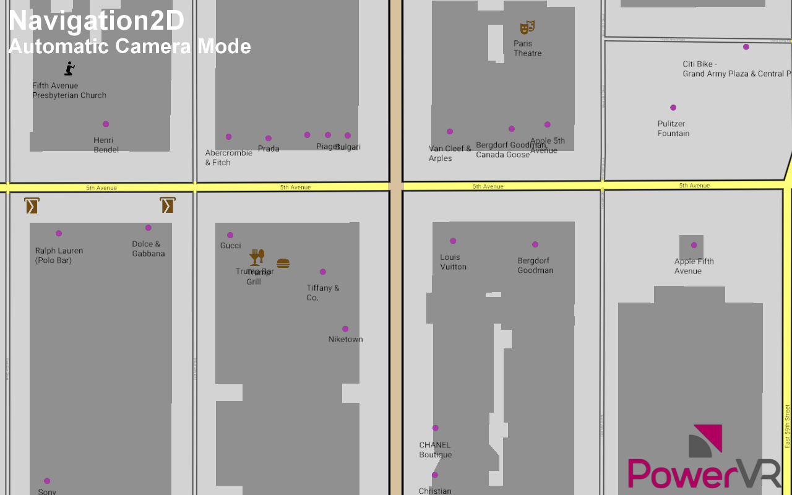

============
Navigation2D
============

Demonstrates parsing, processing and rendering of raw OSM data as a 2D navigational map.

API
---
* Vulkan

Description
-----------
The 2D navigation example shows the complete process of creating a navigational map from raw data, in this 
case Open Street Map (OSM) data. 

The example demonstrates:

* loading and parsing of the XML 
* the processing of the raw data 
* triangulation with the ear-clipping algorithm to generate triangles
* defining the roads
* batching everything into tiles as renderable polygons.

This example also shows several rendering techniques such as: 

* anti-aliased lines with outline for roads 
* UI elements for road names and places of interest
* an effective tile-based approach to batching and culling the geometry. 

Controls
--------
Q- Quit- Close the application