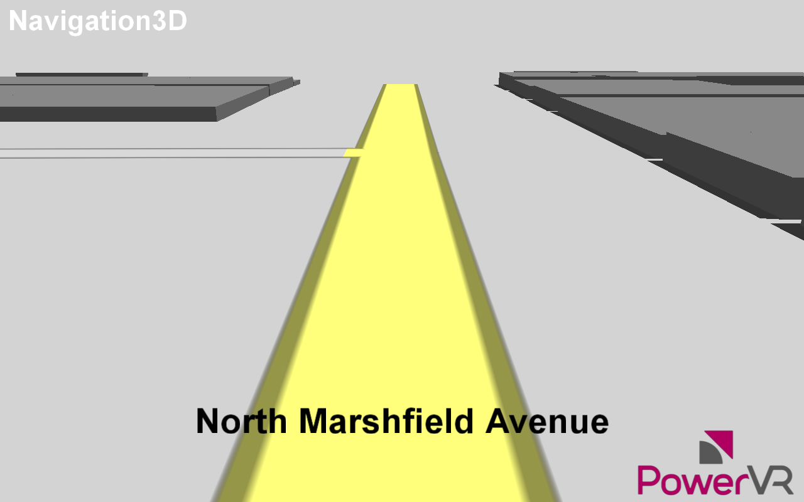

============
Navigation3D
============

Demonstrates parsing, processing and rendering of raw OSM data as a 3D navigational map.

API
---
* Vulkan

Description
-----------	
The 3D navigation example demonstrates the entire process of creating a navigational map from raw XML data,
in this case using Open Street Map (OSM) data. 

The example shows how to load and parse the XML. It then shows how to process the raw data into renderable polygons which can be used by the GPU. This is achieved through triangulation, which uses the ear-clipping algorithm to generate triangles from lists of points.

This example also shows several rendering techniques such as: 

* anti-aliased lines with GRLAA for road outlines 
* handling of UI elements for road names and places of interest 
* an effective tile based approach to batching and culling the geometry.

Controls
--------
Q- Quit- Close the application