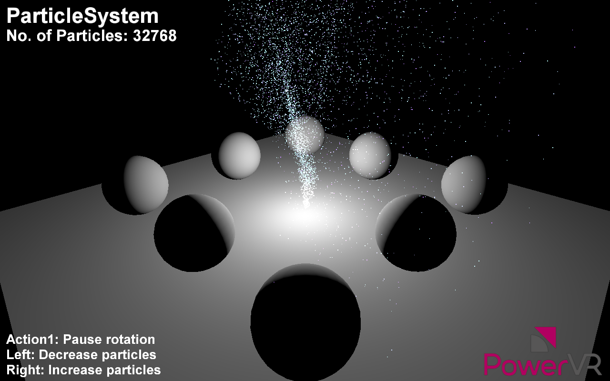

==============
ParticleSystem
==============

This example shows how to implement a simple particle system using GPGPU.

API
---
* Vulkan

Description
-----------
Particle systems are techniques that use a large amount of sprites to simulate phenomena that would be difficult to reproduce with conventional rendering techniques. 

This example uses GPGPU (GPU Compute) to implement a particle system. This is a simple integration-based simulation which is advanced and then rendered every frame strictly on the GPU, without any CPU access of that data. It also highlights the interaction between the compute and the rendering part of a simulation.

Controls
--------
- Quit- Close demo
	- 	Left/Right- Decrease/increase number of particles
- Up/Down- Switch between GPU Compute and CPU Particle System implementation.