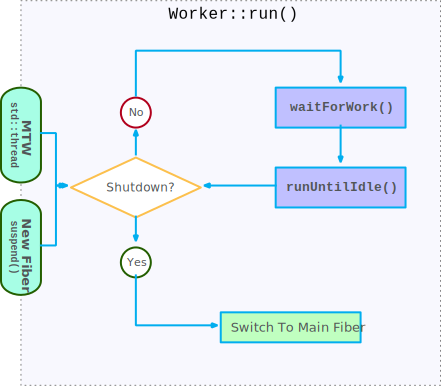
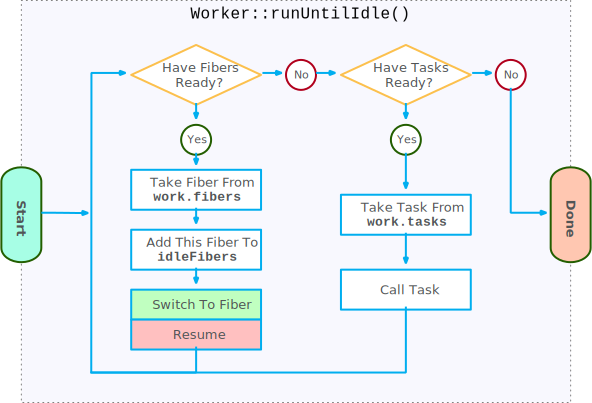
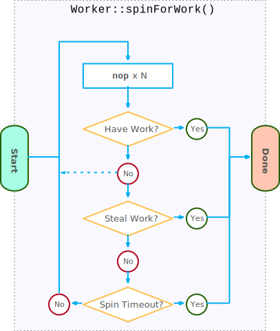
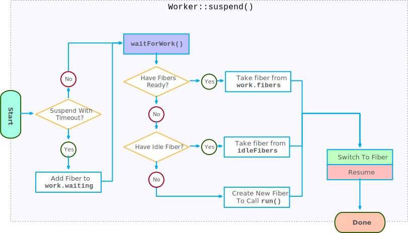

# `marl::Scheduler`

Table of Contents:

- [`marl::Scheduler`](#marlscheduler)
  - [Binding](#binding)
  - [Fibers](#fibers)
  - [Tasks](#tasks)
  - [Workers](#workers)
    - [`marl::Scheduler::Worker::run()`](#marlschedulerworkerrun)
    - [`marl::Scheduler::Worker::runUntilIdle()`](#marlschedulerworkerrununtilidle)
    - [`marl::Scheduler::Worker::waitForWork()`](#marlschedulerworkerwaitforwork)
    - [`marl::Scheduler::Worker::spinForWork()`](#marlschedulerworkerspinforwork)
    - [`marl::Scheduler::Worker::suspend()`](#marlschedulerworkersuspend)
  - [Worker Types](#worker-types)
    - [Single-Threaded-Workers](#single-threaded-workers)
    - [Multi-Threaded-Workers](#multi-threaded-workers)

The `marl::Scheduler` is the most complex part of marl and is responsible for executing tasks and keeping threads running when tasks become blocked.

This document describes the inner workings of the scheduler. This document is not intended to describe usage.

## Binding

The scheduler must be bound to each thread that calls `marl::schedule()`.
The scheduler destructor will block until the scheduler is unbound from all threads.

Binding is made using the `marl::Scheduler::bind()` and `marl::Scheduler::unbind()` methods.

Binding assigns a thread-local storage variable so the scheduler is associated with the given thread. This serves two purposes:

1. It allows `marl::schedule()` and the various synchronization primitives to be called without requiring a pointer to the `marl::Scheduler`.
2. More importantly, it provides a way to get the currently executing fiber for the current thread. This is used by `marl::ConditionVariable::wait()` to suspend the current fiber and place it into a vector so the `marl::ConditionVariable::notify_`xxx`()` methods can reschedule the blocked fibers.

Each binding also creates an internal [Single-Threaded-Worker](#single-threaded-workers) for the calling thread. This worker is used for scheduling tasks when there are no [Multi-Threaded-Workers](#multi-threaded-workers) available. Unbinding will ensure that all scheduled tasks for the  [Single-Threaded-Worker](#single-threaded-workers) are completed before returning.

## Fibers

A [fiber](https://en.wikipedia.org/wiki/Fiber_(computer_science)) is a lightweight cooperative thread, which can be suspended and resumed at explicit yield points.

At the time of writing, there's no standard and cross-platform library for fibers or coroutines, so marl implements the `marl::OSFiber` class for each supported platform and ABI. Most of these implementations are written in assembly and simply save and restore the callee-saved registers along with maintaining an allocation for the fiber's stack. `marl::OSFiber` is an internal implementation detail, and is not exposed in the public API.

`marl::Scheduler::Fiber` is the public fiber interface that is tightly coupled with the `marl::Scheduler`. The `marl::Scheduler::Fiber` has a simple `std::condition_variable` like interface.

Each `marl::Scheduler::Fiber` is permanently associated with a `marl::Scheduler::Worker`, and is guaranteed to only ever be resumed on the same thread used to suspend.

## Tasks

A `marl::Task` is an alias to `std::function<void()>`, a function that takes no arguments, and returns no value.

Tasks are scheduled using `marl::schedule()`, and are typically implemented as a lambda:

```c++
marl::schedule([] {
    printf("Hello world!\n");
});
```

While the `marl::Task` signature takes no parameters, it is common to capture variables as part of this lambda for task inputs and outputs.

All the marl synchronization primitives (with exception of `marl::ConditionVariable`) hold a shared pointer to internal state, and you are encouraged to capture these **by value**. This may seem counter-intuitive, but passing by reference can lead to memory corruption if the task outlives the stack used to call `marl::schedule()`. Maintaining a shared state object clearly has allocation and performance overheads, but it was decided that the safety outweighed the costs.

```c++
marl::WaitGroup wg(1);
marl::schedule([=] { // capture by value, not reference!
    printf("Hello world!\n");
    wg.done();
});
wg.wait();
```

## Workers

The scheduler holds a number of `marl::Scheduler::Worker`s. Each worker holds:

- `work.tasks` - A queue of tasks, yet to be started.
- `work.fibers` - A queue of suspended fibers, ready to be resumed.
- `work.waiting` - A queue of suspended fibers, waiting to be resumed or time out.
- `work.num` - A counter that is kept in sync with `work.tasks.size() + work.fibers.size()`.
- `work.numBlockedFibers` - A counter that records the current number of fibers blocked in a [`suspend()`](#marlschedulerworkersuspend) call.
- `idleFibers` - A set of idle fibers, ready to be reused.

When a task is scheduled with a call to `marl::schedule()`, a worker is picked, and the task is placed on to the worker's `work.tasks` queue. The worker is picked using the following rules:

- If the scheduler has no dedicated worker threads (`marl::Scheduler::config().workerThreads.count == 0`), then the task is queued on to the [Single-Threaded-Worker](#single-threaded-workers) for the currently executing thread.
- Otherwise one of the [Multi-Threaded-Workers](#multi-threaded-workers) is picked. If any workers have entered a [spin-for-work](#marlschedulerworkerspinforwork) state, then these will be prioritized, otherwise a [Multi-Threaded-Worker](#multi-threaded-workers) is picked in a round-robin fashion.

### `marl::Scheduler::Worker::run()`

`run()` is the main processing function for worker fibers. `run()` is called by the start of each [Multi-Threaded-Worker](#multi-threaded-workers) thread, and whenever a new worker fiber is spawned from [`Worker::suspend()`](#marlschedulerworkersuspend) when all other fibers have become blocked.

This function is shared by both the [Single-Threaded](#single-threaded-workers) and [Multi-Threaded](#multi-threaded-workers) worker types.

`run()` calls `runUntilShutdown()`, which will enter a loop that:

- Calls [`waitForWork()`](#marlschedulerworkerwaitforwork) to block until there's something new to process.
- Calls [`runUntilIdle()`](#marlschedulerworkerrununtilidle) to process all new tasks and fibers. Note that fibers can switch inside [`runUntilIdle()`](#marlschedulerworkerrununtilidle), so the execution of `run()` may hop between fibers for a single thread.

This loop continues until the worker has finished all its work and has been told to shut down.

Once the loop has exited due to the worker being told to shut down, the `mainFiber` is resumed, which will handle the rest of the shutdown logic.



### `marl::Scheduler::Worker::runUntilIdle()`

As the name suggests, this function executes its work until there is no more work, or all work is blocked.

The basic logic of this method is as follows:

1. Resume any unblocked tasks (fibers)

   `runUntilIdle()` begins by completing all fibers that are ready to be resumed (no longer blocked).
   This is done by taking a fiber from the `work.fibers` queue, placing the current fiber into the `idleFibers` queue (this fiber is considered idle as it is looking for work), and switching the context over to the taken fiber.

   Executing unblocked fibers is prioritized over starting new tasks. This is because new tasks may result in yet more fibers, and each fiber consumes a certain amount of memory (typically for stack).

2. Start executing new tasks

   Once all resumable fibers have been completed or have become re-blocked, new tasks are taken from the `work.tasks` queue, and are executed. Once a task is completed, control returns back to `runUntilIdle()`, and the main loop starts again from 1.

3. Once there's no more fibers or tasks to execute, `runUntilIdle()` returns.



### `marl::Scheduler::Worker::waitForWork()`

When a worker runs out of tasks to start and fibers to resume, `waitForWork()` is called to block until there's something for the worker to do.

If the worker is a [Multi-Threaded-Worker](#multi-threaded-workers), `waitForWork()` begins by entering [`spinForWork()`](#marlschedulerworkerspinforwork), otherwise this stage is skipped.

`waitForWork()` then waits for any of the following to occur before returning:

- A fiber becoming ready to be resumed, by being enqueued on the `work.fibers` queue.
- A task becoming enqueued on the `work.tasks` queue.
- A fiber timing out in the `work.waiting` queue.
- The worker being shutdown.

Any fibers that have timed out in the `work.waiting` queue are automatically moved onto the `work.fibers` queue before returning.


### `marl::Scheduler::Worker::spinForWork()`

`spinForWork()` has two roles:

1. It attempts to steal work from other workers to keep worker work-loads evenly balanced.

   Task lengths can vary significantly in duration, and over time some workers can end up with a large queue of work, while others are starved. `spinForWork()` is only called when the worker is starved, and will attempt to steal tasks from randomly picked workers. Because fibers must only be executed on the same thread, only tasks, not fibers can be stolen.

2. It attempts to avoid yielding the thread to the OS.

   It is common to have a single task (provider) scheduling many small sub-tasks to the scheduler, which are evenly distributed to the workers (consumers). These consumers typically outnumber the providers, and it is easy to have the provider struggle to provide enough work to keep the consumers fully occupied.

   In this situation, the workers can enter a loop where they are given a task, complete it, and end up waiting a short duration for more work. Allowing a worker thread to yield to the OS when waiting for another task (e.g. with `std::condition_variable::wait()`) can be costly in terms of performance. Depending on the platform, it may take a millisecond or more before the thread is resumed by the OS. A stall of this length can lead to significant stalls in the entire task dependency graph.

`spinForWork()` contains a loop that runs for a short duration. In the body of the loop, the following is performed:

- A tight loop of `nops` is used to keep the CPU busy, while periodically checking `work.num` to see if any new work has become available. If new work is found, `spinForWork()` returns immediately.
- If no new work was scheduled, an attempt is made to steal a task from another random worker. If the steal was successful, `spinForWork()` returns immediately.
- If the steal was unsuccessful, `std::this_thread::yield()` is called to prevent marl from starving the OS.



### `marl::Scheduler::Worker::suspend()`

Marl allows tasks to block, while keeping threads busy.

If a task blocks, then `Scheduler::Worker::suspend()` is called. `suspend()` begins by calling [`Scheduler::Worker::waitForWork()`](#marlschedulerworkerwaitforwork), which blocks until there's a task or fiber that can be executed. Then, one of the following occurs:

 1. If there's any unblocked fibers, the fiber is taken from the `work.fibers` queue and is switched to.
 2. If there's any idle fibers, one is taken from the `idleFibers` set and is switched to. This idle fiber when resumed, will continue the role of executing tasks.
 3. If none of the above occurs, then a new fiber needs to be created to continue executing tasks. This fiber is created to begin execution in [`marl::Scheduler::Worker::run()`](#marlschedulerworkerrun), and is switched to.

In all cases, the `suspend()` call switches to another fiber. When the suspended fiber is resumed, `suspend()` returns back to the caller.



## Worker Types

A worker is created as either a Single-Threaded-Worker or Multi-Threaded-Worker.

The majority of the logic is identical between the two modes.

The most significant difference is that the Multi-Threaded-Worker spawns a dedicated worker thread to call `marl::Scheduler::run()`, whereas the Single-Threaded-Worker will only call `marl::Scheduler::run()` on a new fiber, when all other fibers become blocked.

### Single-Threaded-Workers

A single-threaded-worker (STW) is created for each thread that is bound with a call to `marl::Scheduler::bind()`.

If the scheduler has no dedicated worker threads (`marl::Scheduler::config().workerThreads.count == 0`), then scheduled tasks are queued on to the STW for the currently executing thread.

Because in this mode there are no worker threads, the tasks queued on the STW are not automatically background executed. Instead, tasks are only executed whenever there's a call to [`marl::Scheduler::Worker::suspend()`](#marlschedulerworkersuspend).
The logic for [`suspend()`](#marlschedulerworkersuspend) is common for STWs and MTWs, spawning new fibers that call [`marl::Scheduler::Worker::run()`](#marlschedulerworkerrun) whenever all other fibers are blocked.

```c++
void SingleThreadedWorkerExample() {
  marl::Scheduler::Config cfg;
  cfg.setWorkerThreadCount(0); // STW mode.

  marl::Scheduler scheduler(cfg);
  scheduler.bind();
  defer(scheduler.unbind());

  // Calling marl::schedule() enqueues the task on the STW, but does not
  // execute it until the thread is blocked.
  marl::Event done;
  marl::schedule([=] {
    done.signal();
  });

  // This is a blocking call.
  // marl::Event::wait() (indirectly) calls marl::Scheduler::Worker::suspend().
  // marl::Scheduler::Worker::suspend() creates and switches to a fiber which
  // calls marl::Scheduler::Worker::run() to run all enqueued tasks. Once the
  // main fiber becomes unblocked, marl::Scheduler::Worker::runUntilIdle() will
  // switch back to the main fiber to continue execution of the application.
  done.wait();
}
```

### Multi-Threaded-Workers

Multi-Threaded-Workers are created when the `marl::Scheduler` is constructed with a positive number of worker threads (`marl::Scheduler::Config::workerThread::count > 0`).

Each MTW is paired with a new `std::thread` that begins by calling `marl::Scheduler::Worker::run()`.

When the worker is told to shut down and all work is complete, `marl::Scheduler::Worker::run()` exits the main processing loop, and switches back to the main thread fiber which ends the `std::thread`.
