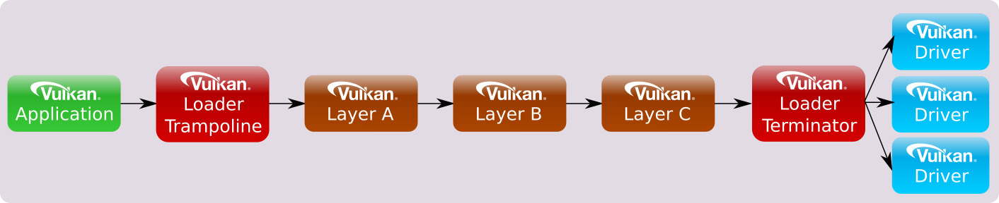

<!-- markdownlint-disable MD041 -->
[![Khronos Vulkan][1]][2]

[1]: https://vulkan.lunarg.com/img/Vulkan_100px_Dec16.png "https://www.khronos.org/vulkan/"
[2]: https://www.khronos.org/vulkan/

# Application Interface to Loader <!-- omit from toc -->
[![Creative Commons][3]][4]

<!-- Copyright &copy; 2015-2023 LunarG, Inc. -->

[3]: https://i.creativecommons.org/l/by-nd/4.0/88x31.png "Creative Commons License"
[4]: https://creativecommons.org/licenses/by-nd/4.0/

## Table of Contents <!-- omit from toc -->

- [Overview](#overview)
- [Interfacing with Vulkan Functions](#interfacing-with-vulkan-functions)
  - [Vulkan Direct Exports](#vulkan-direct-exports)
  - [Directly Linking to the Loader](#directly-linking-to-the-loader)
    - [Dynamic Linking](#dynamic-linking)
    - [Static Linking](#static-linking)
  - [Indirectly Linking to the Loader](#indirectly-linking-to-the-loader)
  - [Best Application Performance Setup](#best-application-performance-setup)
  - [ABI Versioning](#abi-versioning)
    - [Windows Dynamic Library Usage](#windows-dynamic-library-usage)
    - [Linux Dynamic Library Usage](#linux-dynamic-library-usage)
    - [MacOs Dynamic Library Usage](#macos-dynamic-library-usage)
  - [Bundling the Loader With An Application](#bundling-the-loader-with-an-application)
- [Application Layer Usage](#application-layer-usage)
  - [Meta-Layers](#meta-layers)
  - [Implicit vs Explicit Layers](#implicit-vs-explicit-layers)
    - [Override Layer](#override-layer)
  - [Forcing Layer Source Folders](#forcing-layer-source-folders)
    - [Exception for Elevated Privileges](#exception-for-elevated-privileges)
  - [Forcing Layers to be Enabled on Windows, Linux and macOS](#forcing-layers-to-be-enabled-on-windows-linux-and-macos)
  - [Overall Layer Ordering](#overall-layer-ordering)
  - [Debugging Possible Layer Issues](#debugging-possible-layer-issues)
- [Application Usage of Extensions](#application-usage-of-extensions)
  - [Instance and Device Extensions](#instance-and-device-extensions)
  - [WSI Extensions](#wsi-extensions)
  - [Unknown Extensions](#unknown-extensions)
  - [Filtering Out Unknown Instance Extension Names](#filtering-out-unknown-instance-extension-names)
- [Physical Device Ordering](#physical-device-ordering)

## Overview

This is the Application-centric view of working with the Vulkan loader.
For the complete overview of all sections of the loader, please refer
to the [LoaderInterfaceArchitecture.md](LoaderInterfaceArchitecture.md) file.

## Interfacing with Vulkan Functions

There are several ways Vulkan functions may be interfaced through the loader:


### Vulkan Direct Exports

The loader library on Windows, Linux, Android, and macOS will export all core
Vulkan entry-points and all appropriate Window System Interface (WSI)
entry-points.
This is done to make it simpler to get started with Vulkan development.
When an application links directly to the loader library in this way, the
Vulkan calls are simple *trampoline* functions that jump to the appropriate
dispatch table entry for the object they are given.


### Directly Linking to the Loader

#### Dynamic Linking

The loader is distributed as a dynamic library (.dll on Windows or .so on Linux
or .dylib on macOS) which gets installed to the system path for dynamic
libraries.
Furthermore, the dynamic library is generally installed to Windows
systems as part of driver installation and is generally provided on Linux
through the system package manager.
This means that applications can usually expect a copy of the loader to be
present on a system.
If applications want to be completely sure that a loader is present, they can
include a loader or runtime installer with their application.

#### Static Linking

In previous versions of the loader, it was possible to statically link the
loader.
**This was removed and is no longer possible.**
The decision to remove static linking was because of changes to the driver
which made older applications that statically linked unable to find newer
drivers.

Additionally, static linking posed several problems:
 - The loader can never be updated without re-linking the application
 - The possibility that two included libraries could contain different versions
 of the loader
   - Could cause conflicts between the different loader versions

The only exception to this is for macOS, but is not supported or tested.

### Indirectly Linking to the Loader

Applications are not required to link directly to the loader library, instead
they can use the appropriate platform-specific dynamic symbol lookup on the
loader library to initialize the application's own dispatch table.
This allows an application to fail gracefully if the loader cannot be found.
It also provides the fastest mechanism for the application to call Vulkan
functions.
An application only needs to query (via system calls such as `dlsym`) the
address of `vkGetInstanceProcAddr` from the loader library.
The application then uses `vkGetInstanceProcAddr` to load all functions
available, such as `vkCreateInstance`, `vkEnumerateInstanceExtensionProperties`
and `vkEnumerateInstanceLayerProperties` in a platform-independent way.

### Best Application Performance Setup

To get the best possible performance in a Vulkan application, the application
should set up its own dispatch table for every Vulkan API entry-point.
For every instance-level Vulkan command in the dispatch table, the function pointer
should be queried and filled in by using the results of `vkGetInstanceProcAddr`.
Additionally, for every device-level Vulkan command, the function pointer
should be queried and filled in using the results of `vkGetDeviceProcAddr`.

*Why do this?*

The answer comes in how the call chain of instance functions are implemented
versus the call chain of a device functions.
Remember, a [Vulkan instance is a high-level construct used to provide Vulkan
system-level information](LoaderInterfaceArchitecture.md#instance-specific).
Because of this, instance functions need to be broadcast to every available
driver on the system.
The following diagram shows an approximate view of an instance call chain with
three enabled layers:



This is also how a Vulkan device function call chain looks if queried
using `vkGetInstanceProcAddr`.
On the other hand, a device function doesn't need to worry about the broadcast
because it knows specifically which associated driver and which associated
physical device the call should terminate at.
Because of this, the loader doesn't need to get involved between any enabled
layers and the driver.
Thus, using a loader-exported Vulkan device function, the call chain
in the same scenario as above would look like:


An even better solution would be for an application to perform a
`vkGetDeviceProcAddr` call on all device functions.
This further optimizes the call chain by removing the loader all-together under
most scenarios:


Also, notice if no layers are enabled, the application function pointers point
**directly to the driver**.
With many function calls, the lack of indirection in each adds up to non-trivial
performance savings.

**NOTE:** There are some device functions which still require the loader to
intercept them with a *trampoline* and *terminator*.
There are very few of these, but they are typically functions which the loader
wraps with its own data.
In those cases, even the device call chain will continue to look like the
instance call chain.
One example of a device function requiring a *terminator* is
`vkCreateSwapchainKHR`.
For that function, the loader needs to potentially convert the KHR_surface
object into an driver-specific KHR_surface object prior to passing down the rest
of the function's information to the driver.

Remember:
 * `vkGetInstanceProcAddr` is used to query instance and physical device
   functions, but can query all functions.
 * `vkGetDeviceProcAddr` is only used to query device functions.


### ABI Versioning

The Vulkan loader library will be distributed in various ways including Vulkan
SDKs, OS package distributions and Independent Hardware Vendor (IHV) driver
packages.
These details are beyond the scope of this document.
However, the name and versioning of the Vulkan loader library is specified so
an app can link to the correct Vulkan ABI library version.
ABI backwards compatibility is guaranteed for all versions with the same major
number (e.g. 1.0 and 1.1).

#### Windows Dynamic Library Usage

On Windows, the loader library encodes the ABI version in its name such that
multiple ABI incompatible versions of the loader can peacefully coexist on a
given system.
The Vulkan loader library file name is `vulkan-<ABI version>.dll`.
For example, for Vulkan version 1.X on Windows the library filename is
`vulkan-1.dll`.
This library file can typically be found in the `windows\system32`
directory (on 64-bit Windows installs, the 32-bit version of the loader with
the same name can be found in the `windows\sysWOW64` directory).

#### Linux Dynamic Library Usage

For Linux, shared libraries are versioned based on a suffix.
Thus, the ABI number is not encoded in the base of the library filename as on
Windows.

On Linux, applications that have a hard dependency on Vulkan should request
linking to the unversioned name `libvulkan.so` in their build system.
For example by importing the CMake target `Vulkan::Vulkan` or by using the
output of `pkg-config --cflags --libs vulkan` as compiler flags.
As usual for Linux libraries, the compiler and linker will resolve this to
a dependency on the correct versioned SONAME, currently `libvulkan.so.1`.
Linux applications that load Vulkan-Loader dynamically at runtime do not
benefit from this mechanism, and should instead make sure to pass the
versioned name such as `libvulkan.so.1` to `dlopen()`, to ensure that they
load a compatible version.

#### MacOs Dynamic Library Usage

MacOs linking is similar to Linux, with the exception being that the standard
dynamic library is named `libvulkan.dylib` and the ABI versioned library is
currently named `libvulkan.1.dylib`.


### Bundling the Loader With An Application

The Khronos loader is typically installed on platforms either in a
platform-specific way (i.e. packages on Linux) or as part of a driver install
(i.e. using the Vulkan Runtime installer on Windows).
Applications or engines may desire to install the Vulkan loader locally to their
execution tree as part of their own installation process.
This may be because providing the specific loader:

 1) Guarantees certain Vulkan API exports are available in the loader
 2) Ensures certain loader behavior is well-known
 3) Provides consistency across user installation

However, this is **strongly discouraged** because:

 1) The packaged loader may not be compatible with future driver revisions
(this can be especially true on Windows where driver install locations can
change during updates to the OS)
 2) It can prevent the application/engine from taking advantage of new Vulkan
API version/extension exports
 3) The application/engine will miss out on important loader bug-fixes
 4) The packaged loader will not contain useful feature updates (like
improved loader debugability)

Of course, even if an application/engine does initially release with a specific
version of the Khronos loader, it may chose to update or remove that loader at
some point in the future.
This could be due to the exposure of needed functionality in the loader as time
progresses.
But, that relies upon end-users correctly performing whatever update process is
necessary at that future time which may result in different behavior across
different user's systems.

One better alternative, at least on Windows, is to package the Vulkan Runtime
installer for the desired version of the Vulkan loader with your product.
Then, the installation process can use that to ensure the end-user's system
is up to date.
The Runtime installer will detect the version already installed and will only
install a newer runtime if necessary.

Another alternative is to write the application so it can fallback to earlier
versions of Vulkan yet display a warning indicating functionality is disabled
until the user updates their system to a specific runtime/driver.


## Application Layer Usage

Applications desiring Vulkan functionality beyond what Vulkan drivers
on their system already expose, may use various layers to augment the API.
A layer cannot add new Vulkan core API entry-points that are not exposed in
Vulkan.h.
However, layers may offer implementations of extensions that introduce
additional entry-points beyond what is available without those layers.
These additional extension entry-points can be queried through the Vulkan
extension interface.

A common use of layers is for API validation which can be enabled during
application development and left out when releasing the application.
This allows easy control of the overhead resulting from enabling validation of
the application's usage of the API, which wasn't always possible in previous
graphics APIs.

To find out what layers are available to an application, use
`vkEnumerateInstanceLayerProperties`.
This will report all layers that have been discovered by the loader.
The loader looks in various locations to find layers on the system.
For more information see the
[Layer discovery](LoaderLayerInterface.md#layer-discovery)
section in the
[LoaderLayerInterface.md document](LoaderLayerInterface.md) document.

To enable specific layers, simply pass the names of the layers to
enable in the `ppEnabledLayerNames` field of the `VkInstanceCreateInfo` during
a call to `vkCreateInstance`.
Once done, the layers that have been enabled will be active for all Vulkan functions
using the created `VkInstance`, and any of its child objects.

**NOTE:** Layer ordering is important in several cases since some layers
interact with each other.
Be careful when enabling layers as this may be the case.
See the [Overall Layer Ordering](#overall-layer-ordering) section for more
information.

The following code section shows how to go about enabling the
`VK_LAYER_KHRONOS_validation` layer.

```
char *instance_layers[] = {
    "VK_LAYER_KHRONOS_validation"
};
const VkApplicationInfo app = {
    .sType = VK_STRUCTURE_TYPE_APPLICATION_INFO,
    .pNext = NULL,
    .pApplicationName = "TEST_APP",
    .applicationVersion = 0,
    .pEngineName = "TEST_ENGINE",
    .engineVersion = 0,
    .apiVersion = VK_API_VERSION_1_0,
};
VkInstanceCreateInfo inst_info = {
    .sType = VK_STRUCTURE_TYPE_INSTANCE_CREATE_INFO,
    .pNext = NULL,
    .pApplicationInfo = &app,
    .enabledLayerCount = 1,
    .ppEnabledLayerNames = (const char *const *)instance_layers,
    .enabledExtensionCount = 0,
    .ppEnabledExtensionNames = NULL,
};
err = vkCreateInstance(&inst_info, NULL, &demo->inst);
if (VK_ERROR_LAYER_NOT_PRESENT == err) {
  // Couldn't find the validation layer
}
```

At `vkCreateInstance` and `vkCreateDevice`, the loader constructs call chains
that include the application specified (enabled) layers.
Order is important in the `ppEnabledLayerNames` array; array element 0 is the
topmost (closest to the application) layer inserted in the chain and the last
array element is closest to the driver.
See the [Overall Layer Ordering](#overall-layer-ordering) section for more
information on layer ordering.

**NOTE:** *Device Layers Are Now Deprecated*
> `vkCreateDevice` originally was able to select layers in a similar manner to
`vkCreateInstance`.
> This led to the concept of "instance layers" and "device layers".
> It was decided by Khronos to deprecate the "device layer" functionality and
> only consider "instance layers".
> Therefore, `vkCreateDevice` will use the layers specified at
`vkCreateInstance`.
> Because of this, the following items have been deprecated:
> * `VkDeviceCreateInfo` fields:
>   * `ppEnabledLayerNames`
>   * `enabledLayerCount`
> * The `vkEnumerateDeviceLayerProperties` function


### Meta-Layers

Meta-layers are layers which contain an ordered list of other layers to enable.
This is to allow grouping layers together in a specified order so that they can
interact properly.
Originally, this was used to group together the individual Vulkan Validation
layers in the proper order to avoid conflicts.
It was necessary because instead of a single Validation layer, validation was
split into multiple component layers.
The new `VK_LAYER_KHRONOS_validation` layer pulled everything into a single
layer, dropping the need for meta layers.
While not necessary for validation anymore, VkConfig does use meta layers to
group layers together based on user's preferences.
More can be found out about this functionality through both the
[VkConfig documentation](https://github.com/LunarG/VulkanTools/blob/main/vkconfig/README.md)
and the section later on the [Override Layer](#override-layer).

Meta-layers are detailed more in the
[Meta-Layers](LoaderLayerInterface.md#meta-layers) section of the
[LoaderLayerInterface.md](LoaderLayerInterface.md) file in this folder.


### Implicit vs Explicit Layers


Explicit layers are layers which are enabled by an application (e.g. with the
vkCreateInstance function as mentioned previously).

Implicit layers are enabled automatically by their very existence, unless
requiring an additional manual enable step, unlike explicit layers that must be
enabled explicitly.
For example, certain application environments (e.g. Steam or an automotive
infotainment system) may have layers which they always want enabled for all
applications that they start.
Other implicit layers may be for all applications started on a given system
(e.g. layers that overlay frames-per-second).

Implicit layers have an additional requirement over explicit layers in that
they require being able to be disabled by an environmental variable.
This is due to the fact that they are not visible to the application and could
cause issues.
A good principle to keep in mind would be to define both an enable and disable
environment variable so the users can deterministically enable the
functionality.
On Desktop platforms (Windows, Linux, and macOS), these enable/disable settings
are defined in the layer's JSON file.

Discovery of system-installed implicit and explicit layers is described later
in the [Layer discovery](LoaderLayerInterface.md#layer-discovery)
section in the
[LoaderLayerInterface.md](LoaderLayerInterface.md) document.

Implicit and explicit layers may be found in different locations based on the
underlying operating system.
The table below details more information:

<table style="width:100%">
  <tr>
    <th>Operating System</th>
    <th>Implicit Layer Identification</th>
  </tr>
  <tr>
    <td>Windows</td>
    <td>Implicit layers are located in a different Windows registry location
        than explicit layers.</td>
  </tr>
  <tr>
    <td>Linux</td>
    <td>Implicit layers are located in a different directory location than
        explicit layers.</td>
  </tr>
  <tr>
    <td>Android</td>
    <td>There is **No Support For Implicit Layers** on Android.</td>
  </tr>
  <tr>
    <td>macOS</td>
    <td>Implicit layers are located in a different directory location than
        explicit layers.</td>
  </tr>
</table>


#### Override Layer

The "Override Layer" is a special implicit meta-layer created by the
[VkConfig](https://github.com/LunarG/VulkanTools/blob/main/vkconfig/README.md)
tool and available by default when the tool is running.
Once VkConfig exits, the override layer is removed, and the system should
return to standard Vulkan behavior.
Whenever the override layer is present in the layer search path, the loader will
pull it into the layer call stack with the standard implicit layers along with
all layers contained in the list of layers to load.
This allows an end-user or developer to easily force on any number of layers
and settings via VkConfig.

The override layer is discussed more in the
[Override Meta-Layer](LoaderLayerInterface.md#override-meta-layer) section of the
[LoaderLayerInterface.md](LoaderLayerInterface.md) file in this folder.


### Forcing Layer Source Folders

Developers may need to use special, pre-production layers, without modifying
the system-installed layers.

This can be accomplished in one of two ways:

 1. Selecting specific layer paths using the
[VkConfig](https://github.com/LunarG/VulkanTools/blob/main/vkconfig/README.md)
tool shipped with the Vulkan SDK.
 2. Directing the loader to look for layers in specific files and/or folders by using the
`VK_LAYER_PATH` and/or `VK_IMPLICIT_LAYER_PATH` environment variables.

The `VK_LAYER_PATH` and `VK_IMPLICIT_LAYER_PATH` environment variables can contain multiple
paths separated by the operating-system specific path separator.
On Windows, this is a semicolon (`;`), while on Linux and macOS it is a colon
(`:`).

If `VK_LAYER_PATH` exists, the files and/or folders listed will be scanned for explicit
layer manifest files.
Implicit layer discovery is unaffected by this environment variable.

If `VK_IMPLICIT_LAYER_PATH` exists, the files and/or folders listed will be scanned for
implicit layer manifest files.
Explicit layer discovery is unaffected by this environment variable.

Each directory listed in `VK_LAYER_PATH` and `VK_IMPLICIT_LAYER_PATH` should be the full
pathname of a folder containing layer manifest files.

See the
[Table of Debug Environment Variables](LoaderInterfaceArchitecture.md#table-of-debug-environment-variables)
in the [LoaderInterfaceArchitecture.md document](LoaderInterfaceArchitecture.md)
for more details.


#### Exception for Elevated Privileges

For security reasons, `VK_LAYER_PATH` and `VK_IMPLICIT_LAYER_PATH` are ignored if running
with elevated privileges.
Because of this, the environment variables can only be used for applications that do not
use elevated privileges.

For more information see
[Elevated Privilege Caveats](LoaderInterfaceArchitecture.md#elevated-privilege-caveats)
in the top-level
[LoaderInterfaceArchitecture.md][LoaderInterfaceArchitecture.md] document.


### Forcing Layers to be Enabled on Windows, Linux and macOS

Developers may want to enable layers that are not enabled by the given
application they are using.

This can be also be accomplished in one of two ways:

 1. Selecting specific layers using the
[VkConfig](https://github.com/LunarG/VulkanTools/blob/main/vkconfig/README.md)
tool shipped with the Vulkan SDK.
 2. Directing the loader to look for additional layers by name using the
`VK_INSTANCE_LAYERS` environment variable.

Both can be used to enable additional layers which are not specified (enabled)
by the application at `vkCreateInstance`.

The `VK_INSTANCE_LAYERS` environment variable is a list of layer names to enable
separated by the operating-system specific path separator.
On Windows, this is a semicolon (`;`), while on Linux and macOS it is a colon
(`:`).
The order of the names is relevant with the first layer name in the list being
the top-most layer (closest to the application) and the last layer name in the
list being the bottom-most layer (closest to the driver).
See the [Overall Layer Ordering](#overall-layer-ordering) section for more
information.

Application specified layers and user specified layers (via environment
variables) are aggregated and duplicates removed by the loader when enabling
layers.
Layers specified via environment variable are top-most (closest to the
application) while layers specified by the application are bottom-most.

An example of using these environment variables to activate the validation
layer `VK_LAYER_KHRONOS_validation` on Linux or macOS is as follows:

```
> $ export VK_INSTANCE_LAYERS=VK_LAYER_KHRONOS_validation
```

See the
[Table of Debug Environment Variables](LoaderInterfaceArchitecture.md#table-of-debug-environment-variables)
in the [LoaderInterfaceArchitecture.md document](LoaderInterfaceArchitecture.md)
for more details.


### Overall Layer Ordering

The overall ordering of all layers by the loader based on the above looks
as follows:


Ordering may also be important internally to the list of explicit layers.
Some layers may be dependent on other behavior being implemented before
or after the loader calls it.
For example: An overlay layer may want to use `VK_LAYER_KHRONOS_validation`
to verify that the overlay layer is behaving appropriately.
This requires putting the overlay layer closer to the application so that the
validation layer can intercept any Vulkan API calls the overlay layer needs to
make to function.


### Debugging Possible Layer Issues

If it is possible that a layer is causing issues, there are several things that
can be tried which are documented in the
[Debugging Possible Layer Issues](LoaderDebugging.md#debugging-possible-layer-issues)
section of the [LoaderDebugging.mg](LoaderDebugging.md) document in the docs
folder.


## Application Usage of Extensions

Extensions are optional functionality provided by a layer, the loader, or a
driver.
Extensions can modify the behavior of the Vulkan API and need to be specified
and registered with Khronos.
These extensions can be implemented by a Vulkan driver, the loader, or a layer
to expose functionality not available in the core API.
Information about various extensions can be found in the Vulkan Spec, and
vulkan.h header file.


### Instance and Device Extensions

As hinted at in the
[Instance Versus Device](LoaderInterfaceArchitecture.md#instance-versus-device)
section of the main
[LoaderInterfaceArchitecture.md](LoaderInterfaceArchitecture.md) document,
there are two types of extensions:
 * Instance Extensions
 * Device Extensions

An instance extension modifies existing behavior or implements new behavior on
instance-level objects, such as `VkInstance` and `VkPhysicalDevice`.
A device extension does the same for device-level objects, such as `VkDevice`,
`VkQueue`, and `VkCommandBuffer` as well as any children of those objects.

It is **very** important to know what the type of an extension is because
instance  extensions must be enabled with `vkCreateInstance` while device
extensions are enabled with `vkCreateDevice`.

When calling `vkEnumerateInstanceExtensionProperties` and
`vkEnumerateDeviceExtensionProperties`, the loader discovers and aggregates all
extensions of their respective type from layers (both explicit and implicit),
drivers, and the loader before reporting them to the application.

Looking at `vulkan.h`, both functions are very similar,
for example, the `vkEnumerateInstanceExtensionProperties` prototype looks as
follows:

```
VkResult
   vkEnumerateInstanceExtensionProperties(
      const char *pLayerName,
      uint32_t *pPropertyCount,
      VkExtensionProperties *pProperties);
```

While the `vkEnumerateDeviceExtensionProperties` prototype looks like:

```
VkResult
   vkEnumerateDeviceExtensionProperties(
      VkPhysicalDevice physicalDevice,
      const char *pLayerName,
      uint32_t *pPropertyCount,
      VkExtensionProperties *pProperties);
```

The "pLayerName" parameter in these functions is used to select either a single
layer or the Vulkan platform implementation.
If "pLayerName" is NULL, extensions from Vulkan implementation components
(including loader, implicit layers, and drivers) are enumerated.
If "pLayerName" is equal to a discovered layer module name then only extensions
from that layer (which may be implicit or explicit) are enumerated.

**Note:** While device layers are deprecated, the instance enabled layers are
still present in the device call-chain.

Duplicate extensions (e.g. an implicit layer and driver might report support for
the same extension) are eliminated by the loader.
For duplicates, the driver version is reported and the layer version is culled.

Also, extensions **must be enabled** (in `vkCreateInstance` or `vkCreateDevice`)
before the functions associated with the extensions can be used.
If an extension function is queried using either `vkGetInstanceProcAddr` or
`vkGetDeviceProcAddr`, but the extension has not been enabled, undefined behavior
could result.
The Validation layers will catch this invalid API usage.


### WSI Extensions

Khronos-approved WSI extensions are available and provide Windows System
Integration support for various execution environments.
It is important to understand that some WSI extensions are valid for all
targets, but others are particular to a given execution environment (and
loader).
This Khronos loader (currently targeting Windows, Linux, macOS, Stadia, and
Fuchsia) only enables and directly exports those WSI extensions that are
appropriate to the current environment.
For the most part, the selection is done in the loader using compile-time
preprocessor flags.
All versions of the Khronos loader currently expose at least the following WSI
extension support:
- VK_KHR_surface
- VK_KHR_swapchain
- VK_KHR_display

In addition, each of the following OS targets for the loader support target-
specific extensions:

| Windowing System | Extensions available                       |
| ---------------- | ------------------------------------------ |
| Windows          | VK_KHR_win32_surface                       |
| Linux (Wayland)  | VK_KHR_wayland_surface                     |
| Linux (X11)      | VK_KHR_xcb_surface and VK_KHR_xlib_surface |
| macOS (MoltenVK) | VK_MVK_macos_surface                       |
| QNX (Screen)     | VK_QNX_screen_surface                      |

It is important to understand that while the loader may support the various
entry-points for these extensions, there is a handshake required to actually
use them:
* At least one physical device must support the extension(s)
* The application must use such a physical device when creating a logical
device
* The application must request the extension(s) be enabled while creating the
instance or logical device (this depends on whether or not the given extension
works with an instance or a device)

Only then can the WSI extension be properly used in a Vulkan program.


### Unknown Extensions

With the ability to expand Vulkan so easily, extensions will be created that
the loader knows nothing about.
If the extension is a device extension, the loader will pass the unknown
entry-point down the device call chain ending with the appropriate
driver entry-points.
The same thing will happen if the extension is an instance extension which
takes a physical device parameter as its first component.
However, for all other instance extensions the loader will fail to load it.

*But why doesn't the loader support unknown instance extensions?*
<br/>
Let's look again at the instance call chain:


Notice that for a normal instance function call, the loader has to handle
passing along the function call to the available drivers.
If the loader has no idea of the parameters or return value of the instance
call, it can't properly pass information along to the drivers.
There may be ways to do this, which will be explored in the future.
However, for now, the loader does not support instance extensions which don't
expose entry points that take a physical device as their first parameter.

Because the device call-chain does not normally pass through the loader
*terminator*, this is not a problem for device extensions.
Additionally, since a physical device is associated with one driver, the loader
can use a generic *terminator* pointing to one driver.
This is because both of these extensions terminate directly in the
driver they are associated with.

*Is this a big problem?*
<br/>
No!
Most extension functionality only affects either a physical or logical device
and not an instance.
Thus, the overwhelming majority of extensions should be supported with direct
loader support.

### Filtering Out Unknown Instance Extension Names

In some cases, a driver may support instance extensions that are not supported
by the loader.
For the above reasons, the loader will filter out the names of these unknown
instance extensions when an application calls
`vkEnumerateInstanceExtensionProperties`.
Additionally, this behavior will cause the loader to emit an error during
`vkCreateInstance` if the application still attempts to use one of these
extensions.
The intent is to protect applications so that they don't inadvertently use
functionality which could lead to a crash.

On the other hand, if the extension must be forced on, the filtering may be
disabled by defining the `VK_LOADER_DISABLE_INST_EXT_FILTER` environment
variable to a non-zero number.
This will effectively disable the loader's filtering of instance extension
names.

## Physical Device Ordering

Prior to the 1.3.204 loader, physical devices on Linux could be returned in an
inconsistent order.
To remedy this, the Vulkan loader will now sort devices once they have been
received from the drivers (before returning the information to any enabled
layers) in the following fashion:
 * Sort based on device type (Discrete, Integrated, Virtual, all others)
 * Sort internal to the types based on PCI information (Domain, Bus, Device, and
   Function).

This allows for a consistent physical device order from run to run on the same
system, unless the actual underlying hardware changes.

A new environment variable is defined to give users the ability to force a
specific device, `VK_LOADER_DEVICE_SELECT`.
This environment variable should be set to the desired devices hex value for
Vendor Id and Device Id (as returned from `vkGetPhysicalDeviceProperties` in
the `VkPhysicalDeviceProperties` structure).
It should look like the following:

```
set VK_LOADER_DEVICE_SELECT=0x10de:0x1f91
```

This will force on the device with a vendor ID of "0x10de" and a device ID
of "0x1f91".
If that device is not found, this is simply ignored.

All device selection work done in the loader can be disabled by setting the
environment variable `VK_LOADER_DISABLE_SELECT` to a non-zero value.
This is intended for debug purposes to narrow down any issues with the loader
device selection mechanism, but can be used by others.

[Return to the top-level LoaderInterfaceArchitecture.md file.](LoaderInterfaceArchitecture.md)
