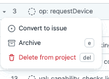

# Developing

The WebGPU CTS is written in TypeScript.

## Setup

After checking out the repository and installing node/npm, run:

```sh
npm ci
```

Before uploading, you can run pre-submit checks (`npm test`) to make sure it will pass CI.
Use `npm run fix` to fix linting issues.

`npm run` will show available npm scripts.
Some more scripts can be listed using `npx grunt`.

## Dev Server

To start the development server, use:

```sh
npm start
```

Then, browse to the standalone test runner at the printed URL.

The server will generate and compile code on the fly, so no build step is necessary.
Only a reload is needed to see saved changes.
(TODO: except, currently, `README.txt` and file `description` changes won't be reflected in
the standalone runner.)

Note: The first load of a test suite may take some time as generating the test suite listing can
take a few seconds.

## Documentation

In addition to the documentation pages you're reading, there is TSDoc documentation.
Start at the [helper index](https://gpuweb.github.io/cts/docs/tsdoc/).

## Standalone Test Runner / Test Plan Viewer

**The standalone test runner also serves as a test plan viewer.**
(This can be done in a browser without WebGPU support.)
You can use this to preview how your test plan will appear.

You can view different suites (webgpu, unittests, stress, etc.) or different subtrees of
the test suite.

- `http://localhost:8080/standalone/` (defaults to `?runnow=0&debug=0&q=webgpu:*`)
- `http://localhost:8080/standalone/?q=unittests:*`
- `http://localhost:8080/standalone/?q=unittests:basic:*`

The following url parameters change how the harness runs:

- `runnow=1` runs all matching tests on page load.
- `debug=1` enables verbose debug logging from tests.
- `worker=dedicated` (or `worker` or `worker=1`) runs the tests on a dedicated worker instead of the main thread.
- `worker=shared` runs the tests on a shared worker instead of the main thread.
- `worker=service` runs the tests on a service worker instead of the main thread.
- `power_preference=low-power` runs most tests passing `powerPreference: low-power` to `requestAdapter`
- `power_preference=high-performance` runs most tests passing `powerPreference: high-performance` to `requestAdapter`

### Web Platform Tests (wpt) - Ref Tests

You can inspect the actual and reference pages for web platform reftests in the standalone
runner by navigating to them. For example, by loading:

 - `http://localhost:8080/out/webgpu/web_platform/reftests/canvas_clear.https.html`
 - `http://localhost:8080/out/webgpu/web_platform/reftests/ref/canvas_clear-ref.html`

You can also run a minimal ref test runner.

 - open 2 terminals / command lines.
 - in one, `npm start`
 - in the other, `node tools/run_wpt_ref_tests <path-to-browser-executable> [name-of-test]`

Without `[name-of-test]` all ref tests will be run. `[name-of-test]` is just a simple check for
substring so passing in `rgba` will run every test with `rgba` in its filename.

Examples:

MacOS

```
# Chrome
node tools/run_wpt_ref_tests /Applications/Google\ Chrome\ Canary.app/Contents/MacOS/Google\ Chrome\ Canary
```

Windows

```
# Chrome
node .\tools\run_wpt_ref_tests "C:\Users\your-user-name\AppData\Local\Google\Chrome SxS\Application\chrome.exe"
```

## Editor

Since this project is written in TypeScript, it integrates best with
[Visual Studio Code](https://code.visualstudio.com/).
This is optional, but highly recommended: it automatically adds `import` lines and
provides robust completions, cross-references, renames, error highlighting,
deprecation highlighting, and type/JSDoc popups.

Open the `cts.code-workspace` workspace file to load settings convenient for this project.
You can make local configuration changes in `.vscode/`, which is untracked by Git.

## Pull Requests

When opening a pull request, fill out the PR checklist and attach the issue number.
If an issue hasn't been opened, find the draft issue on the
[project tracker](https://github.com/orgs/gpuweb/projects/3) and choose "Convert to issue":



Opening a pull request will automatically notify reviewers.

To make the review process smoother, once a reviewer has started looking at your change:

- Avoid major additions or changes that would be best done in a follow-up PR.
- Avoid deleting commits that have already been reviewed, which occurs when using
  rebases (`git rebase`) and force pushes (`git push -f`). These can make
  it difficult for reviewers to review incremental changes as GitHub usually cannot
  view a useful diff across a rebase. If it's necessary to resolve conflicts
  with upstream changes, use a merge commit (`git merge`) and don't include any
  unnecessary changes in the merge, so that a reviewer can skip over merge commits
  when working through the individual commits in the PR.

  The "Create a merge commit" merge option is disabled, so `main` history always
  remains linear (no merge commits). PRs are usually landed using "Squash and merge".
- When you address a review comment, mark the thread as "Resolved".

### TODOs

The word "TODO" refers to missing test coverage. It may only appear inside file/test descriptions
and README files (enforced by linting).

To use comments to refer to TODOs inside the description, use a backreference, e.g., in the
description, `TODO: Also test the FROBNICATE usage flag [1]`, and somewhere in the code, `[1]:
Need to add FROBNICATE to this list.`.

Use `MAINTENANCE_TODO` for TODOs which don't impact test coverage.
