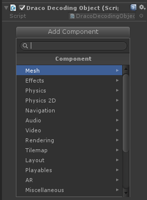
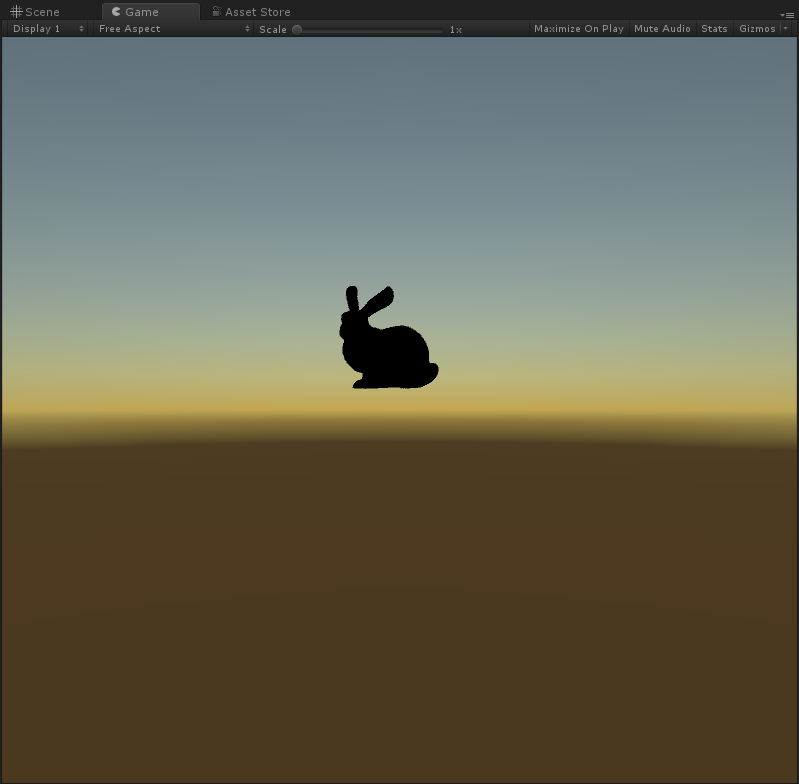

# Draco Unity Integration Guide

This document walks through the process of building Draco for Unity, and
creating a Unity project that uses Draco to decode a .drc file.

[TOC]

## Building Draco for Unity

All of the steps here assume that you're familiar with running build tools for
the target of your choice, and that you have your system configured correctly to
use those build tools.

Basic prerequisites for these builds:
- All platforms require CMake.
- For Android: a recent NDK.
- For iOS and MacOS: a recent Xcode release.
- For Windows: a recent Visual Studio release.

### Android

These instructions are armeabi-v7a and arm64-v8a Android builds.

#### armv7

``` bash
$ cd path/to/draco
$ export CMAKE_ANDROID_NDK=path/to/ndk
$ mkdir armeabi-v7a && cd armeabi-v7a
$ cmake ../ \
  -DCMAKE_TOOLCHAIN_FILE=../cmake/toolchains/armv7-android-ndk-libcpp.cmake \
  -DDRACO_UNITY_PLUGIN=ON
$ make -j
```

#### arm64

``` bash
$ cd path/to/draco
$ export CMAKE_ANDROID_NDK=path/to/ndk
$ mkdir arm64-v8a && cd arm64-v8a
$ cmake ../ \
  -DCMAKE_TOOLCHAIN_FILE=../cmake/toolchains/arm64-android-ndk-libcpp.cmake \
  -DDRACO_UNITY_PLUGIN=ON
$ make -j
```

### iOS

These instructions build unsigned Draco targets and produce a fat libdraco.a
that includes Draco support for armv7, armv7s, and arm64 iOS.

``` bash
$ cmake path/to/draco -G Xcode \
  -DCMAKE_BUILD_TYPE=Release \
  -DCMAKE_CONFIGURATION_TYPES=Release \
  -DCMAKE_SYSTEM_NAME=iOS \
  -DCMAKE_OSX_ARCHITECTURES=armv7\;armv7s\;arm64 \
  -DCMAKE_XCODE_ATTRIBUTE_ONLY_ACTIVE_ARCH=NO \
  -DCMAKE_OSX_DEPLOYMENT_TARGET=10.0 \
  -DCMAKE_XCODE_ATTRIBUTE_CODE_SIGNING_REQUIRED=NO \
  -DCMAKE_XCODE_ATTRIBUTE_CODE_SIGN_IDENTITY="" \
  -DDRACO_UNITY_PLUGIN=1

$ xcodebuild

# Build outputs are the Release-iphoneos directory.
```

### MacOS

``` bash
$ cd path/to/draco
$ mkdir build_unity_xcode
$ cd build_unity_xcode
$ cmake ..  -G Xcode \
  -DDRACO_UNITY_PLUGIN=ON \
  -DCMAKE_BUILD_TYPE=Release \
  -DCMAKE_CONFIGURATION_TYPES=Release
$ xcodebuild

# Build outputs are in the Release directory.
```

### Windows

These instructions use Visual Studio 16 2019. Configuration for older versions
of Visual Studio is different. Consult CMake documentation for information on
configuring for your version of Visual Studio.

#### Win32

``` bash
$ cd path/to/draco
$ mkdir build_unity_win32
$ cd build_unity_win32
$ cmake ../ -G "Visual Studio 16 2019" -A Win32 -DDRACO_UNITY_PLUGIN=ON
$ cmake --build . --config Release --target install -- /M:36

# Build outputs are in the Release directory.
```

#### Win64

``` bash
$ cd path/to/draco
$ mkdir build_unity_win64
$ cd build_unity_win64
$ cmake ../ -G "Visual Studio 16 2019" -A x64 -DDRACO_UNITY_PLUGIN=ON
$ cmake --build . --config Release --target install -- /M:36

# Build outputs are in the Release directory.
```

## Testing Draco in Unity

### 1. Create the Project

Open Unity Hub and create a new project. Name it DracoDemo.

The following two images are taken from Unity Hub for Windows, but the steps are
the same on other platforms.


Click “New” Button, which opens create new project dialog box


Click the `Create` button to create the project.

***TIP***: The shell commands in the next step are much less tedious if you
create the project in a sibling directory of the Draco repository.

### 2. Copy in the Draco files

Run these commands in the shell of your choice to place Draco files where Unity
can load them.

``` bash
# These commands assume you created the project in a sibling directory of the
# Draco repository. If your project is stored elsewhere you'll need to use
# absolute paths.

$ cd path/to/draco
$ mkdir -p ../DracoDemo/Assets/Plugins
$ cp unity/Plugin/dracodec_unity.dll ../DracoDemo/Assets/Plugins/
$ cp unity/DracoMeshLoader.cs ../DracoDemo/Assets/
$ cp unity/DracoDecodingObject.cs ../DracoDemo/Assets/
$ mkdir -p ../DracoDemo/Assets/Resources
$ cp javascript/example/models/bunny.drc \
  ../DracoDemo/Assets/Resources/bunny.drc.bytes
```

### 3. Connect the Draco decoder in Unity

##### A. Allow unsafe code in the player settings

The image examples here are from Windows. The MacOS version of Unity differs
in appearance, but the field names and values remain the same.

")
")

##### B. Add Draco to the Unity project

The first step is to create an empty game object. Here's what that looks like on
Windows. The MacOS version of Unity is very similar.


##### C. Attach the DracoDecodingObject.cs script to the game object.

Do one of the following:

* Drag the script asset to a GameObject in the hierarchy panel, or
* Drag it to the inspector of the GameObject that is currently selected.


##### D. Reposition the camera

Change Main Camera’s position to 0,0,-1.


##### E. Add a Mesh Filter component to the GameObject




##### F. Add a Mesh Renderer component to the GameObject


##### G. Play your project

The integration basics are completed, and you should see a pink bunny when you
play the project.


### 5. Add Materials to Your Mesh

##### A. Pick a Material for the Mesh Renderer.


##### B. Select a material.


##### C. Play your project

Play it again: you should see a black bunny now.

***Don't panic***: Newer versions of Unity have lighting by default. Your bunny might
already look like the lighted version in the next step.




### 6. Add a light

In the most recent Unity releases this step isn't necessary because scenes have
a light by default, but this is how to do that if your Unity installation is
older or behaves differently.

##### A. Add and position the light


##### B. Play your project

Play it again: you should see a lit bunny now.


“Play” your project. You should see a lit bunny.


### 7. Extras

Rotate your bunny.

Add the following code to `DracoDecodingObject.cs`:

``` c#
void Update() {
  transform.Rotate(0, 30 * Time.deltaTime, 0);
}
```
