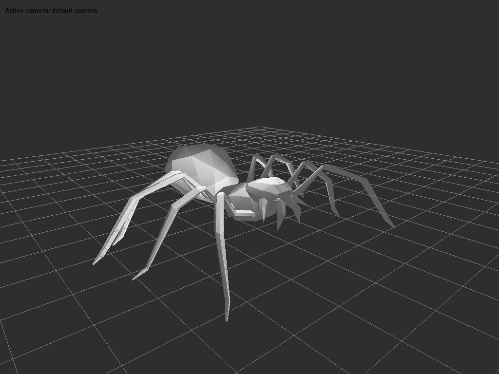

PyAssimp: Python bindings for libassimp
=======================================

A simple Python wrapper for Assimp using ``ctypes`` to access the
library. Requires Python >= 2.6.

Python 3 support is mostly here, but not well tested.

Note that pyassimp is not complete. Many ASSIMP features are missing.

USAGE
-----

Complete example: 3D viewer
~~~~~~~~~~~~~~~~~~~~~~~~~~~

``pyassimp`` comes with a simple 3D viewer that shows how to load and
display a 3D model using a shader-based OpenGL pipeline.

   Screenshot

To use it, from within ``/port/PyAssimp``:

::

    $ cd scripts
    $ python ./3D-viewer <path to your model>

You can use this code as starting point in your applications.

Writing your own code
~~~~~~~~~~~~~~~~~~~~~

To get started with ``pyassimp``, examine the simpler ``sample.py``
script in ``scripts/``, which illustrates the basic usage. All Assimp
data structures are wrapped using ``ctypes``. All the data+length fields
in Assimp's data structures (such as ``aiMesh::mNumVertices``,
``aiMesh::mVertices``) are replaced by simple python lists, so you can
call ``len()`` on them to get their respective size and access members
using ``[]``.

For example, to load a file named ``hello.3ds`` and print the first
vertex of the first mesh, you would do (proper error handling
substituted by assertions ...):

.. code:: python

    from pyassimp import *
    scene = load('hello.3ds')

    assert len(scene.meshes)
    mesh = scene.meshes[0]

    assert len(mesh.vertices)
    print(mesh.vertices[0])

    # don't forget this one, or you will leak!
    release(scene)

Another example to list the 'top nodes' in a scene:

.. code:: python

    from pyassimp import *
    scene = load('hello.3ds')

    for c in scene.rootnode.children:
        print(str(c))

    release(scene)

INSTALL
-------

Install ``pyassimp`` by running:

::

    $ python setup.py install

PyAssimp requires a assimp dynamic library (``DLL`` on windows, ``.so``
on linux, ``.dynlib`` on macOS) in order to work. The default search
directories are:

-  the current directory
-  on linux additionally: ``/usr/lib``, ``/usr/local/lib``,
   ``/usr/lib/x86_64-linux-gnu``

To build that library, refer to the Assimp master ``INSTALL``
instructions. To look in more places, edit ``./pyassimp/helper.py``.
There's an ``additional_dirs`` list waiting for your entries.
