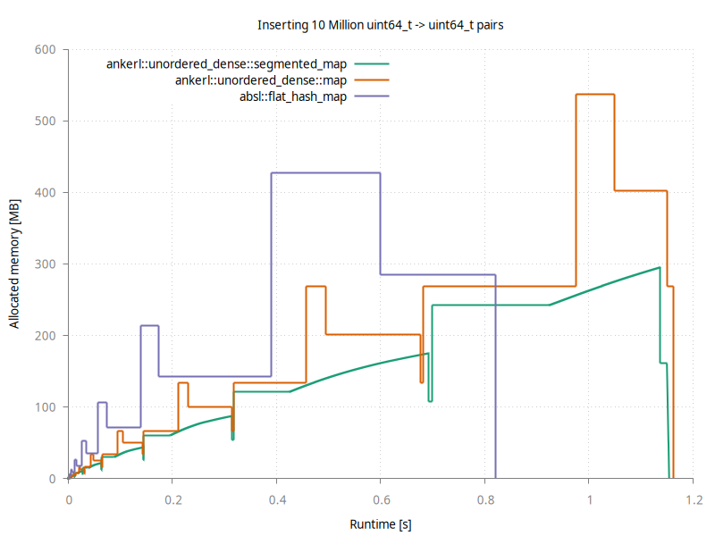

<a id="top"></a>

[](https://github.com/martinus/unordered_dense/releases)
[](https://raw.githubusercontent.com/martinus/unordered_dense/main/LICENSE)
[](https://github.com/martinus/unordered_dense/actions)
[](https://bestpractices.coreinfrastructure.org/projects/6220)
[](https://github.com/sponsors/martinus)

# 🚀 ankerl::unordered_dense::{map, set} <!-- omit in toc -->

A fast & densely stored hashmap and hashset based on robin-hood backward shift deletion for C++17 and later.

The classes `ankerl::unordered_dense::map` and `ankerl::unordered_dense::set` are (almost) drop-in replacements of `std::unordered_map` and `std::unordered_set`. While they don't have as strong iterator / reference stability guaranties, they are typically *much* faster.

Additionally, there are `ankerl::unordered_dense::segmented_map` and `ankerl::unordered_dense::segmented_set` with lower peak memory usage. and stable iterator/references on insert.

- [1. Overview](#1-overview)
- [2. Installation](#2-installation)
  - [2.1. Installing using cmake](#21-installing-using-cmake)
- [3. Usage](#3-usage)
  - [3.1. Modules](#31-modules)
  - [3.2. Hash](#32-hash)
    - [3.2.1. Simple Hash](#321-simple-hash)
    - [3.2.2. High Quality Hash](#322-high-quality-hash)
    - [3.2.3. Specialize `ankerl::unordered_dense::hash`](#323-specialize-ankerlunordered_densehash)
    - [3.2.4. Heterogeneous Overloads using `is_transparent`](#324-heterogeneous-overloads-using-is_transparent)
    - [3.2.5. Automatic Fallback to `std::hash`](#325-automatic-fallback-to-stdhash)
    - [3.2.6. Hash the Whole Memory](#326-hash-the-whole-memory)
  - [3.3. Container API](#33-container-api)
    - [3.3.1. `auto extract() && -> value_container_type`](#331-auto-extract----value_container_type)
    - [3.3.2. `extract()` single Elements](#332-extract-single-elements)
    - [3.3.3. `[[nodiscard]] auto values() const noexcept -> value_container_type const&`](#333-nodiscard-auto-values-const-noexcept---value_container_type-const)
    - [3.3.4. `auto replace(value_container_type&& container)`](#334-auto-replacevalue_container_type-container)
  - [3.4. Custom Container Types](#34-custom-container-types)
  - [3.5. Custom Bucket Types](#35-custom-bucket-types)
    - [3.5.1. `ankerl::unordered_dense::bucket_type::standard`](#351-ankerlunordered_densebucket_typestandard)
    - [3.5.2. `ankerl::unordered_dense::bucket_type::big`](#352-ankerlunordered_densebucket_typebig)
- [4. `segmented_map` and `segmented_set`](#4-segmented_map-and-segmented_set)
- [5. Design](#5-design)
  - [5.1. Inserts](#51-inserts)
  - [5.2. Lookups](#52-lookups)
  - [5.3. Removals](#53-removals)
- [6. Real World Usage](#6-real-world-usage)

## 1. Overview

The chosen design has a few advantages over `std::unordered_map`: 

* Perfect iteration speed - Data is stored in a `std::vector`, all data is contiguous!
* Very fast insertion & lookup speed, in the same ballpark as [`absl::flat_hash_map`](https://abseil.io/docs/cpp/guides/container`)
* Low memory usage
* Full support for `std::allocators`, and [polymorphic allocators](https://en.cppreference.com/w/cpp/memory/polymorphic_allocator). There are `ankerl::unordered_dense::pmr` typedefs available
* Customizeable storage type: with a template parameter you can e.g. switch from `std::vector` to `boost::interprocess::vector` or any other compatible random-access container.
* Better debugging: the underlying data can be easily seen in any debugger that can show an `std::vector`.

There's no free lunch, so there are a few disadvantages:

* Deletion speed is relatively slow. This needs two lookups: one for the element to delete, and one for the element that is moved onto the newly empty spot.
* no `const Key` in `std::pair<Key, Value>`
* Iterators and references are not stable on insert or erase.

## 2. Installation

<!-- See https://github.com/bernedom/SI/blob/main/doc/installation-guide.md -->
The default installation location is `/usr/local`.

### 2.1. Installing using cmake 

Clone the repository and run these commands in the cloned folder:

```sh
mkdir build && cd build
cmake ..
cmake --build . --target install
```

Consider setting an install prefix if you do not want to install `unordered_dense` system wide, like so:

```sh
mkdir build && cd build
cmake -DCMAKE_INSTALL_PREFIX:PATH=${HOME}/unordered_dense_install ..
cmake --build . --target install
```

To make use of the installed library, add this to your project:

```cmake
find_package(unordered_dense CONFIG REQUIRED)
target_link_libraries(your_project_name unordered_dense::unordered_dense)
```

## 3. Usage

### 3.1. Modules

`ankerl::unordered_dense` supports c++20 modules. Simply compile `src/ankerl.unordered_dense.cpp` and use the resulting module, e.g. like so:

```sh
clang++ -std=c++20 -I include --precompile -x c++-module src/ankerl.unordered_dense.cpp
clang++ -std=c++20 -c ankerl.unordered_dense.pcm
```

To use the module with e.g. in `module_test.cpp`, use 

```cpp
import ankerl.unordered_dense;
```

and compile with e.g.

```sh
clang++ -std=c++20 -fprebuilt-module-path=. ankerl.unordered_dense.o module_test.cpp -o main
```

A simple demo script can be found in `test/modules`.

### 3.2. Hash

`ankerl::unordered_dense::hash` is a fast and high quality hash, based on [wyhash](https://github.com/wangyi-fudan/wyhash). The `ankerl::unordered_dense` map/set differentiates between hashes of high quality (good [avalanching effect](https://en.wikipedia.org/wiki/Avalanche_effect)) and bad quality. Hashes with good quality contain a special marker:

```cpp
using is_avalanching = void;
```

This is the cases for the specializations `bool`, `char`, `signed char`, `unsigned char`, `char8_t`, `char16_t`, `char32_t`, `wchar_t`, `short`, `unsigned short`, `int`, `unsigned int`, `long`, `long long`, `unsigned long`, `unsigned long long`, `T*`, `std::unique_ptr<T>`, `std::shared_ptr<T>`, `enum`, `std::basic_string<C>`, and `std::basic_string_view<C>`.

Hashes that do not contain such a marker are assumed to be of bad quality and receive an additional mixing step inside the map/set implementation.

#### 3.2.1. Simple Hash

Consider a simple custom key type:

```cpp
struct id {
    uint64_t value{};

    auto operator==(id const& other) const -> bool {
        return value == other.value;
    }
};
```

The simplest implementation of a hash is this:

```cpp
struct custom_hash_simple {
    auto operator()(id const& x) const noexcept -> uint64_t {
        return x.value;
    }
};
```
This can be used e.g. with 

```cpp
auto ids = ankerl::unordered_dense::set<id, custom_hash_simple>();
```

Since `custom_hash_simple` doesn't have a `using is_avalanching = void;` marker it is considered to be of bad quality and additional mixing of `x.value` is automatically provided inside the set.

#### 3.2.2. High Quality Hash

Back to the `id` example, we can easily implement a higher quality hash:

```cpp
struct custom_hash_avalanching {
    using is_avalanching = void;

    auto operator()(id const& x) const noexcept -> uint64_t {
        return ankerl::unordered_dense::detail::wyhash::hash(x.value);
    }
};
```

We know `wyhash::hash` is of high quality, so we can add `using is_avalanching = void;` which makes the map/set directly use the returned value.


#### 3.2.3. Specialize `ankerl::unordered_dense::hash`

Instead of creating a new class you can also specialize `ankerl::unordered_dense::hash`:

```cpp
template <>
struct ankerl::unordered_dense::hash<id> {
    using is_avalanching = void;

    [[nodiscard]] auto operator()(id const& x) const noexcept -> uint64_t {
        return detail::wyhash::hash(x.value);
    }
};
```

#### 3.2.4. Heterogeneous Overloads using `is_transparent`

This map/set supports heterogeneous overloads as described in [P2363 Extending associative containers with the remaining heterogeneous overloads](https://www.open-std.org/jtc1/sc22/wg21/docs/papers/2022/p2363r3.html) which is [targeted for C++26](https://wg21.link/p2077r2). This has overloads for `find`, `count`, `contains`, `equal_range` (see [P0919R3](https://www.open-std.org/jtc1/sc22/wg21/docs/papers/2018/p0919r3.html)), `erase` (see [P2077R2](https://www.open-std.org/jtc1/sc22/wg21/docs/papers/2020/p2077r2.html)), and  `try_emplace`, `insert_or_assign`, `operator[]`, `at`, and `insert` & `emplace` for sets (see [P2363R3](https://www.open-std.org/jtc1/sc22/wg21/docs/papers/2022/p2363r3.html)).

For heterogeneous overloads to take affect, both `hasher` and `key_equal` need to have the attribute `is_transparent` set.

Here is an example implementation that's usable with any string types that is convertible to `std::string_view` (e.g. `char const*` and `std::string`):

```cpp
struct string_hash {
    using is_transparent = void; // enable heterogeneous overloads
    using is_avalanching = void; // mark class as high quality avalanching hash

    [[nodiscard]] auto operator()(std::string_view str) const noexcept -> uint64_t {
        return ankerl::unordered_dense::hash<std::string_view>{}(str);
    }
};
```

To make use of this hash you'll need to specify it as a type, and also a `key_equal` with `is_transparent` like [std::equal_to<>](https://en.cppreference.com/w/cpp/utility/functional/equal_to_void):

```cpp
auto map = ankerl::unordered_dense::map<std::string, size_t, string_hash, std::equal_to<>>();
```

For more information see the examples in `test/unit/transparent.cpp`.


#### 3.2.5. Automatic Fallback to `std::hash`

When an implementation for `std::hash` of a custom type is available, this is automatically used and assumed to be of bad quality (thus `std::hash` is used, but an additional mixing step is performed).


#### 3.2.6. Hash the Whole Memory

When the type [has a unique object representation](https://en.cppreference.com/w/cpp/types/has_unique_object_representations) (no padding, trivially copyable), one can just hash the object's memory. Consider a simple class

```cpp
struct point {
    int x{};
    int y{};

    auto operator==(point const& other) const -> bool {
        return x == other.x && y == other.y;
    }
};
```

A fast and high quality hash can be easily provided like so:

```cpp
struct custom_hash_unique_object_representation {
    using is_avalanching = void;

    [[nodiscard]] auto operator()(point const& f) const noexcept -> uint64_t {
        static_assert(std::has_unique_object_representations_v<point>);
        return ankerl::unordered_dense::detail::wyhash::hash(&f, sizeof(f));
    }
};
```

### 3.3. Container API

In addition to the standard `std::unordered_map` API (see https://en.cppreference.com/w/cpp/container/unordered_map) we have additional API that is somewhat similar to the node API, but leverages the fact that we're using a random access container internally:

#### 3.3.1. `auto extract() && -> value_container_type`

Extracts the internally used container. `*this` is emptied.

#### 3.3.2. `extract()` single Elements

Similar to `erase()` I have an API call `extract()`. It behaves exactly the same as `erase`, except that the return value is the moved element that is removed from the container:

* `auto extract(const_iterator it) -> value_type`
* `auto extract(Key const& key) -> std::optional<value_type>`
* `template <class K> auto extract(K&& key) -> std::optional<value_type>`

Note that the `extract(key)` API returns an `std::optional<value_type>` that is empty when the key is not found.

#### 3.3.3. `[[nodiscard]] auto values() const noexcept -> value_container_type const&`

Exposes the underlying values container.

#### 3.3.4. `auto replace(value_container_type&& container)`

Discards the internally held container and replaces it with the one passed. Non-unique elements are
removed, and the container will be partly reordered when non-unique elements are found.

### 3.4. Custom Container Types

`unordered_dense` accepts a custom allocator, but you can also specify a custom container for that template argument. That way it is possible to replace the internally used `std::vector` with e.g. `std::deque` or any other container like `boost::interprocess::vector`. This supports fancy pointers (e.g. [offset_ptr](https://www.boost.org/doc/libs/1_80_0/doc/html/interprocess/offset_ptr.html)), so the container can be used with e.g. shared memory provided by `boost::interprocess`.

### 3.5. Custom Bucket Types

The map/set supports two different bucket types. The default should be good for pretty much everyone.

#### 3.5.1. `ankerl::unordered_dense::bucket_type::standard`

* Up to 2^32 = 4.29 billion elements.
* 8 bytes overhead per bucket.

#### 3.5.2. `ankerl::unordered_dense::bucket_type::big`

* up to 2^63 = 9223372036854775808 elements.
* 12 bytes overhead per bucket.

## 4. `segmented_map` and `segmented_set`

`ankerl::unordered_dense` provides a custom container implementation that has lower memory requirements than the default `std::vector`. Memory is not contiguous, but it can allocate segments without having to reallocate and move all the elements. In summary, this leads to

* Much smoother memory usage, memory usage increases continuously.
* No high peak memory usage.
* Faster insertion because elements never need to be moved to new allocated blocks
* Slightly slower indexing compared to `std::vector` because an additional indirection is needed.

Here is a comparison against `absl::flat_hash_map` and the `ankerl::unordered_dense::map` when inserting 10 million entries


Abseil is fastest for this simple inserting test, taking a bit over 0.8 seconds. It's peak memory usage is about 430 MB. Note how the memory usage goes down after the last peak; when it goes down to ~290MB it has finished rehashing and could free the previously used memory block.

`ankerl::unordered_dense::segmented_map` doesn't have these peaks, and instead has a smooth increase of memory usage. Note there are still sudden drops & increases in memory because the indexing data structure needs still needs to increase by a fixed factor. But due to holding the data in a separate container we are able to first free the old data structure, and then allocate a new, bigger indexing structure; thus we do not have peaks.

## 5. Design

The map/set has two data structures:
* `std::vector<value_type>` which holds all data. map/set iterators are just `std::vector<value_type>::iterator`!
* An indexing structure (bucket array), which is a flat array with 8-byte buckets.

### 5.1. Inserts

Whenever an element is added it is `emplace_back` to the vector. The key is hashed, and an entry (bucket) is added at the
corresponding location in the bucket array. The bucket has this structure:

```cpp
struct Bucket {
    uint32_t dist_and_fingerprint;
    uint32_t value_idx;
};
```

Each bucket stores 3 things:
* The distance of that value from the original hashed location (3 most significant bytes in `dist_and_fingerprint`)
* A fingerprint; 1 byte of the hash (lowest significant byte in `dist_and_fingerprint`)
* An index where in the vector the actual data is stored.

This structure is especially designed for the collision resolution strategy robin-hood hashing with backward shift
deletion.

### 5.2. Lookups

The key is hashed and the bucket array is searched if it has an entry at that location with that fingerprint. When found,
the key in the data vector is compared, and when equal the value is returned.

### 5.3. Removals

Since all data is stored in a vector, removals are a bit more complicated:

1. First, lookup the element to delete in the index array.
2. When found, replace that element in the vector with the last element in the vector. 
3. Update *two* locations in the bucket array: First remove the bucket for the removed element
4. Then, update the `value_idx` of the moved element. This requires another lookup.


## 6. Real World Usage

On 2023-09-10 I did a quick search on github to see if this map is used in any popular open source projects. Here are some of the projects
I found. Please send me a note if you want on that list!

* [PruaSlicer](https://github.com/prusa3d/PrusaSlicer) -  G-code generator for 3D printers (RepRap, Makerbot, Ultimaker etc.) 
* [Kismet](https://github.com/kismetwireless/kismet): Wi-Fi, Bluetooth, RF, and more. Kismet is a sniffer, WIDS, and wardriving tool for Wi-Fi, Bluetooth, Zigbee, RF, and more, which runs on Linux and macOS
* [Rspamd](https://github.com/rspamd/rspamd) - Fast, free and open-source spam filtering system.
* [kallisto](https://github.com/pachterlab/kallisto) -  Near-optimal RNA-Seq quantification
* [Slang](https://github.com/shader-slang/slang) - Slang is a shading language that makes it easier to build and maintain large shader codebases in a modular and extensible fashion.
* [CyberFSR2](https://github.com/PotatoOfDoom/CyberFSR2) - Drop-in DLSS replacement with FSR 2.0 for various games such as Cyberpunk 2077.
* [ossia score](https://github.com/ossia/score) - A free, open-source, cross-platform intermedia sequencer for precise and flexible scripting of interactive scenarios. 
* [HiveWE](https://github.com/stijnherfst/HiveWE) - A Warcraft III World Editor (WE) that focusses on speed and ease of use.
* [opentxs](https://github.com/Open-Transactions/opentxs) - The Open-Transactions project is a collaborative effort to develop a robust, commercial-grade, fully-featured, free-software toolkit implementing the OTX protocol as well as a full-strength financial cryptography library, API, GUI, command-line interface, and prototype notary server.
* [LuisaCompute](https://github.com/LuisaGroup/LuisaCompute) - High-Performance Rendering Framework on Stream Architectures
* [Lethe](https://github.com/lethe-cfd/lethe) - Lethe (pronounced /ˈliːθiː/) is open-source computational fluid dynamics (CFD) software which uses high-order continuous Galerkin formulations to solve the incompressible Navier–Stokes equations (among others).
* [PECOS](https://github.com/amzn/pecos) - PECOS is a versatile and modular machine learning (ML) framework for fast learning and inference on problems with large output spaces, such as extreme multi-label ranking (XMR) and large-scale retrieval.
* [Operon](https://github.com/heal-research/operon) - A modern C++ framework for symbolic regression that uses genetic programming to explore a hypothesis space of possible mathematical expressions in order to find the best-fitting model for a given regression target.
* [MashMap](https://github.com/marbl/MashMap) - A fast approximate aligner for long DNA sequences
* [minigpt4.cpp](https://github.com/Maknee/minigpt4.cpp) - Port of MiniGPT4 in C++ (4bit, 5bit, 6bit, 8bit, 16bit CPU inference with GGML)
